# CS106L: Standard C++ Programming


> “The invisible foundation of everything”

## Content

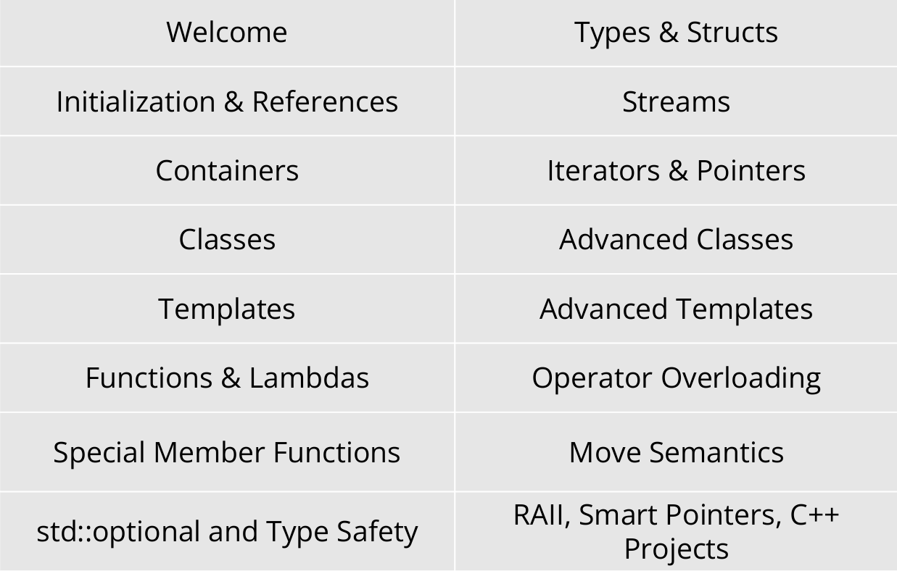

## Lecture 1 Welcome

### C++ Design Philosophy 

* Express ideas and intent directly in code.
*  Enforce safety at compile time whenever possible. 
*  Do not waste time or space.  • Compartmentalize messy constructs. 
*  Allow the programmer full control, responsibility, and choice


## Lecture 2 Types and Structs

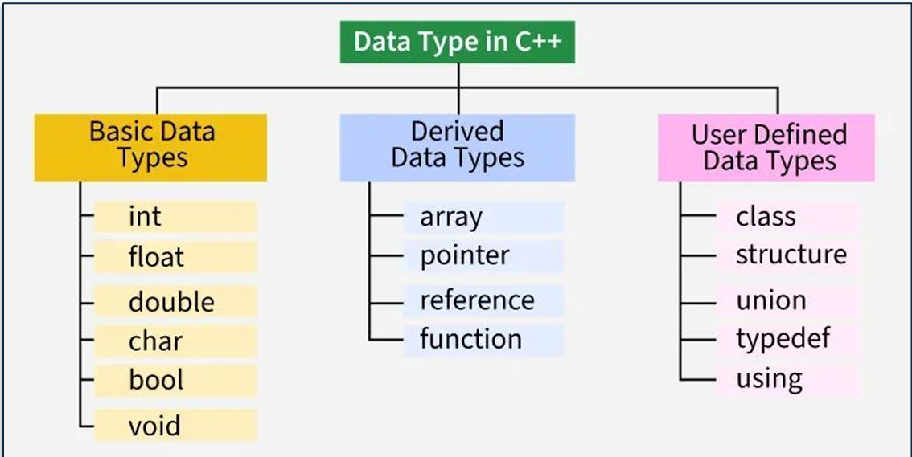

### Compiler VS Interpreter
> [!NOTE]
>
> The interpreted languages read each line of code  line-by-line, translate each line, and then execute it
>
> The compiler translates the ENTIRE program, packages it  into an executable file, and then executes it
>
> Interpreted languages all run in run time! 
>
> Compiled Languages run in first compile time then run time

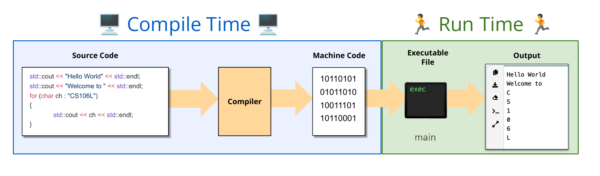

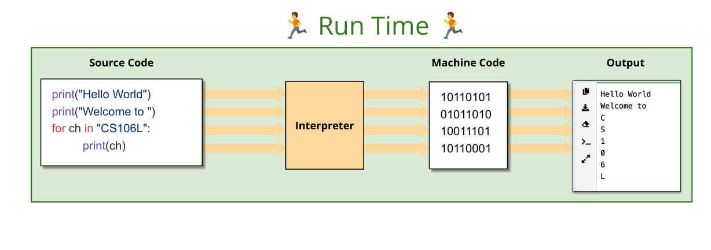

### Types

* C++ is a compiled, statically typed language.

### Structs

* A struct bundles named variables into a new type.
*  std::pair is a general purpose struct with two fields

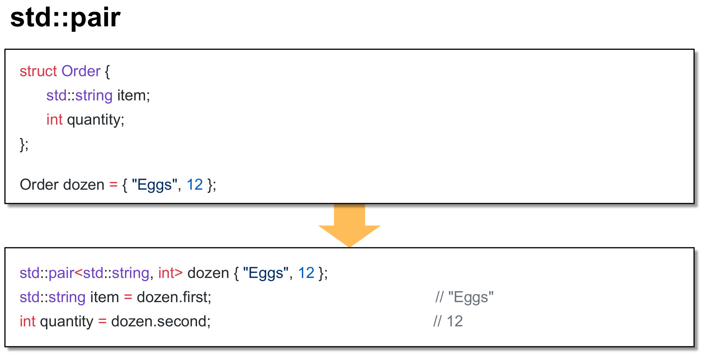

### std ― The C++ Standard Library

To use std::pair, you must #include it

```cpp
#include <utility>
// Now we can use `std::pair` in our code.
std::pair<double, double> point { 1.0, 2.0 };
```


### The ==using== keyword

* Typing out long type names gets tiring, we can create type aliases with the ==using== keyword.

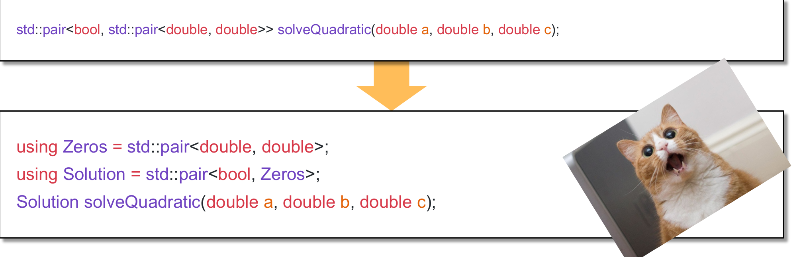

### The ==auto== keyword

* The auto keyword tells the compiler to infer the type

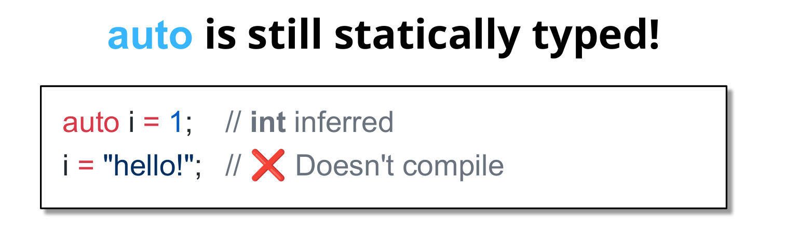


## Lecture 3 Initialization and Reference

### Initialization

1. Direct initialization 
   1.  It doesn’t type check with direct initialization, we possibly now have an  error. This is commonly called a narrowing conversion
   2. 它比较“宽容”，允许隐式的**窄化转换 (Narrowing Conversion)**。例如，`int a(12.9);` 会静默地把 `12.9` 砍成 `12`，只给一个警告甚至不报错。
2. Uniform initialization
   1. With uniform  initialization C++  <u>does</u> care about  types!
   2. 它**严禁**窄化转换。如你图中所见，`int numOne{12.0};` 会直接导致**编译错误**，因为 `12.0`（浮点数）存入 `int` 会丢失精度。
   3. It’s safe! It doesn’t allow for narrowing conversions—which can lead  to unexpected behaviour (or critical system failures  ) 
   4. It’s ubiquitous! It works for all types like vectors, maps, and custom  classes, among other things!
3. Structured Binding
   1. A useful way to initialize some variables from data  structures with fixed sizes at compile time（固定的数据结构）
   2. Ability to access multiple values returned by a function （函数返回值）
   3. Can use on objects where the size is known at  compile-time（编译时就确定的对象）
   4. 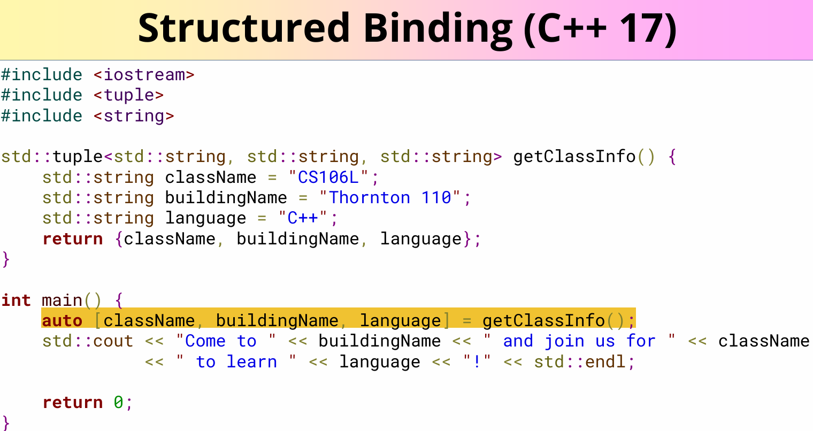

### Reference(&)

```cpp
// 方式1：按值传递（Pass by Value）
auto passByValue = [](std::string str) {
    str = "在函数内修改";
    // 修改的是副本，不影响原始数据
};

// 方式2：按引用传递（Pass by Reference）
auto passByReference = [](std::string& str) {
    str = "在函数内修改";
    // 直接修改原始数据
};
```


### L-values and R-values( Locator Value & Read Value)

* We cannot pass in an r-value by  reference because they’re temporary

| **特性**     | **l-value (左值)**                                           | **r-value (右值)**                                           |
| ------------ | ------------------------------------------------------------ | ------------------------------------------------------------ |
| **全称 **    | **Locator Value** (定位值)                                   | **Read Value** (读取值)                                      |
| **等号位**   | 可以出现在等号的 **左侧或右侧**                              | 只能出现在等号的 **右侧**                                    |
| **内存**     | **拥有明确的内存地址**                                       | **临时值**，通常没有可访问的内存地址                         |
| **代码示例** | `int x = 10;` (其中 **x** 是左值)   `int y = x;` (其中 **y** 是左值) | `int x = 10;` (其中 **10** 是右值)   `int y = x;` (其中 **x** 在这里作为右值使用) |

### Const

* A qualifier for objects that declares they cannot  be modified
* You can declare a const reference to a const variable!
* You can’t declare a non-const reference to a const variable!

```cpp
#include <iostream>
#include <vector>
int main()
{
std::vector<int> vec{ 1, 2, 3 }; /// a normal vector
const std::vector<int> const_vec{ 1, 2, 3 }; /// a const vector
std::vector<int>& ref_vec{ vec }; /// a reference to 'vec'
const std::vector<int>& const_ref{ vec }; /// a const reference
vec.push_back(3); /// this is ok!
const_vec.push_back(3); /// no, this is const!
ref_vec.push_back(3); /// this is ok, just a reference!
const_ref.push_back(3); /// this is const, compiler error!
return 0;
}
```

```cpp
#include <iostream>
#include <vector>

int main() {
    std::vector<int> vec{1, 2, 3};           // 非常量vector
    const std::vector<int>& const_ref = vec; // const引用绑定到非常量对象
    
    // 问题：还能通过其他方式修改vec吗？
    // 问题：const_ref会随之改变吗？
    
    return 0;
}
```

```cpp
#include <iostream>
#include <vector>

int main() {
    std::vector<int> vec{1, 2, 3};
    const std::vector<int>& const_ref = vec;  // const引用
    
    std::cout << "初始状态：" << std::endl;
    std::cout << "vec内容: ";
    for (int n : vec) std::cout << n << " ";
    std::cout << "\nconst_ref内容: ";
    for (int n : const_ref) std::cout << n << " ";
    std::cout << "\n\n";
    
    // 实验1：直接修改vec（通过原始变量）
    vec.push_back(4);
    std::cout << "vec.push_back(4)后：" << std::endl;
    std::cout << "vec大小: " << vec.size() << "，内容: ";
    for (int n : vec) std::cout << n << " ";
    std::cout << "\nconst_ref大小: " << const_ref.size() 
              << "，内容: ";
    for (int n : const_ref) std::cout << n << " ";
    std::cout << "\n\n";
    
    // 实验2：通过其他引用修改
    std::vector<int>& ref = vec;
    ref.push_back(5);
    std::cout << "通过ref.push_back(5)后：" << std::endl;
    std::cout << "vec内容: ";
    for (int n : vec) std::cout << n << " ";
    std::cout << "\nconst_ref内容: ";
    for (int n : const_ref) std::cout << n << " ";
    std::cout << "\n\n";
    
    // 实验3：直接修改vec的元素
    vec[0] = 100;
    std::cout << "vec[0] = 100后：" << std::endl;
    std::cout << "vec内容: ";
    for (int n : vec) std::cout << n << " ";
    std::cout << "\nconst_ref内容: ";
    for (int n : const_ref) std::cout << n << " ";
    std::cout << "\n\n";
    
    // 实验4：尝试通过const_ref修改（应该失败）
    // const_ref.push_back(6);  // ❌ 编译错误
    // const_ref[1] = 200;      // ❌ 编译错误
    
    // 实验5：验证它们是否是同一个对象
    std::cout << "地址验证：" << std::endl;
    std::cout << "&vec地址: " << &vec << std::endl;
    std::cout << "&const_ref地址: " << &const_ref << std::endl;
    std::cout << "它们是否相同地址？ " << (&vec == &const_ref) << std::endl;
    
    return 0;
}
```

```bash
初始状态：
vec内容: 1 2 3 
const_ref内容: 1 2 3 

vec.push_back(4)后：
vec大小: 4，内容: 1 2 3 4 
const_ref大小: 4，内容: 1 2 3 4 

通过ref.push_back(5)后：
vec内容: 1 2 3 4 5 
const_ref内容: 1 2 3 4 5 

vec[0] = 100后：
vec内容: 100 2 3 4 5 
const_ref内容: 100 2 3 4 5 

地址验证：
&vec地址: 0x7ffeed3b4a30
&const_ref地址: 0x7ffeed3b4a30
它们是否相同地址？ 1
```

* **const引用是"只读窗口"，不是"只读对象"**


## Lecture 4 Streams

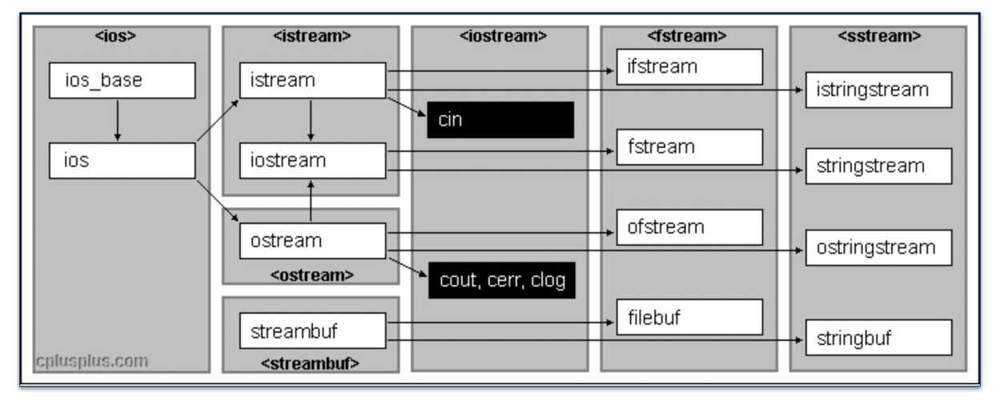

### Streams: a general input/output abstraction for C++

### ios_base

* ios_base is the foundation for everything streams related
* What data does ios_base maintain?
  * State Information :  flags that tell you the  status/health of your stream
    * `failbit` → logical error (ex. type error) 
    * `eofbit`→ reached end of string
  * Control Information :  how does the stream  present the data?(数字输出的进制)

* 如下图，这是一个类继承的关系（ios_base是最原始的父类）

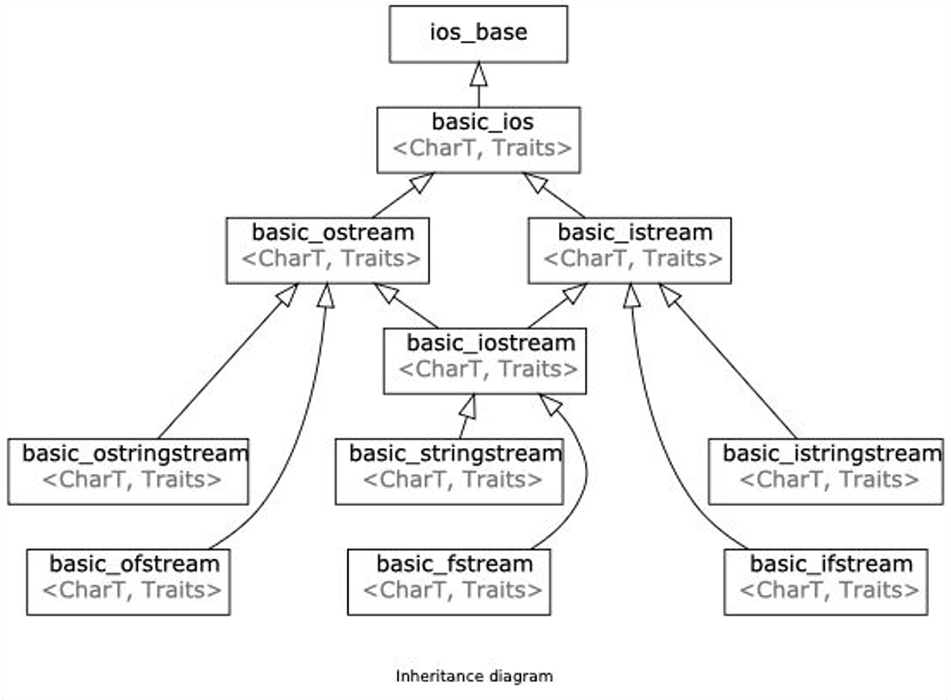

* Input streams (I)  :a way to read data from a source 
  * Are inherited from std::istream 
  * ex. reading in something from the console (std::cin) 
  * primary operator:  `>>` (called the extraction operator)
* Output streams (O) : a way to write data to a destination  
  * Are inherited from std::ostream 
  * ex. writing out something to the console (std::cout) 
  * primary operator:  `<<`(called the insertion operator)

* iostream takes has all  of the characteristics of  ostream and istream.


### std::stringstream: a way to treat strings as streams

* “把字符串当成 `cin` 来用”

```cpp
void foo() {
    /// partial Bjarne Quote
    std::string initial_quote = “Bjarne Stroustrup C makes it easy to shoot yourself in the foot\n”; 
    /// create a stringstream
    std::stringstream ss(initial_quote);
    /// data destinations
    std::string first;
    std::string last;
    std::string language, extracted_quote;
    ss >> first >> last >> language;
    std::cout << first << “ ” << last << “ said this: ”<< language << “ “ << 
    extracted_quote << std::endl;
}
```

### getline()

```cpp
istream& getline(istream& is, string& str, char delim);
//getline() reads an input stream, is, up until the delim char and stores it in some buffer, str
//The delim char is by default ‘\n’
//getline() consumes the delim character !!!
```


### cout and cin

Character in output streams are stored in an intermediary buffer  before being flushed to the destination.

cout and cin are both buffered.

When do we flush the buffer?

* std::cout << std::flush 
* std::cout << std::endl （**在大多数典型的终端交互场景下，==`cout` 后面跟 `'\n'` 换行符通常就会刷新缓冲区==，效果类似于 `std::endl`**，仅当输出流为非交互式时（例如文件、Unix管道）使用`std::ios::sync_with_stdio(false)`才会阻止'\n'刷新缓冲区。）
* When you reach the end of your program 
* When the buffer is full 
* When tied streams interact (ie. cout has to flush before you take  input via cin)

> [!NOTE]
>
> You shouldn’t use getline() and std::cin()  together, because of the difference in how they parse  data. 
>
> std::cin() - leaves the newline in the buffer 
>
> getline() - gets rid of the newline
>
> `std::cin >> pi;`之后buffer指针指向`\n`, `getline()`看到`\n`就停止了，所以什么都没有读到。
>
> 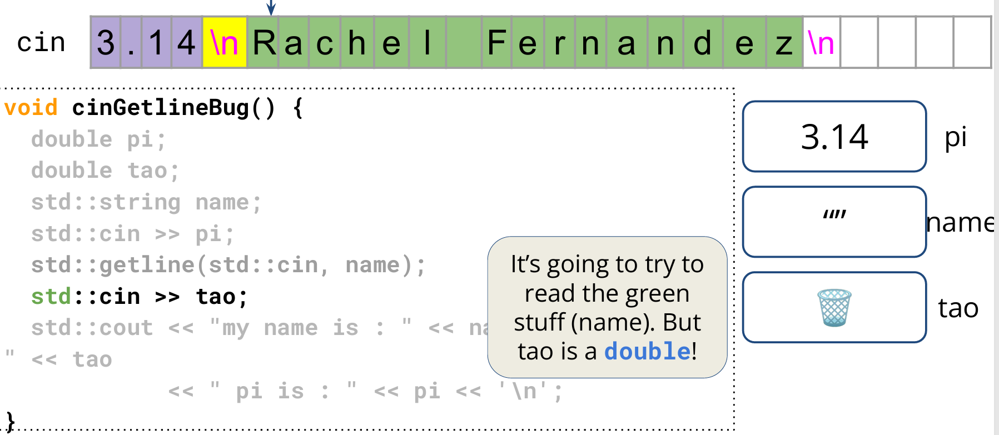
>
> 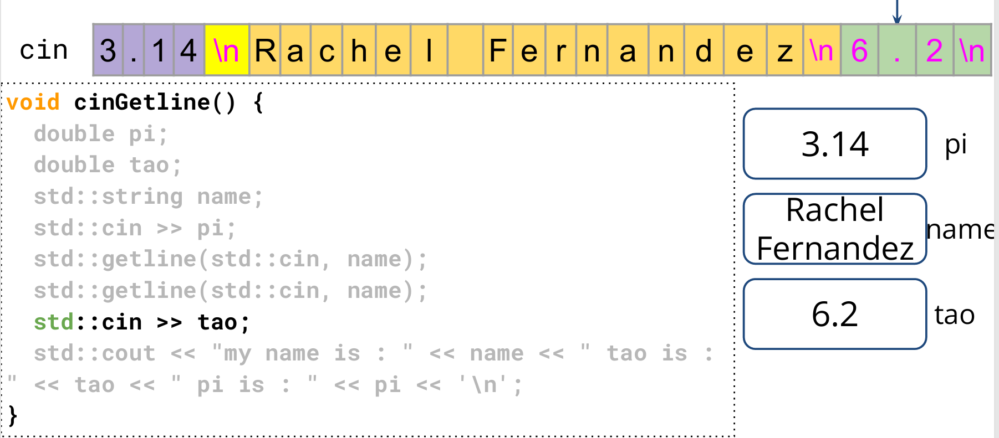

### cerr and clog

cerr: used to output errors (unbuffered)

* sends errors out IMMEDIATELY 

clog: used for non-critical event logging  (buffered)

### Output File Streams

* Here are some you should know: 
  * is_open() 
  * open() 
  * close() 
  * fail()

```cpp
int main() {
    /// associating file on construction
    std::ofstream ofs(“hello.txt”)//Creates an output file stream to the file “hello.txt”
    if (ofs.is_open()) {
    ofs << “Hello CS106L!” << ‘\n’;
    //Checks if the file is open and if it is, then tries to write to it
    }
    ofs.close();//This closes the output file stream to “hello.txt”

    ofs << “this will not get written”;//Will silently fail
    ofs.open(“hello.txt”, std::ios::app);//Reopens the stream, std::ios::app specifies you want to append, not truncate!
    ofs << “this will though! It’s open again”;//Successfully writes to stream

    return 0;
    }
```

### Input File Streams

```cpp
int inputFileStreamExample() {
    std::ifstream ifs(“input.txt”);
    if (ifs.is_open()) {
    	std::string line;
        std::getline(ifs, line);
    	std::cout << “Read from the file: “ << line << ‘\n’;
    }
    if (ifs.is_open()) {
    	std::string lineTwo;
        std::getline(ifs, lineTwo);
    	std::cout << “Read from the file: “ << lineTwo << ‘\n’;
    }
    return 0;
}
```

## Lecture 5 Containers

### STL: Standard Template Library

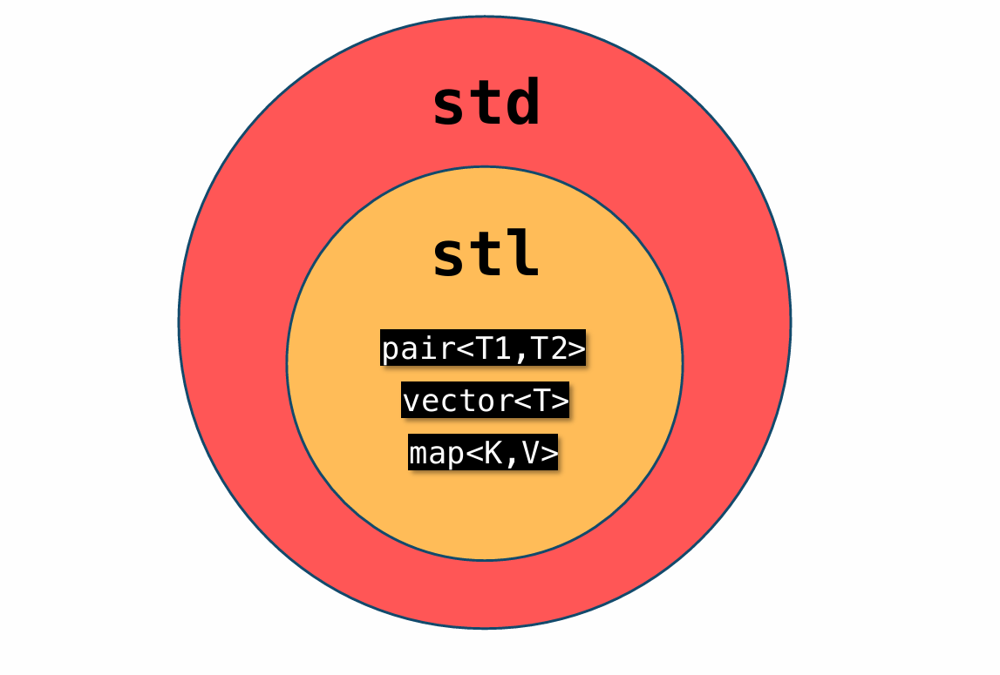

### Sequence Containers

* Sequence containers store a linear sequence of elements.

#### std::vector

| **功能描述 (What you want to do?)** | **std::vector<int>**               |
| ----------------------------------- | ---------------------------------- |
| **创建空 Vector**                   | `std::vector<int> v;`              |
| **创建包含 n 个 0 的 Vector**       | `std::vector<int> v(n);`           |
| **创建包含 n 个值为 k 的 Vector**   | `std::vector<int> v(n, k);`        |
| **在末尾添加元素 k**                | `v.push_back(k);`                  |
| **清空 Vector**                     | `v.clear();`                       |
| **检查是否为空**                    | `if (v.empty())`                   |
| **获取索引 i 处的元素**             | `int k = v.at(i);` `int k = v[i];` |
| **替换索引 i 处的元素**             | `v.at(i) = k;` `v[i] = k;`         |

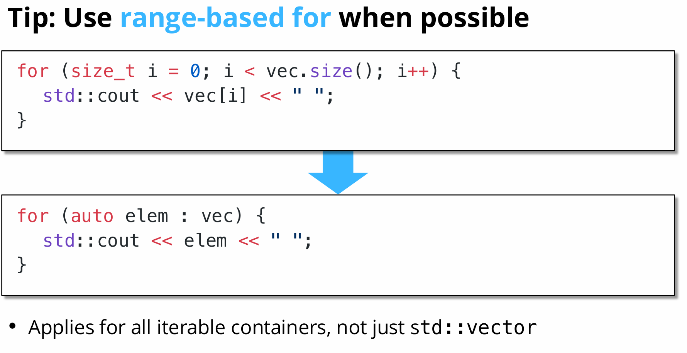

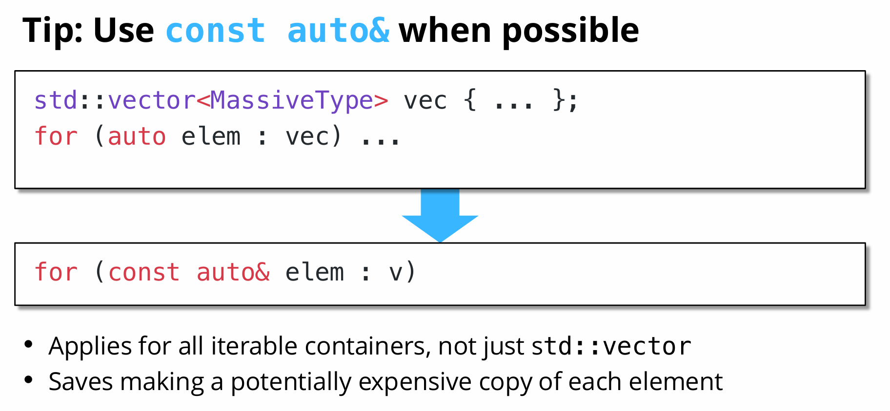

* **避免对每个元素进行潜在的昂贵复制**，如果容器中元素是大型对象（如 `MassiveType`），复制它们会消耗大量时间和内存

```cpp
std::vector<int> vec{5, 6}; // {5, 6}
vec[1] = 3;
// {5, 3}
vec[2] = 4;
vec.at(2) = 4;
// undefined behavior
// Runtime error
//使用 operator[]（方括号运算符），不检查边界，直接访问内存
//使用 at() 成员函数，会检查边界
```


#### std::deque

* deque(double-ended queue) allows efficient insertion/removal at either end

1) 创建一个没有任何元素的空 deque 容器：

```cpp
std::deque<int> d;
```

和空 array 容器不同，空的 deque 容器在创建之后可以做添加或删除元素的操作，因此这种简单创建 deque 容器的方式比较常见。

2) 创建一个具有 n 个元素的 deque 容器，其中每个元素都采用对应类型的默认值：

```cpp
std::deque<int> d(10);
```

此行代码创建一个具有 10 个元素（默认都为 0）的 deque 容器。

3) 创建一个具有 n 个元素的 deque 容器，并为每个元素都指定初始值，例如：

```cpp
std::deque<int> d(10, 5)
```

如此就创建了一个包含 10 个元素（值都为 5）的 deque 容器。

4) 在已有 deque 容器的情况下，可以通过拷贝该容器创建一个新的 deque 容器，例如：

```cpp
std::deque<int> d1(5);
std::deque<int> d2(d1);
```

注意，采用此方式，必须保证新旧容器存储的元素类型一致。

5) 通过拷贝其他类型容器中指定区域内的元素（也可以是普通数组），可以创建一个新容器，例如：

```cpp
//拷贝普通数组，创建deque容器
int a[] = { 1,2,3,4,5 };
std::deque<int>d(a, a + 5);
//适用于所有类型的容器
std::array<int, 5>arr{ 11,12,13,14,15 };
std::deque<int>d(arr.begin()+2, arr.end());//拷贝arr容器中的{13,14,15}
```

### Associative Containers

#### std::map

* Equivalent of a Python dictionary
* std::map<K,  V>   stores a collection of std::pair<const K,  V>  

| **功能描述 (What you want to do?)** | **std::map<char, int>**                        |
| ----------------------------------- | ---------------------------------------------- |
| **创建空 Map**                      | `std::map<char, int> m;`                       |
| **添加键值对 (Key k, Value v)**     | `m.insert({k, v});` `m[k] = v;`                |
| **删除键 k 及其对应的值**           | `m.erase(k);`                                  |
| **检查是否包含键 k**                | `if (m.count(k))` `if (m.contains(k))` (C++20) |
| **检查 Map 是否为空**               | `if (m.empty())`                               |
| **获取或修改键 k 关联的值**         | `int i = m[k];` `m[k] = i;`                    |

> [!NOTE]
>
> Q: How is map(or set) implemented?
>
> A: Binary Search Tree (technically a red-black tree)
>
> std::map requires K to have an operator< std::map requires K to have an operator`<`, 这样的键才可以进行比较，构成二叉搜索树
>
> 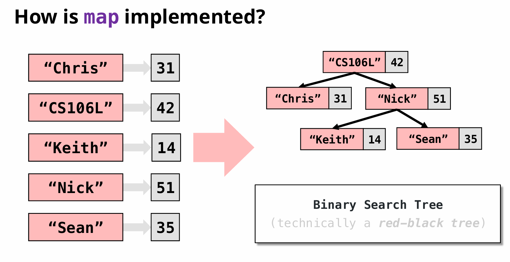

```cpp
std::map<std::string, int> wordCount;      // 字符串作为键 ✅
std::map<int, std::string> idToName;       // 整数作为键 ✅  
std::map<double, int> priceCount;          // 浮点数作为键 ✅
std::map<std::set<int>, int> setMap;       // 甚至set作为键 ✅（因为set有<运算符）
std::map<std::ifstream, int> map2; 		  //ERROR - std::ifstream has no operator <

```

#### std::set

* std::set stores a collection of unique items
* std::set is an std::map without values

| **功能描述**            | **std::set<char>**                                           |
| ----------------------- | ------------------------------------------------------------ |
| **创建一个空集合**      | `std::set<char> s;`                                          |
| **将 k 添加到集合中**   | `s.insert(k);`                                               |
| **从集合中移除 k**      | `s.erase(k);`                                                |
| **检查 k 是否在集合中** | `if (s.count(k))`  or `if (s.contains(k))` （仅限 C++20 及以上） |
| **检查集合是否为空**    | `if (s.empty())`                                             |

#### std::unordered_map and std::unordered_set

> [!NOTE]
>
> 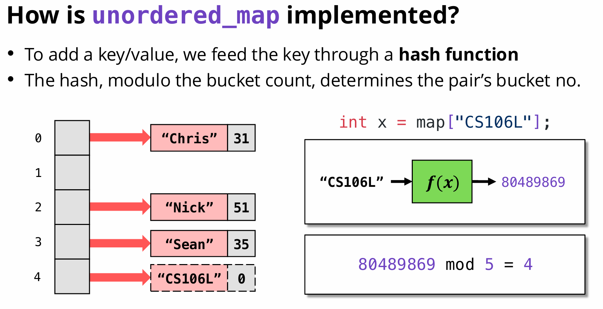
>
> std::unordered_map requires K to be hashable

* When to use unordered_map vs. map? 
  * unordered_map is usually faster than map 
  * However, it uses more memory (organized vs. disorganized garage) 
  * If your key type has no total order (operator<), use unordered_map! 
  * If you must choose, unordered_map is a safe bet

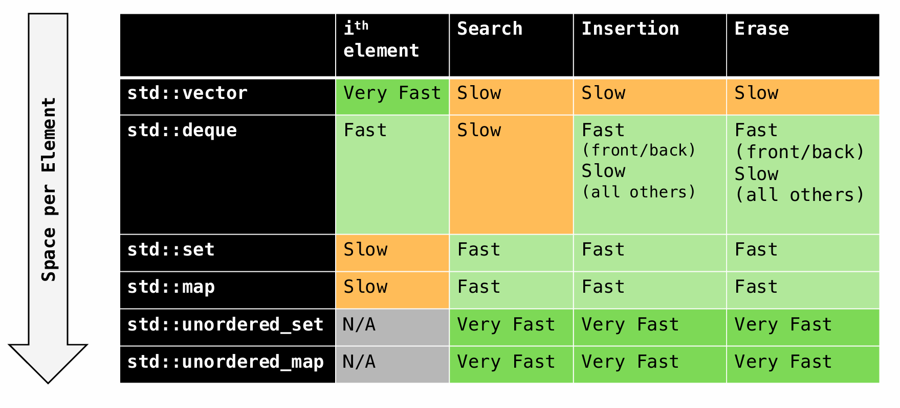


## Lecture 6: Iterators

###  Iterator Basics

* Containers and iterators work together to allow iteration

* iterator is a type alias

* ```cpp
  template <typename T>
  class vector {
  using iterator = /* some iterator type */;;
  // Implementation details...
  };
  
  ```

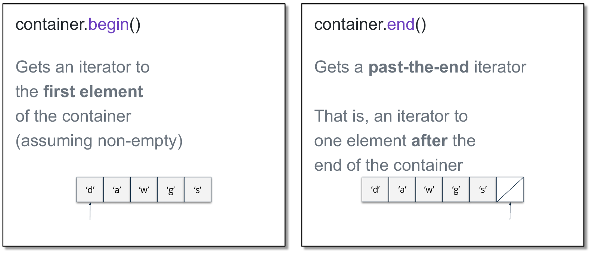

==`container.end()` 返回的确实是**指向最后一个元素之后（past-the-end）**的迭代器==

If c is empty, then  begin() and end() are  equal!

> [!NOTE]
>
> 为什么用++it，而不是it++？
>
> 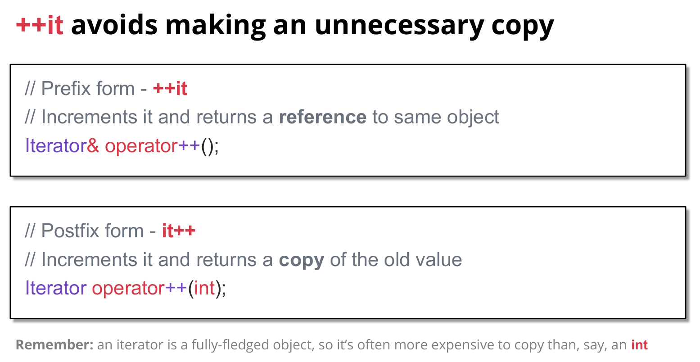

### Iterator Types

| **迭代器类型**               | **核心功能**       | **移动能力**                | **读写权限**          | **对应容器示例**                          |
| ---------------------------- | ------------------ | --------------------------- | --------------------- | ----------------------------------------- |
| **输入 (Input)**             | 读取元素           | 只能向前 (`++`)，单次通行   | 只读 (`auto e = *it`) | `std::istream_iterator`                   |
| **输出 (Output)**            | 写入元素           | 只能向前 (`++`)，单次通行   | 只写 (`*it = e`)      | `std::ostream_iterator`                   |
| **前向 (Forward)**           | 多次遍历读取/写入  | 只能向前 (`++`)             | 可读可写              | `std::forward_list`, `std::unordered_set` |
| **双向 (Bidirectional)**     | 向前或向后遍历     | 可前可后 (`++`, `--`)       | 可读可写              | `std::set`, `std::map`, `std::list`       |
| **随机访问 (Random Access)** | 像数组一样跳跃访问 | 任意移动 (`+n`, `-n`, `[]`) | 可读可写              | `std::vector`, `std::deque`, 数组         |

### Pointers and Memory

和C一样的

* An iterator points to a container element 
* A pointer points to any object
* The address of an object is the location of its lowest byte
* A pointer is the address of a variable

```cpp
std::vector<int> v {1,2,3,4,5};
int* arr = &v[0]; // Copy construction
arr += 1; // Random access
++arr; // Move pointer forward
arr += 2; // Random access
if (arr == &v[4]) // Pointer comparison
/////////////////////We could do the same thing with iterators!
```


## Lecture 7: Classes

### Classes 

Object-oriented-programming is centered around objects, focusing on design and implementation of classes! 

Classes are the user-defined types that can be declared as an  object!

> [!NOTE]
>
> THE DIFFERENCE BETWEEN CLASS & STRUCT
>
> 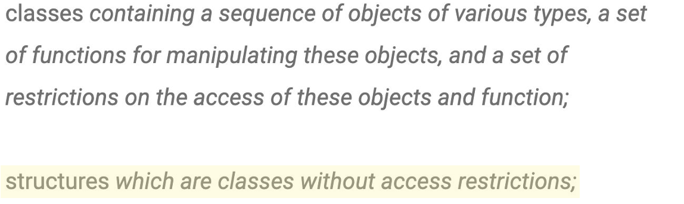
>
> Classes have public and  private sections! A user can access the  public stuff But is **restricted** from  accessing the private stuff

#### Header File (.h) vs Source Files (.cpp)

| 用途     | 头文件 (.h)                          | 源文件 (.cpp)                 |
| :------- | :----------------------------------- | :---------------------------- |
| 包含内容 | 定义接口                             | 实现类的成员函数              |
| 存放类型 | 函数原型、类声明、类型定义、宏、常量 | 函数实现、可执行代码          |
| 作用说明 | 被多个源文件共享（通过 `#include`）  | 被编译成目标文件              |
| 示例     | `void someFunction();`               | `void someFunction() { ... }` |

#### The constructor

```cpp
#include “StanfordID.h”
#include <string>
//方法1
StanfordID::StanfordID(std::string name, std::string sunet, int idNumber) {
    this->name = name;//this 是 C++ 的一个关键字，在类的成员函数（包括构造函数）中自动可用，它是一个指针，指向当前对象实例。
    this->state = state;
    this->age = age;
}

//方法2
StanfordID::StanfordID(std::string name, std::string sunet, int idNumber): 
name{name}, sunet{sunet}, idNumber{idNumber} {};//函数体可以为空

//默认构造函数（无参数），可以与上面的构造函数共存，因为可以根据input来判断到底是哪个、
// default constructor
StanfordID::StanfordID() {
    name = “John Appleseed”;
    sunet = “jappleseed”;
    idNumber = 00000001;
}
```

#### The destructor

基本特点：

1. **类名前加波浪号**：`~类名()`
2. **没有参数和返回类型**：不能重载（一个类只能有一个析构函数）
3. **自动调用**：对象生命周期结束时自动执行
4. **不能被显式调用**（除了通过`delete`）

```cpp
class StanfordID {
    // ... 其他成员 ...
public:
    ~StanfordID();  // 析构函数声明
};

// 析构函数实现
StanfordID::~StanfordID() {
    // 清理代码
    std::cout << "StanfordID对象被销毁: " << name << std::endl;
}
```


### Inheritance

* Dynamic Polymorphism: Different types of objects may need  the same interface 
* Extensibility: Inheritance allows you to extend a class by  creating a subclass with specific properties

```cpp
class Shape {
public:
    	virtual double area() const = 0;//纯虚函数：在基类中声明但不定义（不实例化），必须在派生类中重写（覆盖）的函数。
};

class Circle : public Shape {
public:
    // constructor
    Circle(double radius): _radius{radius} {};
    double area() const {
   		return 3.14 * _radius * _radius;//Here we are overwriting the base class function area() for a circle
    }
private:
    double _radius;
};
```

#### Types of intance

| 继承类型          | 语法示例                | 基类public成员变为         | 基类protected成员变为    | 基类private成员 |
| :---------------- | :---------------------- | :------------------------- | :----------------------- | :-------------- |
| **public继承**    | `class B : public A`    | **public** (保持公有)      | **protected** (保持保护) | **不可访问**    |
| **protected继承** | `class B : protected A` | **protected** (降级为保护) | **protected** (保持保护) | **不可访问**    |
| **private继承**   | `class B : private A`   | **private** (降级为私有)   | **private** (降级为私有) | **不可访问**    |

#### The Diamond Problem

* **Virtual inheritance** means that a derived class, in this case D, should only have  a single instance of base classes, in this case A.

| 特性             | 普通继承                   | 虚继承                       |
| :--------------- | :------------------------- | :--------------------------- |
| **基类副本数**   | 每个派生类有自己的基类副本 | 共享同一个基类副本           |
| **内存布局**     | 基类数据直接嵌入派生类     | 通过指针间接访问共享基类     |
| **菱形继承**     | 产生多个基类副本，导致歧义 | 只有一个基类副本，避免歧义   |
| **语法**         | `class B : public A`       | `class B : virtual public A` |
| **构造函数调用** | 由直接派生类调用           | 由最底层派生类直接调用       |
| **性能**         | 访问快（直接）             | 访问稍慢（间接指针）         |
| **使用频率**     | 非常常见（90%+）           | 较少，特定场景使用           |

```cpp
#include <iostream>
using namespace std;

class A {
public:
    A() { cout << "A构造" << endl; }
};

class B : virtual public A {
public:
    B() { cout << "B构造" << endl; }
};

class C : virtual public A {
public:
    C() { cout << "C构造" << endl; }
};

class D : public B, public C {
public:
    D() { cout << "D构造" << endl; }
};

int main() {
    D d;
    // 输出顺序：
    // A构造  ← D直接调用A的构造函数
    // B构造
    // C构造
    // D构造
    return 0;
}


//reason
// 1. 虚基类A（最优先）
A::A()  // 输出"A构造"

// 2. 非虚基类（按声明顺序）
B::B()  // 输出"B构造"
C::C()  // 输出"C构造"

// 3. D自己的构造函数体
D::D()  // 输出"D构造"

// 最终输出：A构造 B构造 C构造 D构造
```

## Lecture 8: Inheritance

### Access modifiers

* By default, classes are inherited privately.
* **`protected` 成员** 对 **子类可见**，但对类外部不可见。
  - 介于 `private`（仅自己可见）和 `public`（全部可见）之间

```cpp
class Entity {
protected:              // ← 保护成员
    double x, y, z;     // 坐标
    HitBox hitbox;      // 碰撞框

public:
    void update();
    // 注意：这里写了一句“We need to mark them protected inside Entity”
    // 意思是：要把 x, y, z 等标记为 protected，才能被子类访问
};

class Projectile : public Entity { // 继承 Entity
private:
    double vx, vy, vz;

public:
    void move() {
        x += vx; // ✅ 可以访问，因为 x 在 Entity 中是 protected
        y += vy;
        z += vz;
    }
};
```

### Object Slicing

```cpp
int main() {
    Player player;
    Tree tree;
    Projectile proj;
    
	std::vector<Entity*> entities { Player(), Tree(), Projectile()};//当将派生类对象赋值给基类对象时，会发生“切片”——派生类特有的部分被切掉，只保留基类的部分。
	while (true) {
        std::cout << "Rendering frame..." << std::endl;
		for (auto& entity : entities) {
			entity->update();//切片后，object的函数丢失
			entity->render();
		}
	}
    return 0;    
} 
```

### Virtual Functions

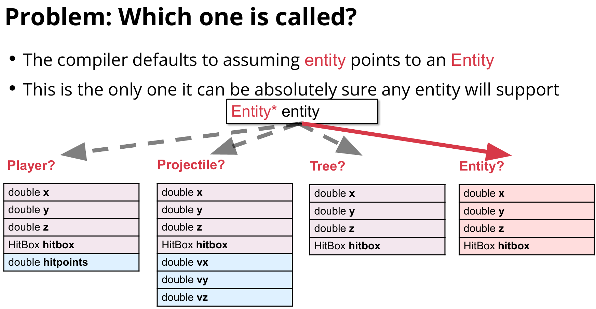

```cpp
int main() {
    Player player;
    Tree tree;
    Projectile proj;
    
	std::vector<Entity*> entities { &player, &tree, &proj };//Using Entity* comes at a cost:We “forget” which type the object actually is
	while (true) {
        std::cout << "Rendering frame..." << std::endl;
		for (auto& entity : entities) {
			entity->update();
			entity->render();
		}
	}
    return 0;    
} 
```

> [!NOTE]
>
> Notice: there is a difference between the compile-time vs. runtime  type of the object! 
>
> * At compile time, it is treated as an Entity 
> * At runtime, it could be an Entity or any subclass, e.g. Projectile, Player, etc
>
> What we need is dynamic dispatch :
>
> ​	Depending on the runtime (dynamic) type of the object, a different  method should be called (dispatched)

```cpp
//错误案例
class Entity {
protected:
    double x, y, z;
    HitBox hitbox;
public:
    void update() {};
    void render() {};
};

class Player : public Entity {
    double hitpoints = 100;
public:
    void damage(double hp) {
        hitpoints -= hp;
    }
    
    void update() {
        std::cout << "Updating Player!" << std::endl;
    }

    void render() {
        std::cout << "Rendering Player!" << std::endl;
    }
};

//正确案例
class Entity {
protected:
    double x, y, z;
    HitBox hitbox;
public:
    virtual void update() {};
    virtual void render() {};
};

class Player : public Entity {
    double hitpoints = 100;
public:
    void damage(double hp) {
        hitpoints -= hp;
    }
    
    void update() override {
        std::cout << "Updating Player!" << std::endl;
    }

    void render() override {
        std::cout << "Rendering Player!" << std::endl;
    }
};

```

* Marking a function as virtual enables dynamic dispatch, subclasses can override this method

* Behind the sence

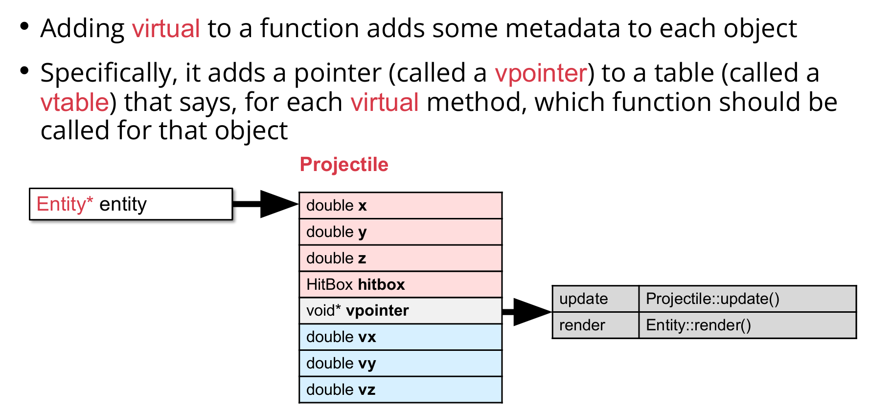

* virtual function's cons:
  * In C++, you have to opt in because they are more expensive 
  * Increased size of memory layout of the class 
  * Takes longer to look up `vtable` and call the method

#### Pure virtual functions

```cpp
class Entity {
public:
    virtual void update() = 0;//Mark a virtual function as pure virtual by adding = 0; instead of an implementation! 
    virtual void render() = 0;
};
```

A class with **one or more** pure virtual functions is an abstract class, **it can’t  be instantiated!** 

Overriding all of the pure virtual functions makes the class concrete!

```
class Entity {
public:
	virtual void update() = 0;
	virtual void render() = 0;
};
Entity e; 
// ❌ Entity is abstract!
class Projectile : public Entity { 
public:
	void update() override {};
	void render() override {};
};
Projectile p; 
// ✅ Projectile is concrete
```


## Lecture 9:  Template Classes

### Template Classes 

#### Template Instantiation

```cpp
Vector<int> intVec;
Vector<double> doubleVec;
Vector<std::string> strVec;
Vector<Vector<int>> vecVec;
struct MyCustomType {};
Vector<MyCustomType> structVec;
```

| 语言 | 是否需要带 `struct`        | 示例                       |
| :--- | :------------------------- | :------------------------- |
| C    | **必须带**（除非 typedef） | `struct MyCustomType obj;` |
| C++  | **不需要带**               | `MyCustomType obj;`        |

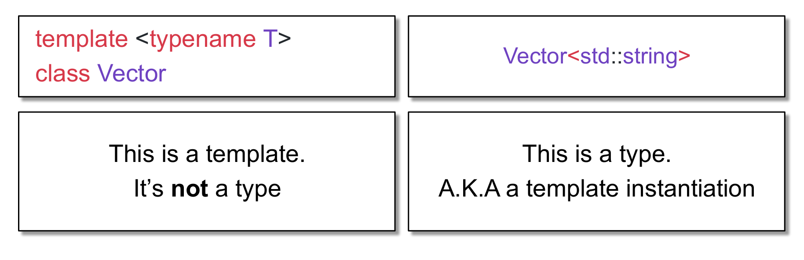

#### Non-type Template Parameters

* 非类型参数必须是编译时就能确定的常量

```cpp
//具体使用？
template <size_t N>
class SizeTemplate {};
SizeTemplate<5> s;

template <bool B>
class BoolTemplate {};
BoolTemplate<true> b;

template<typename T, std::size_t N> 
struct std::array { /* ... */ };
// An array of exactly 5 strings
std::array<std::string, 5> arr;
```

| 特性         | `std::array`               | `std::vector`             |
| :----------- | :------------------------- | :------------------------ |
| **内存位置** | 栈上（或作为对象成员内联） | 堆上（数据指针指向堆）    |
| **内存分配** | 无额外分配                 | 需要堆分配（可能多次）    |
| **大小**     | 编译期固定 (`N`)           | 运行时可变                |
| **开销**     | 极小（只有数据本身）       | 有指针+大小+容量等开销    |
| **确定性**   | 确定性强，无分配失败风险   | 可能分配失败（bad_alloc） |

#### A few template quirks

1. Must copy template <…> syntax in .cpp

   1. ```cpp
      #include "Vector.h"
      
      // 构造函数实现
      template <typename T>
      Vector<T>::Vector(size_t n) : data(new T[n]), size(n) {}
      
      // at() 函数实现
      template <typename T>//这个不能少， T 是 type
      T& Vector<T>::at(size_t i) {
          if (i >= size) {
              throw std::out_of_range("Index out of range");
          }
          return data[i];
      }
      ```

2.  .h must include .cpp at bottom of file

   1. For non-template classes, the .cpp file includes the .h file 

   2. ```cpp
      // StrVector.cpp
      #include "StrVector.h"
      string& StrVector::at(size_t i) 
      {
      // Implementation...
      }
      ```

   3. For template classes, the .h file includes the .cpp file

   4. ```cpp
      template <typename T>
      class Vector {
      public:
      T& at(size_t i);
      };
      #include "Vector.cpp"
      ```

3.  typename is the same as class

   1. ```cpp
      // All of the following are identical:
      template <typename K, typename V>
      struct pair;
      
      template <class K, typename V>
      struct pair;
      
      template <class K, class V>
      struct pair;
      
      template <class K, typename V>
      struct pair;
      ```

### Const Correctness

> [!NOTE]
>
> * Make sure to also add  const  to the implementation, or the  compiler will scream ！
>
> * ```cpp
>   template<class T> 
>   class Vector {
>   public:
>       size_t size();
>       bool empty();
>       T& operator[] (size_t index); 
>       T& at(size_t index);
>       void push_back(const T& elem);
>   };
>                                               
>   ```
>
>   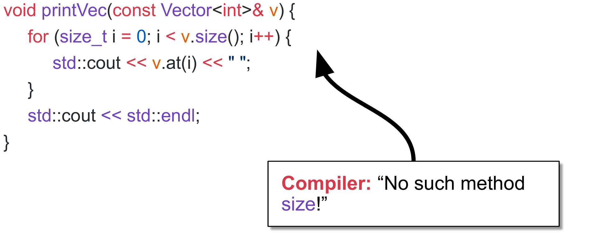


```cpp
class Vector {
public:
    // 非const成员函数
    void modify() {
        this->size_ = 10;  // ✅ this 是 Vector*，可以修改
    }
    
    // const成员函数
    size_t getSize() const {
        // this->size_ = 10;  // ❌ this 是 const Vector*，不能修改
        return this->size_;  // ✅ 只能读取
    }
};
```

#### Const interface

* Objects marked as const can only make use of the const interface 
* The const interface are the functions that are const in an object

```cpp
class Vector {
public:
    void modify();      // 非const方法
    void read() const;  // const方法
};

const Vector cv;        // const对象

cv.read();    // ✅ 可以调用const方法
// cv.modify(); // ❌ 错误！不能调用非const方法
```

#### Const overloading

一个类里面写两种方法：const方法返回const值，给const变量用；non-const方法返回non-const值，给non-const变量用。

```cpp
template<class T> 
class Vector {
public:
    T& at(size_t index);
    const T& at(size_t index) const;
    T& findElement(const T& value);
    const T& findElement(const T& value) const;
};

Vector<int> vec;              // 非const对象
const Vector<int>& cref = vec; // const引用

// 情况1：非const对象调用
vec.at(0) = 10;              // ✅ 调用版本1：T& at(size_t)
// 可以修改返回值

// 情况2：const对象调用
int value = cref.at(0);       // ✅ 调用版本2：const T& at(size_t) const
// cref.at(0) = 10;          // ❌ 错误！返回const引用，不能修改
```

#### Casting

* Casting: the process of converting one type to another
* const_cast allows us to “cast away” the const-ness of a variable

```cpp
// 1. 先实现 const 版本（核心逻辑放在这里）
template <typename T>
const T& Vector<T>::findElement(const T& value) const {
    for (size_t i = 0; i < logical_size; i++) {
        if (elems[i] == value) { // 修正了变量名
            return elems[i];
        }
    }
    throw std::out_of_range("Element not found");
}

// 2. 非 const 版本调用 const 版本
template <typename T>
T& Vector<T>::findElement(const T& value) {
    // 第一步：给 *this 加上 const 属性，以便调用上面的 const 版本
    // 第二步：将返回的 const T& 强制转回 T&
    return const_cast<T&>(
        static_cast<const Vector<T>&>(*this).findElement(value)
    );
}
```

| **步骤**                                    | **操作**         | **目的**                                                     |
| ------------------------------------------- | ---------------- | ------------------------------------------------------------ |
| **`static_cast<const Vector<T>&>(\*this)`** | 显式增加 `const` | 确保编译器调用的是 `const` 版本的 `findElement`，而不是递归调用自己（会导致死循环）。 |
| **`.findElement(value)`**                   | 调用逻辑         | 执行实际的查找逻辑。                                         |
| **`const_cast<T&>(...)`**                   | 移除 `const`     | 因为我们现在处于非 `const` 函数中，返回 `T&` 是合法的。      |

*  ==Just about never using const_cast!==

 #### The ==mutable== keyword

```cpp
struct MutableStruct {
    int dontTouchThis;
    mutable double iCanChange;
};
const MutableStruct cm;
// cm.dontTouchThis = 42; // ❌ Not allowed, cm is const
cm.iCanChange = 3.14; // ✅ Ok, iCanChange is mutable
```

## Lecture 10: Template Functions

### Template Functions

* Key Idea: Templates automate code generation

  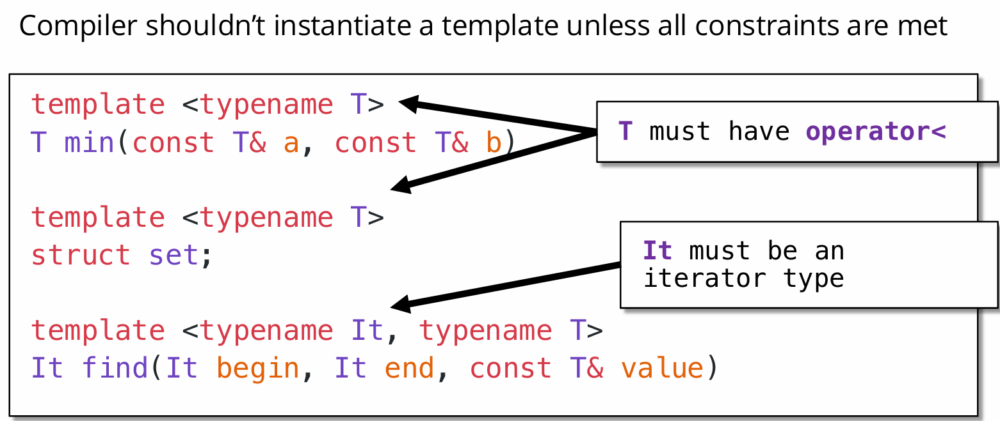

### Concept

* concept: a named set of  constraints

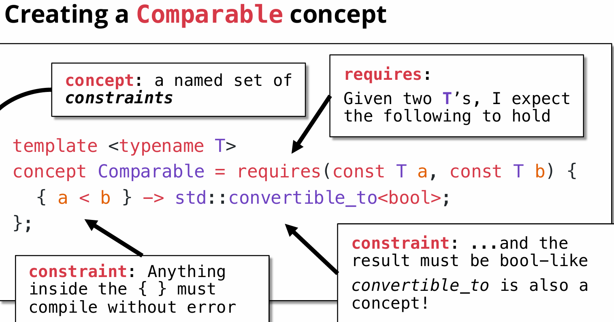

`static_assert(Comparable<int>);     // 编译成功：int原生支持<比较`

#### built-in concepts

|name| analysis |
| ------------------------------------------------------------ | ------------------------------------------------------------ |
| [same_as](https://en.cppreference.com/w/cpp/concepts/same_as.html)(C++20) | specifies that a type is the same as another type (concept)  |
| [derived_from](https://en.cppreference.com/w/cpp/concepts/derived_from.html)(C++20) | specifies that a type is derived from another type (concept) |
| [convertible_to](https://en.cppreference.com/w/cpp/concepts/convertible_to.html)(C++20) | specifies that a type is implicitly convertible to another type (concept) |
| [common_reference_with](https://en.cppreference.com/w/cpp/concepts/common_reference_with.html)(C++20) | specifies that two types share a common reference type (concept) |
| [common_with](https://en.cppreference.com/w/cpp/concepts/common_with.html)(C++20) | specifies that two types share a common type (concept)       |
| [integral](https://en.cppreference.com/w/cpp/concepts/integral.html)(C++20) | specifies that a type is an integral type (concept)          |
| [signed_integral](https://en.cppreference.com/w/cpp/concepts/signed_integral.html)(C++20) | specifies that a type is an integral type that is signed (concept) |
| [unsigned_integral](https://en.cppreference.com/w/cpp/concepts/unsigned_integral.html)(C++20) | specifies that a type is an integral type that is unsigned (concept) |
| [floating_point](https://en.cppreference.com/w/cpp/concepts/floating_point.html)(C++20) | specifies that a type is a floating-point type (concept)     |
| [assignable_from](https://en.cppreference.com/w/cpp/concepts/assignable_from.html)(C++20) | specifies that a type is assignable from another type (concept) |
| [swappableswappable_with](https://en.cppreference.com/w/cpp/concepts/swappable.html)(C++20) | specifies that a type can be swapped or that two types can be swapped with each other (concept) |

#### Iterator concepts

| [input_iterator](https://en.cppreference.com/w/cpp/iterator/input_iterator.html)(C++20) | specifies that a type is an input iterator, that is, its referenced values can be read and it can be both pre- and post-incremented (concept) |
| ------------------------------------------------------------ | ------------------------------------------------------------ |
| [output_iterator](https://en.cppreference.com/w/cpp/iterator/output_iterator.html)(C++20) | specifies that a type is an output iterator for a given value type, that is, values of that type can be written to it and it can be both pre- and post-incremented (concept) |
| [forward_iterator](https://en.cppreference.com/w/cpp/iterator/forward_iterator.html)(C++20) | specifies that an [`input_iterator`](https://en.cppreference.com/w/cpp/iterator/input_iterator.html) is a forward iterator, supporting equality comparison and multi-pass (concept) |
| [bidirectional_iterator](https://en.cppreference.com/w/cpp/iterator/bidirectional_iterator.html)(C++20) | specifies that a [`forward_iterator`](https://en.cppreference.com/w/cpp/iterator/forward_iterator.html) is a bidirectional iterator, supporting movement backwards (concept) |
| [random_access_iterator](https://en.cppreference.com/w/cpp/iterator/random_access_iterator.html)(C++20) | specifies that a [`bidirectional_iterator`](https://en.cppreference.com/w/cpp/iterator/bidirectional_iterator.html) is a random-access iterator, supporting advancement in constant time and subscripting (concept) |
| [contiguous_iterator](https://en.cppreference.com/w/cpp/iterator/contiguous_iterator.html)(C++20) | specifies that a [`random_access_iterator`](https://en.cppreference.com/w/cpp/iterator/random_access_iterator.html) is a contiguous iterator, referring to elements that are contiguous in memory (concept) |

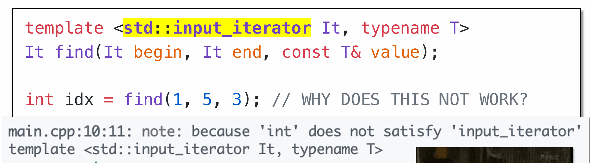

### Variadic Templates


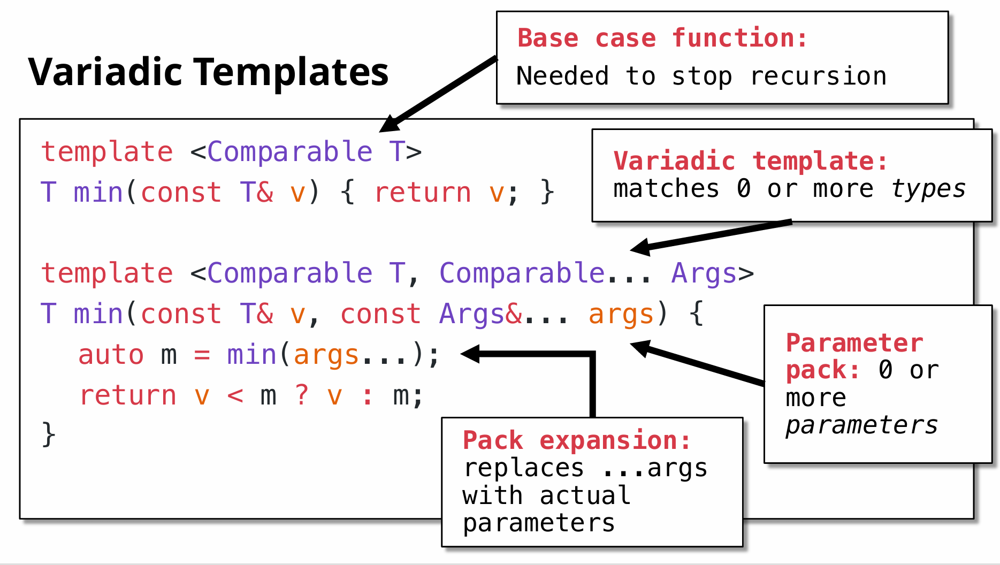

* Variadic types don’t have to be the same
  * format("Queen {}, Protector of the {} Kingdoms", "Rhaenyra", 7); 
  * The {}’s get filled in with arbitrary number/type of arguments

```cpp
void format(const std::string& fmt) {
	std::cout << fmt << std::endl;
}


template <typename T, typename... Args>
void format(const std::string& fmt, T value, Args... args) {//T value：这是参数包中的第一个参数，Args... args：这是剩余的参数包
    auto pos = fmt.find("{}");
    if (pos == std::string::npos) throw std::runtime_error("Extra arg");
    std::cout << fmt.substr(0, pos);
    std::cout << value;
    format(fmt.substr(pos + 2), args...);
}

```

#### Advantage of variadic templates

*  Compiler generates any number of overloads using recursion 
  * This allows us to support any number of function parameters 
* Instantiation happens at compile time

### Template Metaprogramming(TMP)

* TMP is Turing complete
* enum: a way to store a  compile-time constant

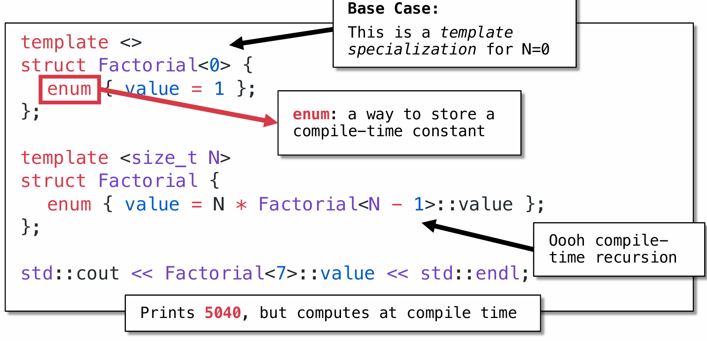

#### `constexpr` & `consteval`

**`constexpr`**

- **"请在编译时尽量运行我"**
- 函数**可能**在编译时执行，也可能在运行时执行
- 编译器根据调用上下文决定

**`consteval`**

- **"必须在编译时运行我！"**
- 函数**只能**在编译时执行
- 产生立即函数（immediate functions）

```cpp
constexpr size_t factorial(size_t n) {
    if (n == 0) return 1;
    return n * factorial(n - 1);
}

// 用法：
constexpr size_t result1 = factorial(5);  // 编译时计算
size_t n = 10;
size_t result2 = factorial(n);            // 运行时计算（如果n不是编译时常量）


consteval size_t factorial(size_t n) {
    if (n == 0) return 1;
    return n * factorial(n - 1);
}

// 用法：
constexpr size_t result1 = factorial(5);  // ✅ 编译时计算
size_t n = 10;
size_t result2 = factorial(n);            // ❌ 编译错误！n不是编译时常量
```

**性能优势**：

- 编译时计算 → 零运行时开销
- 错误在编译期发现 → 更安全

#### When should I use templates? 

* I want the compiler to automate a repetitive coding task 
* I want better error messages
* I don’t want to wait until runtime 
  * Template metaprogramming, constexpr/consteval

## Lecture 11： Functions and Lambdas

### Functions and Lambdas 

* Definition: A predicate is a boolean-valued function
* Pred is a function pointer
* 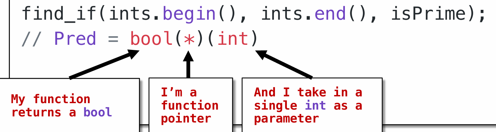


#### lambda基本语法格式
```cpp
auto lambda = [捕获列表](参数列表) -> 返回类型 {
    函数体
    return 表达式;
};
```

**`[=]`** - 所有外部变量按值捕获
```cpp
int a = 1, b = 2, c = 3;
auto lambda = [=]() {
    // a, b, c 都被按值捕获
    return a + b + c;  // 输出 6
};
a = 100;
cout << lambda();  // 仍然输出 6
```

**`[=, &x]`** - 默认按值，x 按引用
```cpp
int x = 1, y = 2, z = 3;
auto lambda = [=, &x]() {
    x = 100;      // 可以修改，会影响外部 x
    // y = 200;   // 错误：y 是按值捕获，不能修改
    return x + y + z;
};
```

**`[&, x]`** - 默认按引用，x 按值
```cpp
int x = 1, y = 2, z = 3;
auto lambda = [&, x]() {
    y = 20;  // 可以修改外部 y
    z = 30;
    // x = 100;  // 错误：x 是按值捕获
    return x + y + z;
};
```


| 捕获方式     | 语法      | 特点                       | 注意事项                     |
| ------------ | --------- | -------------------------- | ---------------------------- |
| 值捕获       | `[x]`     | 复制值，内部修改不影响外部 | 默认不可修改（需加 mutable） |
| 引用捕获     | `[&x]`    | 捕获引用，内部修改影响外部 | 注意生命周期                 |
| 隐式值捕获   | `[=]`     | 所有变量按值捕获           | 可能导致不必要的复制         |
| 隐式引用捕获 | `[&]`     | 所有变量按引用捕获         | 风险高，需谨慎使用           |
| 混合捕获     | `[=, &x]` | 灵活组合                   | 显式指定的优先级更高         |

### Functors

* Definition: A functor is any object that defines an operator()

```cpp
template <typename T>
struct std::greater {
    bool operator()(const T& a, const T& b) const {
    	return a > b;
    }
};

std::greater<int> g;
g(1, 2); // false

```

```cpp
struct my_functor {
    bool operator()(int a) const {
    	return a * value;
    }
    int value;
};
my_functor f;
f.value = 5;
f(10); // 50

```

* When you use a lambda, a functor type is generated

### Algorithms

* <algorithm>  is a collection of template functions
* <algorithm> functions operate on iterators

#### 算法的“三板斧”

所有的 STL 算法几乎都遵循同一种工作模式。理解了这三点，你就掌握了算法的精髓：

##### A. 它们是“外来务工人员”

算法不是容器的成员函数。例如，排序一个 vector，你不是调用 `myVector.sort()`（那是成员函数），而是调用 `std::sort(start, end)`。

- **好处：** 一套 `sort` 代码，可以用在各种不同的容器上。

##### B. 它们靠迭代器生存

算法永远通过**区间**来工作，通常表现为两个迭代器：`[first, last)`。

- `first`：指向你要处理的第一个元素。
- `last`：指向你处理的最后一个元素的**下一个位置**（数学上的左闭右开区间）。

##### C. 它们不改变容器的大小

这是一个新手极易踩坑的点：**STL 算法本身永远不会直接增加或减少容器的容量。**

- 比如 `std::unique`（去重）或 `std::remove`，它们只是把元素往前挪，然后返回一个新的结尾位置。如果你真想删掉多余的元素，你得配合容器的 `erase` 方法。

### Ranges and Views

#### Ranges

* Ranges are a new version of the STL
* Definition: A range is anything with a begin and end

```cpp
int main() {
    std::vector<char> v = {'a', 'b', 'c', 'd', 'e’};
    auto it = std::find(v.begin(), v.end(), 'c');
}
    
//equal to
    
int main() {
	std::vector<char> v = {'a', 'b', 'c', 'd', 'e’};
	auto it = std::ranges::find(v, 'c');
}
```

* Ranges use concepts!

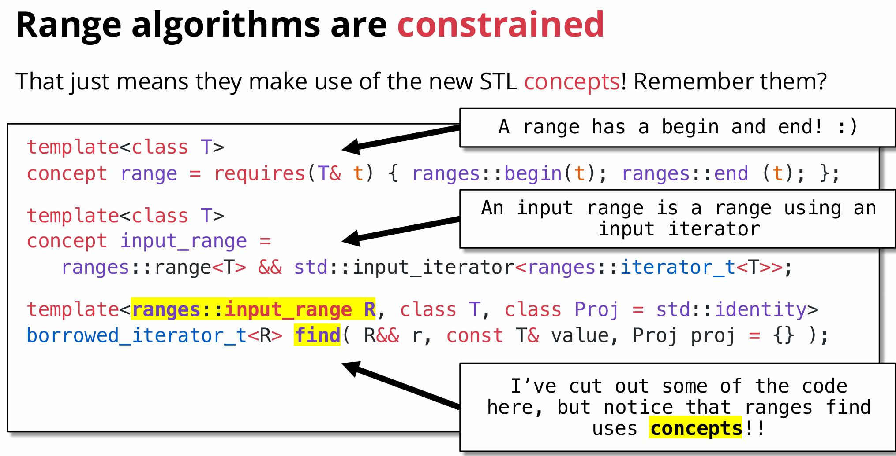

#### Views

* Definition: A view is a range that lazily adapts another range

```cpp
//Method 1: Filter and transform in the old STL
std::vector<char> v = {'a', 'b', 'c', 'd', 'e'};
// Filter -- Get only the vowels
std::vector<char> f;
std::copy_if(v.begin(), v.end(), std::back_inserter(f), isVowel);
// { 'A', 'E' }
// Transform -- Convert to uppercase
std::vector<char> t;
std::transform(f.begin(), f.end(), std::back_inserter(t), toupper);

//Method 2: Use views
//Views are composable
std::vector<char> letters = {'a', 'b', 'c', 'd', 'e’};
auto f = std::ranges::views::filter(letters, isVowel);
// f is a view! It takes an underlying range letters 
// and yields a new range with only vowels!
auto t = std::ranges::views::transform(f, toupper);
// t is a view! It takes an underlying range f 
// and yields a new range with uppercase chars!
auto vowelUpper = std::ranges::to<std::vector<char>>(t);
// Here we materialize the view into a vector! 
// Nothing actually happens until this line!
                             
                             
//Method 3: We can chain views together use operator|
std::vector<char> letters = {'a','b','c','d','e'};
std::vector<char> upperVowel = letters
| std::ranges::views::filter(isVowel)
| std::ranges::views::transform(toupper)
| std::ranges::to<std::vector<char>>();
```

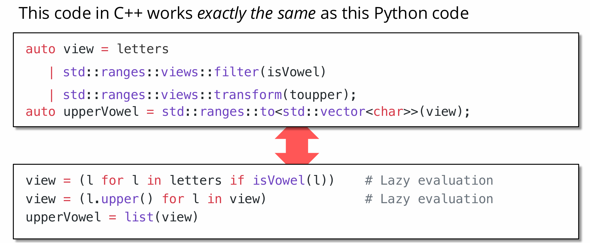

## Lecture 12: Operator Overloading

### Most operators can be overloaded

* What operators can’t be overloaded?
  * Scope Resolution  
  * Ternary  
  * Member Access
  * Pointer-to-member access
  * Object size, type, and casting
  * 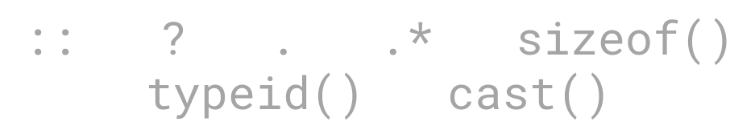

### Operator Overloading Syntax

* Member overloading :Declares the overloaded operator within the scope of your class

```cpp
return_type operator<symbol>(parameter_list);
```

```cpp
#include<StanfordID.h>
bool StanfordID::operator<(const StanfordID& other) const {
    return idNumber < other.idNumber;
}
```

### Non-member overloading(more preferred)

#### syntax

​	a.Declare the overloaded operator outside of class definitions 

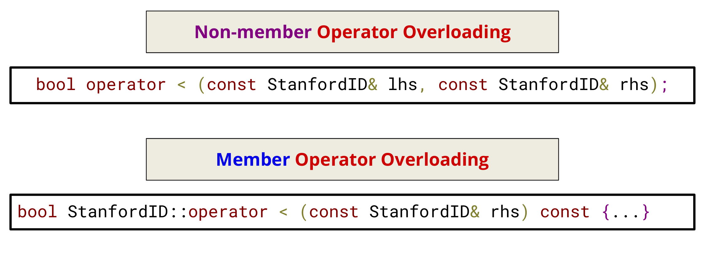

#### Advantages

1. Allows for the left-hand-side to be a non-class type

   1. ```cpp
      bool operator<(int lhs, const StanfordID& rhs) {
          return lhs < rhs.getIDNumber();
      }
      ```

2. Allows us to overload operators with classes we don’t own 

   1. We could define an operator to compare a StanfordID to other  custom classes you define.

### the ==friend== keyword

* The friend keyword allows non-member functions or classes to access private  information in another class
* case 1:

```cpp
class StanfordID {
private:
    int idNumber;
    
public:
    StanfordID(int id) : idNumber(id) {}
    
    // 声明友元函数
    friend bool operator<(int lhs, const StanfordID& rhs);
};

// 实现友元函数（可以访问私有成员 idNumber）
bool operator<(int lhs, const StanfordID& rhs) {
    return lhs < rhs.idNumber;  // 可以直接访问私有成员！
}
```
* case 2:

```cpp
class Student {
private:
    int studentID;
    friend class Registrar;  // 允许 Registrar 访问私有成员
};

class Registrar {
public:
    void updateID(Student& s, int newID) {
        s.studentID = newID;  // 可以访问 Student 的私有成员
    }
};
```

### the rule of contrariety

* There are some good practices like the rule of contrariety 
* For example when you define the operator== use the rule of contrariety to  define operator!=

```cpp
bool StanfordID::operator==(const StanfordID& other) const {
	return (name == other.name) && (sunet == other.sunet) && 
	(idNumber == other.idNumber);
}
bool StanfordID::operator!=(const StanfordID& other) const {
	return !(*this == other);
}
```


## Lecture 13: Special Member Functions

### The Special 6 SMFs

* Default constructor: T()  //Takes no parameters and  creates a new object
* Destructor: ~T() //Called when the object goes  out of scope
* Copy constructor: T(const T&) //Creates a  new object as a  member-wise copy of  another
* Copy assignment operator: T& operator=(const T&) //Assigns an  already existing  object to another
* Move constructor: T(T&&) 
* Move assignment operator: T& operator=(T&&)

```cpp
template <typename T>
class MyClass {
    const int _constant;
    int& _reference;
public:
    // Only way to initialize const and reference members
    MyClass(int value, int& ref) : _constant(value), 
_reference(ref) { }
};


class MyClass {
private:
    const int _constant;  // const成员
    int& reference;       // 引用成员
public:
    // ❌ 错误写法：在构造函数体内"赋值"
    MyClass(int value, int& ref) {
        _constant = value;  // 错误！const不能赋值
        reference = ref;    // 错误！引用必须在初始化时绑定
    }
};
```
### Copy and copy assignment

> [!NOTE]
>
> Deep copy: an object that is a complete, independent copy of the original
>
> 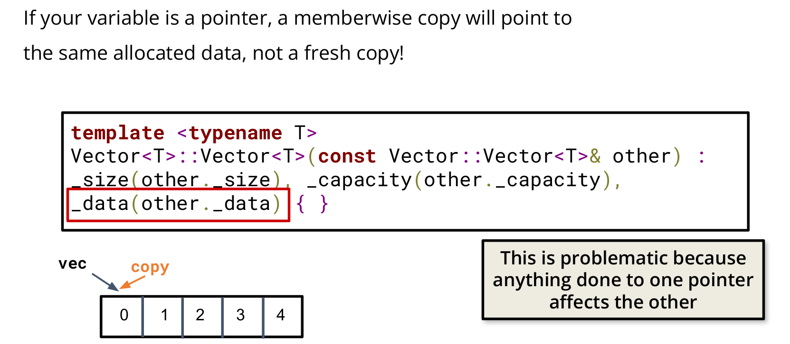
>
> 

### delete

```cpp
// 明确禁用拷贝
PasswordManager(const PasswordManager&) = delete;
PasswordManager& operator=(const PasswordManager&) = delete;
```

* We can selectively allow functionality of special member functions!

### Rule of Zero

* **如果默认的特殊成员函数（SMFs）能用，就不要自己定义！**

* ```cpp
  class a_string_with_an_id {  // 类名：带ID的字符串
  public:
      // getter 和 setter 方法（这里省略了具体实现）
      
  private:
      int id;          // 整型ID
      std::string str; // 字符串成员
  };
  
  a_string_with_an_id object;  // 创建该类的对象
  ```

* 因为两个成员都是**自管理**的：

  - `int id`：基础类型，按值拷贝

  - `std::string str`：标准库类，**已经完美实现了所有特殊成员函数**

  - **编译器会生成正确的默认行为**:
  - 当你写这样的代码时：
  
    ```cpp
    a_string_with_an_id obj1;
    a_string_with_an_id obj2 = obj1;  // 拷贝构造
    ```
  
    编译器生成的拷贝构造函数相当于：
  
    ```cpp
    // 伪代码：编译器生成的拷贝构造函数
    a_string_with_an_id(const a_string_with_an_id& other) 
        : id(other.id),            // 复制int值
          str(other.str) { }       // 调用std::string的拷贝构造函数（深拷贝！）
    ```

### Rule of Three

* **如果你需要自定义析构函数，那么你可能也需要自定义拷贝构造函数和拷贝赋值运算符**

* ```cpp
  class String {
  private:
      char* data;
      size_t size;
      
  public:
      // 1. 自定义构造函数（分配内存）
      String(const char* str) {
          size = strlen(str);
          data = new char[size + 1];
          strcpy(data, str);
      }
      
      // 2. 必须自定义析构函数（释放内存）
      ~String() {
          delete[] data;  // ← 这就是为什么需要Rule of Three
      }
      
      // 3. 必须自定义拷贝构造函数（深拷贝）
      String(const String& other) {
          size = other.size;
          data = new char[size + 1];
          strcpy(data, other.data);
      }
      
      // 4. 必须自定义拷贝赋值运算符
      String& operator=(const String& other) {
          if (this != &other) {  // 防止自赋值
              delete[] data;      // 释放原有内存
              size = other.size;
              data = new char[size + 1];
              strcpy(data, other.data);
          }
          return *this;
      }
  };
  ```

### Rule of Five (optional)

* If we defined copy constructor/assignment and destructor, we  should also define move constructor/assignment 
* This is not required, but our code will be slower as it involves  unnecessary copying

## Lecture 14: Move Semantics

### **Return Value Optimization(RVO)**

**没有RVO时的正常流程：**

```cpp
Photo takePhoto() {
    Photo p;          // 1. 在函数内创建对象
    return p;         // 2. 返回时会调用拷贝构造函数
}

Photo selfie = takePhoto();
// 3. 临时返回对象会被析构
```

**实际有RVO时：**

```cpp
Photo takePhoto() {
    // 编译器直接在selfie的内存位置创建对象
    // 跳过了拷贝构造函数和临时对象的析构
}

Photo selfie = takePhoto();
// 只需要一次构造，没有拷贝
```

- 没有RVO时：函数返回的确实是**临时对象**
- 这个临时对象在表达式结束后就被销毁

### Move vs. Copy Semantics

```cpp
Photo selfie = pic;
// make copies of persistent objects (e.g. variables)
// that might get used in the future
Photo selfie = takePhoto();
// move temporary objects (e.g return values)
// since we no longer need to use them
```

### lvalues & rvalues

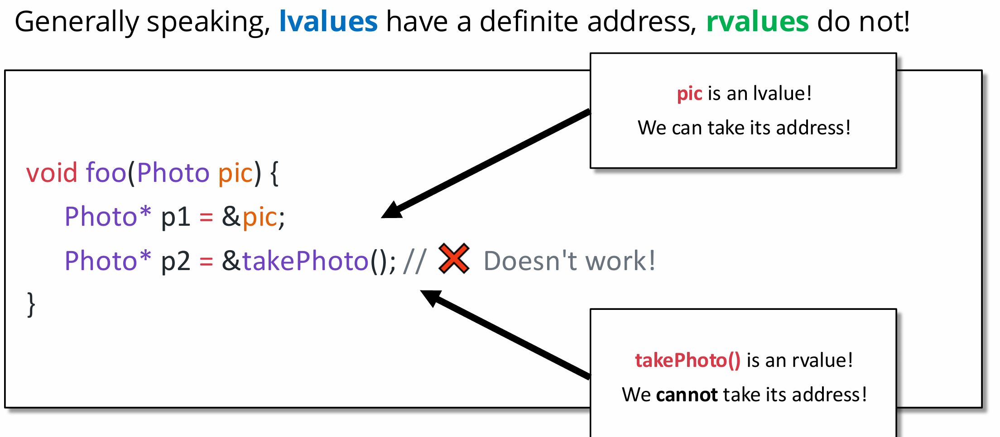

* An l-value’s lifetime is until the end of scope 

* An r-value’s lifetime is until the end of line

> [!NOTE]
>
> **`&`**：左值引用（只能绑定到左值）
> **`&&`**：右值引用（只能绑定到右值）
>
> 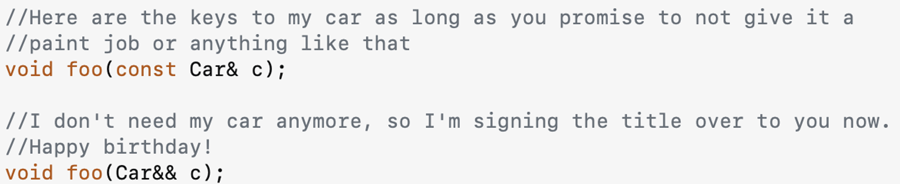

```cpp
Type::(Type&& other)//Move constructor
Type& Type::operator=(Type&& other)//Move assignment operator
```

### std::move

* std::move just type casts an l-value to an r-value
*  Try to avoid explicitly using std::move unless you have good reason! 
*  E.g. performance really matters, you know for sure the object won’t be used
* 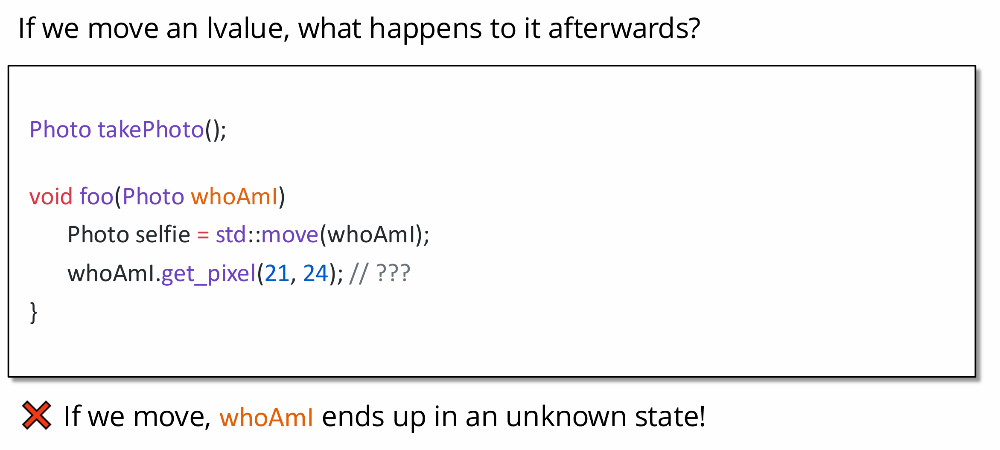

## Lecture 15: Optional And Type Safety 

* std::optional is a template class which will either contain a value of  type T or contain nothing (expressed as `nullopt`)

```cpp
void main(){
    std::optional<int> num1 = {}; //num1 does not have a value
    num1 = 1; //now it does!
    num1 = std::nullopt; //now it doesn't anymore
}
```

### the interface of  `std::optional` 

- **` .value()`**
  - **功能**：返回容器内包含的值。
  - **异常**：如果 `optional` 为空，则抛出 `std::bad_optional_access` 异常。
- **`.value_or(valueType val)`**
  - **功能**：返回容器内包含的值。
  - **默认值**：如果 `optional` 为空，则返回参数中指定的默认值 `val`。
- **`.has_value()`**
  - **功能**：检查容器是否包含值。
  - **返回值**：如果存在值则返回 `true`，否则返回 `false`。

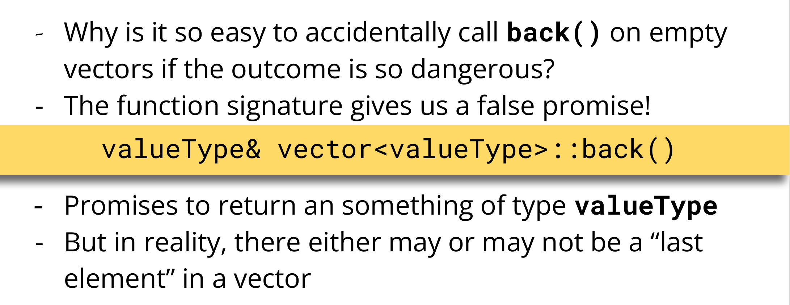

> [!NOTE]
>
> 1. **`std::optional<T&>` 不存在**：
>    - 标准 C++ 的 `std::optional` **不支持引用类型**
>    - 这是设计上的限制（直到 C++20 也没有包含这个特性）
> 2. **原因**：
>    - `std::optional` 必须能够存储值或表示"无值"状态
>    - 对于引用类型，这会带来复杂的内存管理和空引用问题
>    - 引用必须始终绑定到有效对象，但 `optional` 的"无值"状态与这个要求冲突

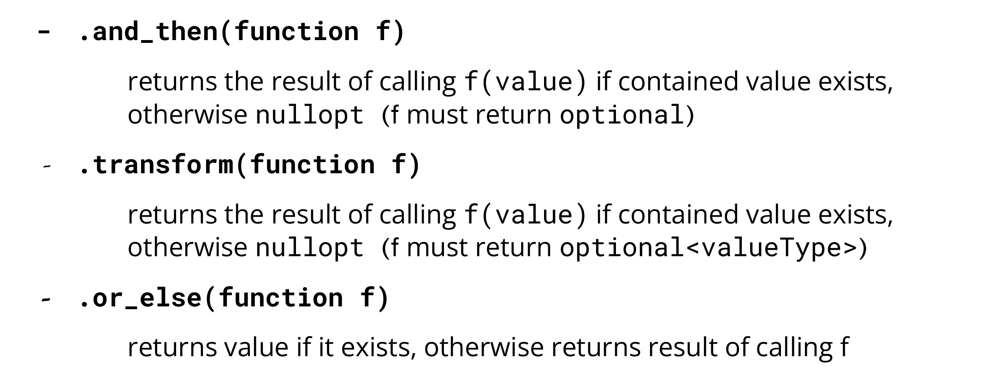

## Lecture 16: RAll-Smart Pointers

### RAII (Resource Acquisition Is Initialization) 

* All resources used by a class should be acquired in the constructor! 
* All resources that are used by a class should be released in the destructor.

RAII是C++的核心编程理念，其核心思想是：

1. **构造时获取资源**：在对象构造函数中完成资源分配（如内存、文件句柄、锁等）
2. **析构时释放资源**：利用C++对象生命周期结束时自动调用析构函数的特性，确保资源永不泄漏
3. **资源与对象同生命周期**：资源持有时间与对象作用域完全绑定

**优势**：

- ✅ **异常安全**：即使发生异常，栈展开时也会调用析构函数释放资源
- ✅ **无泄漏**：避免手动管理资源时的遗忘风险
- ✅ **代码简洁**：资源管理逻辑封装在对象内部

```cpp
// 传统易错方式
void riskyFunction() {
    int* arr = new int[100];  // 可能泄漏
    if (error) throw exception(); // 此处异常将导致内存泄漏
    delete[] arr;  // 可能被跳过
}

// RAII安全方式
void safeFunction() {
    std::vector<int> arr(100);  // 构造时分配，析构时自动释放
    if (error) throw exception(); // 异常安全：arr离开作用域时自动清理
}
```

### Smart Pointers 

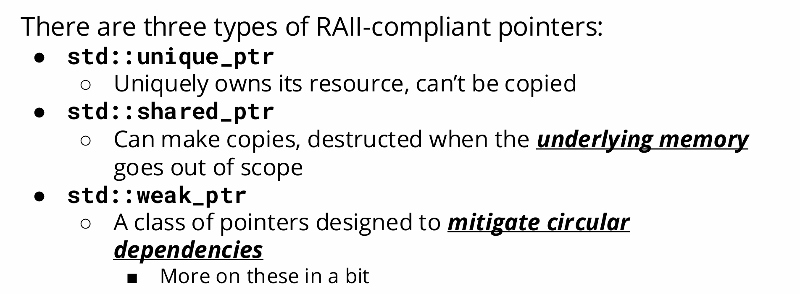

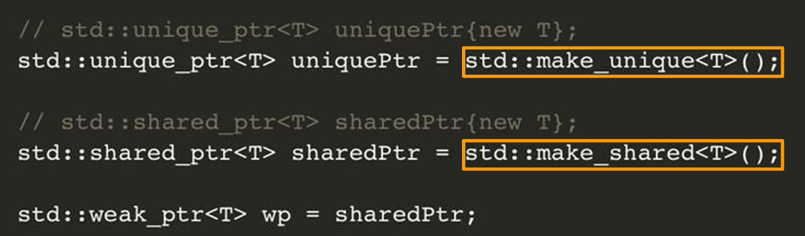

### Building C++ projects

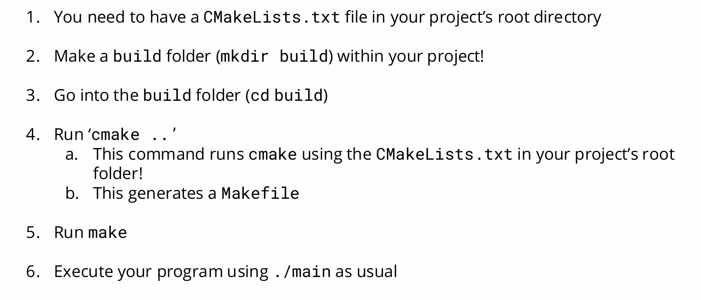


## Lecture 17: Unit Testing

