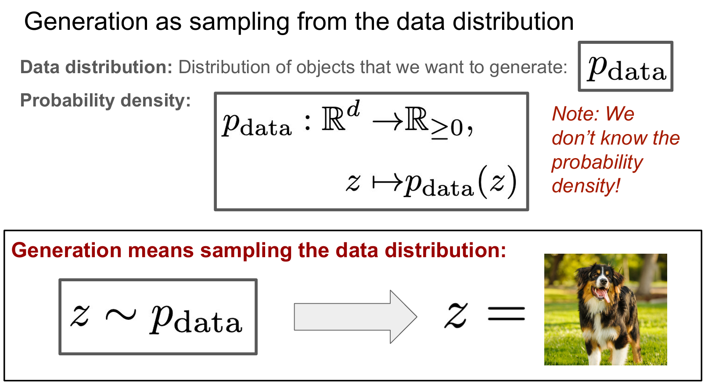

# Lecture1

$$
p_{\text{data}} : \mathbb{R}^d \to \mathbb{R}_{\ge 0}
$$

$$
\quad z \mapsto p_{\text{data}}(z)
$$
如果模型能够完美地捕捉到真实的 $p_{\text{data}}$，那么从这个分布中进行的**每一次有效抽样**，在逻辑上都应该对应一张符合要求的图片

## From Generation to Sampling

​	S**the real meaning of generation** 

## Flow and Diffusion Models

注意虽然这类方法叫flow模型，但网络不是去拟合flow 而是去拟合矢量场 ，进而计算出flow。

**ODE（常微分方程）** 是描述一个物体**“如何随时间变化”**的数学语言。

- **Ordinary（常）**：指的是只有一个自变量（通常是时间 $t$）。
- **Differential（微分）**：指的是方程里包含导数（即变化率、速度）。