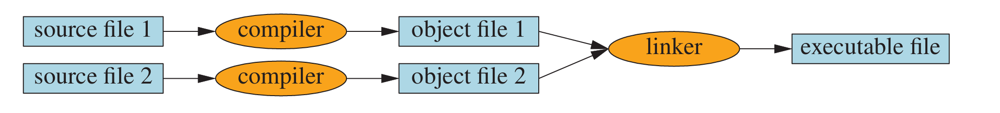
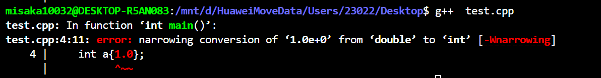

## The classic first program: Hello, World!


```cpp
// This program outputs the messag：
int main()
{
// gain access to the C++ standard librar y
// C++ programs start by executing the function main
std::cout << "Hello, World!\n"; 
return 0;
}
```

* The name `cout` is pronounced ‘‘see-out’’ and is an abbreviation of ‘‘character output stream.’’
*  Every C++ program must have a function called main to tell it where to start executing. 

## Linking



Typically, C++ source code files are given the suffix .cpp (e.g., hello_world.cpp) and object code files are given the suffix .obj (on Windows) or .o (Linux). 

The output from a linker is called an executable file and on Windows its name is often given the suffix .exe. 



