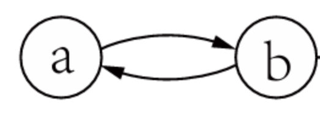
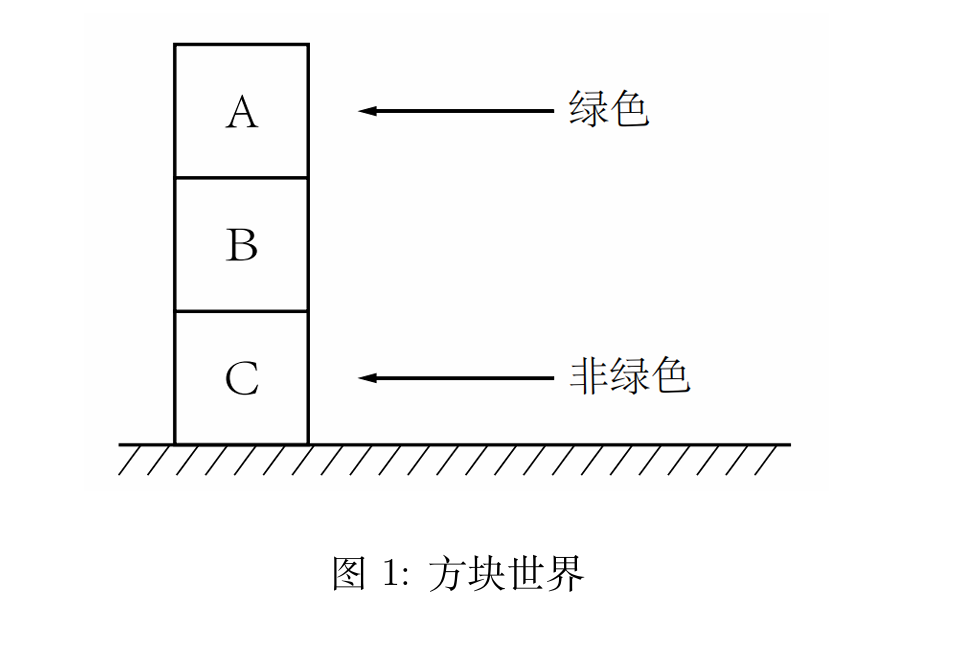

# 第 1 章 推理与论证

## 本章概要

- **人工智能与逻辑**：AI 实现途径包括 **符号主义**（符号表示+逻辑推理，可解释性好）与 **亚符号主义**（统计/数据驱动，如神经网络、大模型）；二者互补。知识的表示与推理是实现高水平 AI 的核心之一，**逻辑学**是知识表示与推理的基础。
- **核心概念**：**推理** = 从前提得到结论；**论证** = 前提 + 结论 + 推理关系。
- **推理的三种日常情形**：① 从已有知识推出新知识（演绎）；② 从案例归纳出新知识（归纳）；③ 从观察现象寻求最佳解释（溯因）。对应三种基本类型：**演绎**（含单调与非单调）、**归纳**、**溯因**。
- **两条主线**：① 各类推理形式的定义与特点；② 人工智能逻辑中的表示与推理（经典逻辑、非单调逻辑、归纳与因果等）。

---

## 1. 常见的推理类型

### 1.1 演绎推理与非单调推理

#### 1.1.1 演绎推理

> **定义**：演绎推理是一种 **保真** 的推理——若前提为真，则结论 **必然** 为真。

- **有效论证**：一个演绎论证是 **有效的** ⟺ 前提为真时，结论必然为真；否则称为 **谬误**。有效性取决于**命题形式**，与各命题的**具体真假**无关。
- **教材例题——豆子/袋子（演绎）**：来自这个袋子的豆子都是白色的；这些豆子来自这个袋子；因此，这些豆子是白色的。（大前提=一般原理，小前提=特殊事例。）
- **三段论形式**（可直接用作“演绎推理例子”）：
  - 所有 M 都是 P
  - 所有 S 都是 M  
  - **因此**，所有 S 是 P
- **单调性**：演绎推理具有单调性——**原有结论不会因新信息的加入而失效**。

#### 1.1.2 非单调推理

当信息 **不确定、不完备或不一致** 时，经典演绎无法直接给出可靠结论，需要非单调推理：

| 情形       | 含义说明 |
| ---------- | -------- |
| **不确定性** | 缺少准确知识，无法得到完全可靠的结论 |
| **不完备性** | 部分信息缺失（如牌局中不知道对手的牌） |
| **不一致性** | 存在互相矛盾的命题 |

**教材例题——鸟会飞/Tweety**：前提“鸟会飞”“Tweety 是鸟”无法得到**有效**演绎结论——因为“鸟会飞”知识**不完备**（未包含不会飞的鸟）、**不确定**。若改成“所有鸟都会飞”则改变原意；若改成“有些鸟会飞”则推理形式无效。因此需要非单调推理。

**两种常见实现方式：**

1. **正常性假设**：在演绎中加入“默认正常”的假设，结论可被新信息推翻。例：“鸟会飞，除非可证它不正常；Tweety 是鸟 ⇒ Tweety 会飞。”若新信息“Tweety 是企鹅”则结论被推翻。
2. **可废止规则**：形如“典型地，若 A 则 B”——一般情况下 A→B 成立，但 **B 可被新信息/反面证据推翻**；常用来表示 **常识**。例：“典型地，若 X 是鸟则 X 会飞”；有“Tweety 是企鹅”“企鹅不会飞”时，原结论“Tweety 会飞”被推翻。（**考点**：可废止规则的核心特点 = **结论可能被新信息推翻**，单选题选 B。）

> **非单调推理**：结论可能随着新信息的加入而被 **推翻** 的推理。基于假设的演绎、可废止推理都属于非单调推理。

**可废止推理 vs 正常性假设（辨析）**

| 维度           | 可废止推理                         | 正常性假设                               |
| -------------- | ---------------------------------- | ---------------------------------------- |
| **知识表示**   | 规则带可废止标记（“典型地，A 则 B”） | 严格蕴含 + 异常谓词（A∧¬Abnormal → B）   |
| **例外处理**   | 结论可被反面证据直接推翻           | 通过判断 Abnormal 是否成立来阻断结论    |
| **默认的载体** | 默认是规则本身的性质               | 默认是“个体正常”的假设                   |
| **推理机制**   | 规则直接支持可废止推导             | 需极小化异常谓词或默认个体正常           |
| **逻辑形式**   | 可废止逻辑（如 defeasible logic）  |  circumscription、缺省逻辑（default logic） |
| **直观理解**   | 规则“有例外”，结论暂时接受         | 规则全称，个体是否正常需默认             |

**典型应用**：常识推理（如“鸟会飞”）、规范推理（法律、道德伦理中的可废止规则）。

---

### 1.2 归纳推理与溯因推理

#### 归纳推理

- **广义**：一切不能保真的推理（即非演绎）。
- **狭义（本书采用）**：从 **特定事例的观察** 推断出 **一般规律** 的过程；用 **归纳强度** 刻画论证好坏。
- **归纳例子**：这些豆子来自这个袋子且是白色的 ⇒ 来自这个袋子的豆子都是白色的。或：观察到多只天鹅均为白色 ⇒ 所有天鹅都是白色的。

> [!NOTE]
> 基于假设的演绎也不能保真，但在分类上通常归入非单调演绎，而不算狭义的“归纳”。

#### 溯因推理

- **定义**：从观察到的 **现象** 出发，推断能 **最好解释** 该现象的原因或假说。
- **直观**：由果推因，选“最佳解释”。**教材例**：来自这个袋子的豆子都是白色的；这些豆子是白色的 ⇒ 因此这些豆子来自这个袋子。形式：若 p 则 q，q 成立 ⇒ 推测 p 成立。

---

### 1.3 关于论证的推理

- 通过 **构造、比较与评估** 论证，来确定某个论证的 **可接受性**；对象是 **论证本身**（元层面）。
- **教材例题——两小儿辩日**：两小儿各提出论证（A1 日初近/日中远，A2 日初远/日中近），并用 A3、A4 相互**支持己方、反驳对方**。论证之间的**反驳关系**：若接受一论证则须拒绝被其反驳的论证；可接受性不仅看前提与推理，还看与其他论证的**冲突关系**。论证图：节点=论证，边=攻击/反驳。

---

## 2. 人工智能逻辑主要研究方向

### 2.1 基于演绎推理的逻辑

**经典一阶逻辑的局限性（为何需要非单调逻辑）**  
- **不完备知识**：例——“转动点火钥匙，发动机启动”依赖“油缸有油”“排气管未堵”等未给出的条件，存在例外，一阶逻辑难以合理表达。  
- **不一致知识**：例——规范1“用药时间到则应给药”、规范2“病人正忙则不应给药”；两条件同时满足则结论矛盾。经典逻辑中**从矛盾可推出任意命题**，系统会“坍塌”，需非单调或论辩框架处理。

| 类型                 | 适用场景                     | 代表内容                         |
| -------------------- | ---------------------------- | -------------------------------- |
| **经典演绎逻辑**     | 确定、完备、一致的知识       | 命题逻辑、一阶逻辑、描述逻辑     |
| **非单调逻辑**       | 有例外、缺省、可废止的知识   | 缺省逻辑、回答集编程、可废止逻辑、论辩系统 |
| **知识与信念的逻辑** | 涉及心智状态（信念、愿望等） | 各种模态逻辑                     |

- 扩展方式：**路径一** 正常性假设/缺省规则 → 缺省逻辑、回答集编程；**路径二** 可废止规则 → 可废止逻辑、论辩系统。

---

### 2.2 归纳、不确定性与因果推断

| 方向           | 核心问题                     | 典型方法/模型                           |
| -------------- | ---------------------------- | --------------------------------------- |
| **归纳逻辑编程** | 从案例自动学习一般规则       | 给定背景知识+案例，学出逻辑程序（覆盖正例、不覆盖反例） |
| **不确定推理** | 在不确定性下进行推理         | 客观概率；主观概率（贝叶斯网络、信念网络、证据理论）；模糊度 |
| **因果推断**   | 从观测中找原因，由果溯因     | 结构因果模型、因果图                    |

### 2.3 基于论证的逻辑

- 在**论证层次**上，依据论证之间的**冲突关系**与**支持关系**评估可接受性。
- **形式论辩理论**：抽象论辩（从冲突论证中选可接受子集）、结构化论辩（从知识构建论证并定义冲突/击败关系）、基于论证的对话（协议与策略）。

### 2.4 实现与工具

- 逻辑系统的实现 = **推理引擎/求解器**：SAT 求解器、回答集编程求解器、归纳逻辑编程求解器、自动推理工具等。

---

## 3. 知识的表示与推理

> **一般规律**：逻辑语言的表达能力越强，对应推理系统的 **计算复杂性** 往往越高。

### 3.1 知识表示语言

- **知识与信念**：知识 = 知道者与命题的关系，且需**真实反映世界**；信念则不必为真。
- **知识类型**：过程性知识 vs 陈述性知识。
- **表示方式**：由**初始符号**与**语法规则**组成；知识可表示为符合语法的符号串（**公式**）。例：符号集 {p,q,r,¬,∧}，规则“若 φ,ψ 是公式则 (¬φ)、(φ∧ψ) 是公式”可生成 (¬p)、¬(p∧q) 等。

### 3.2 符号语言的语义

- 论证由 **结论** 与 **支持该结论的理由** 构成。
- 不同论证的结论可能 **矛盾**；这种矛盾关系常被抽象为论证之间的 **攻击关系**。当一个论证的结论与另一个论证的结论发生矛盾时，称这两个论证相互 **反驳**（rebut）。
- **教材例题——尼克松/教友会/共和党**：论证 α“教友会的人和平主义，尼克松是教友会 ⇒ 尼克松和平主义”；论证 β“共和党非和平主义，尼克松是共和党 ⇒ 尼克松非和平主义”。两结论矛盾，故 α 与 β 相互攻击/反驳；可表示为有向图（节点=论证，边=攻击）。

### 3.3 推理

#### 3.3.1 知识级推理

- **经典演绎**：前提与结论满足 **语义蕴涵** 时，前提为真 ⇒ 结论必然为真。  
  例：¬(p∧q), p ⊨ ¬q（⊨ 表示逻辑蕴涵）。
- **基于论证的推理**：从 **论证图** 到 **可接受论证集合** 的映射（多种语义）：
  - 例如：不接受“自我防御”的论证 → σ₁(G₁)=∅；接受自我防御 → σ₂(G₁)={{α},{β}}。
  - **可防御**：集合 X 可防御论证 x ⟺ 对每个攻击 x 的 y，X 中都有攻击 y 的论证；若 x 被自己所在的集合防御，则称 x **自我防御**。

#### 3.3.2 符号级推理

- 推理可看作**符号操纵**：从一组公式得到新公式，不涉及语义解释。**肯定前件式（MP 规则）**：φ→ψ, φ ⊢ ψ（⊢ = 形式可推演）。例：前提 p→¬q 与 p，可形式推出 ¬q。

#### 3.3.3 推理系统的特性

- **完全性**：若 Γ 在语义上蕴涵 φ，则从 Γ 可形式推出 φ。
- **可靠性**：若从 Γ 可形式推出 φ，则 Γ 在语义上蕴涵 φ。两者共同保证“语义蕴涵”与“形式推演”一致。表达能力与计算复杂性往往矛盾：语言越强，复杂度越高。

### 典例

- **设定**：三块叠放，顶块绿色、中间颜色未知、底块非绿色。判断是否存在“一个绿色方块在一个非绿色方块之上”。

- **所需知识**：个体 A（顶）、B（中）、C（底）；谓词 Green(x)、On(x,y)；已知 Green(A)，¬Green(C)，On(A,B)，On(B,C)；B 颜色未知。
- **推理**：目标 ∃x∃y(Green(x) ∧ ¬Green(y) ∧ On(x,y))。若 B 非绿则 (A,B) 满足；若 B 绿则 (B,C) 满足。故**无论 B 是否绿色**，结论都成立。

