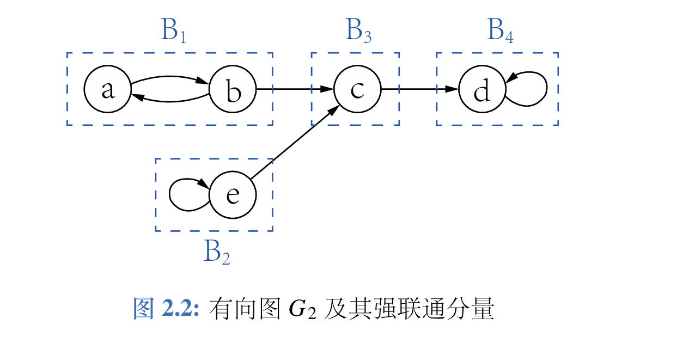

# 第二章 预备知识

## 2.1 集合

### 2.1.1 元素与表示
- **集合**：对象的汇集，对象称为**元（元素）**
- 符号：\( a \in S \)（属于），\( a \notin S \)（不属于）
- 表示法：大写字母表示集合，花括号列举元素，如 \( A = \{1,2,3\} \)

### 2.1.2 外延与内涵
- **外延**：集合中所有元素的全体
- **内涵**：元素共同具有的性质

### 2.1.3 子集与幂集
- **子集**：\( S \subseteq T \) 当且仅当 \( \forall x (x \in S \Rightarrow x \in T) \)
  - 每个集合都是自身的子集
- **真子集**：\( S \subseteq T \) 且 \( S \neq T \)
- **空集**：\( \varnothing \)，不含任何元素，是任何集合的子集
- **幂集**：一个集合的所有子集构成的集合

### 2.1.4 集合的表示与运算

#### 描述法
\[
\{x \mid P(x)\}
\]
表示所有满足性质 \(P(x)\) 的 \(x\) 构成的集合

#### 基本运算
| 运算 | 符号 | 定义 |
|------|------|------|
| 补集 | \( \overline{S} \) | \( \{x \mid x \notin S\} \) |
| 并集 | \( S \cup T \) | \( \{x \mid x \in S \text{ 或 } x \in T\} \) |
| 交集 | \( S \cap T \) | \( \{x \mid x \in S \text{ 且 } x \in T\} \) |
| 差集 | \( S - T \) | \( \{x \mid x \in S \text{ 且 } x \notin T\} \) |

- **不相交**：\( S \cap T = \varnothing \)

### 2.1.5 有序组与笛卡儿积

* 有序偶
  - 记作 \((a,b)\)，相等条件：\((a,b) = (c,d) \iff a = c \text{ 且 } b = d\)

* 有序 \(n\) 元组
  - 记作 \((a_1, \dots, a_n)\)，与有限序列等价

* 笛卡儿积

\[
S_1 \times \cdots \times S_n = \{(x_1,\dots,x_n) \mid x_1 \in S_1, \dots, x_n \in S_n\}
\]
- 若所有 \(S_i\) 相同，记作 \(S^n\)

### 2.1.6 关系

* \(n\) 元关系（\(n \geq 2\)）

  - 定义：\( R \subseteq S^n \)

  - 意义：表示 \(S\) 中元素之间按次序满足某种关系

* 一元关系（\(n = 1\)）

  - 定义：\( R \subseteq S \)

  - 意义：表示 \(S\) 中元素具有某种性质

> [!IMPORTANT]
>
> 集合𝑋上的二元关系𝑅⊆𝑋×𝑋是一个等价关系，当且仅当它满足自反性、对称性和传递性，即：对于𝑋中的任意𝑎,𝑏,𝑐, 
>
> * 自反性：(𝑎,𝑎) ∈ 𝑅, 
> * 对称性：(𝑎,𝑏) ∈ 𝑅当且仅当(𝑏,𝑎) ∈ 𝑅, 
> * 传递性：如果(𝑎,𝑏) ∈ 𝑅且(𝑏,𝑐) ∈ 𝑅，则(𝑎,𝑐) ∈ 𝑅。 
> 
> 关于𝑅下𝑎的等价类，记作[𝑎]，定义为[𝑎]={𝑥 ∈ 𝑋 | (𝑥,𝑎) ∈ 𝑅}。

## 2.2 图

### 2.2.1 基本定义

- **有向图**：边为有序对 (vi,vj) 的图。
- **子图**：G1⊆G2 表示 V1⊆V2 且 E1⊆E2
- **真子图**：子图且 G1≠G2。
- **生成子图**：V1=V2，边集为子集。
- **导出子图**：V1⊆V2，边集为 E2 中两端点均在 V1中的边。

### 2.2.2 路径与圈

- **途径**：顶点与边交替序列 v~0~e~1~v~1~…e~n~v~n~，其中 e~i~=(v~i−1~,v~i~)。
- **闭途径**：起点与终点相同。
- **迹**：边不重复的途径。
- **路**：顶点互不相同的迹。
- **圈**：闭迹且除首尾外顶点互异。

### 2.2.3 连通性与结构

- **可达**：存在从 v1 到 v2的路。
- **强连通图**：任意两顶点互相可达。
- **有向无环图（DAG）**：不含任何有向圈。

### 2.2.4 强连通分量

- **定义**：极大强连通子图，即它是强连通的，且不被任何更大的强连通子图所包含。
- **性质**：将图分解为若干强连通分量后，分量间的边构成一个有向无环图（缩点后的图是 DAG）。

