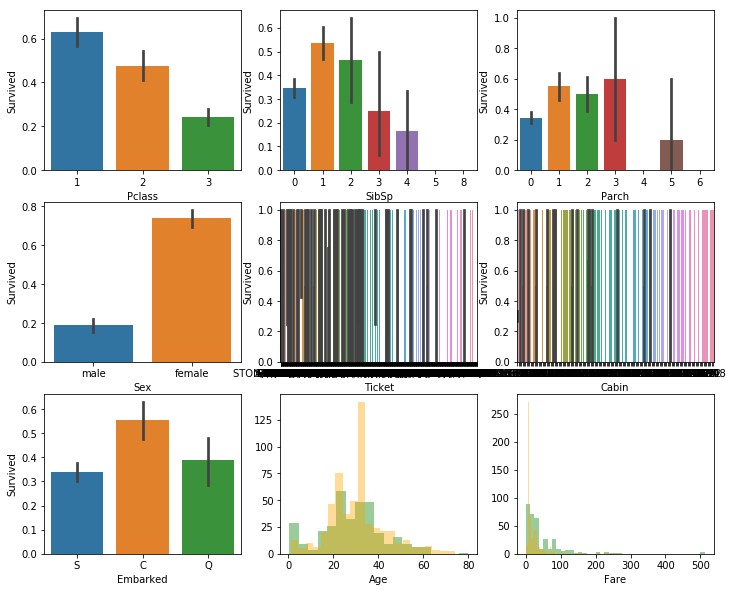
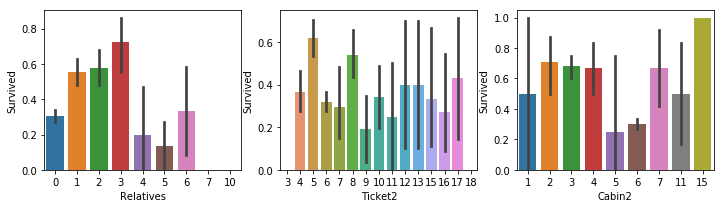

# kaggle泰坦尼克号竞赛思路及9种预测模型的代码详解

    代码参考 https://www.kaggle.com/code/goldens/titanic-on-the-top-with-a-simple-model

## 整体思路


### Steps:

* 1- Preprocessing and exploring
    * 1.1- Imports
    * 1.2- Types
    * 1.3 - Missing Values
    * 1.4 - Exploring
    * 1.5 - Feature Engineering
    * 1.6 - Prepare for models
* 2- Nested Cross Validation
* 3- Submission
  

## 1- Preprocessing and exploring

### 1.1 - Imports


```python
#导入必要的库
import pandas as pd
import matplotlib.pyplot as plt
import seaborn as sns
import numpy as np
from sklearn.model_selection import cross_val_score
from sklearn.ensemble import RandomForestClassifier
from sklearn.svm import SVC, LinearSVC
from sklearn.tree import DecisionTreeClassifier
from sklearn.neighbors import KNeighborsClassifier
from sklearn.linear_model import LogisticRegression, Perceptron, SGDClassifier
from sklearn.naive_bayes import GaussianNB
from sklearn.preprocessing import StandardScaler
from sklearn.pipeline import make_pipeline
from sklearn.model_selection import GridSearchCV
import warnings
# * pandas: 用于数据处理和分析
# * matplotlib.pyplot: 用于绘制图表
# * seaborn: 用于绘制图表，与matplotlib.pyplot类似，但更高级
# * numpy: 用于数值计算
# * sklearn: 用于机器学习模型训练和评估
# * warnings: 用于忽略警告
```


```python
train=pd.read_csv("input/train.csv")#读取训练数据
test=pd.read_csv("input/test.csv")#读取测试数据
test2=pd.read_csv("input/test.csv")#读取测试数据
titanic=pd.concat([train, test], sort=False)#将训练数据和测试数据合并
len_train=train.shape[0]#训练数据的长度
```

### 1.2 - Types


```python
titanic.dtypes.sort_values()#按照数据类型排序
```


    PassengerId      int64
    Pclass           int64
    SibSp            int64
    Parch            int64
    Survived       float64
    Age            float64
    Fare           float64
    Name            object
    Sex             object
    Ticket          object
    Cabin           object
    Embarked        object
    dtype: object

* PassengerId: 乘客ID
* Pclass: 乘客等级
* SibSp: 兄弟姐妹数量
* Parch: 父母子女数量
* Survived: 是否幸存
* Age: 年龄
* Fare: 票价
* Name: 姓名
* Sex: 性别
* Ticket: 票号
* Cabin: 舱位
* Embarked: 登船港口


```python
titanic.select_dtypes(include='int').head()#检查int类型数据情况
```
| PassengerId | Pclass | SibSp | Parch |      |
| ----------: | -----: | ----: | ----: | ---- |
|           0 |      1 |     3 |     1 | 0    |
|           1 |      2 |     1 |     1 | 0    |
|           2 |      3 |     3 |     0 | 0    |
|           3 |      4 |     1 |     1 | 0    |
|           4 |      5 |     3 |     0 | 0    |

```python
titanic.select_dtypes(include='object').head()#检查object类型数据情况
```
| Name |                                               Sex | Ticket |            Cabin | Embarked |      |
| ---: | ------------------------------------------------: | -----: | ---------------: | -------: | ---- |
|    0 |                           Braund, Mr. Owen Harris |   male |        A/5 21171 |      NaN | S    |
|    1 | Cumings, Mrs. John Bradley (Florence Briggs Th... | female |         PC 17599 |      C85 | C    |
|    2 |                            Heikkinen, Miss. Laina | female | STON/O2. 3101282 |      NaN | S    |
|    3 |      Futrelle, Mrs. Jacques Heath (Lily May Peel) | female |           113803 |     C123 | S    |
|    4 |                          Allen, Mr. William Henry |   male |           373450 |      NaN | S    |

```python
titanic.select_dtypes(include='float').head()#检查float类型数据情况
```

| Survived |  Age | Fare |         |
| -------: | ---: | ---: | ------- |
|        0 |  0.0 | 22.0 | 7.2500  |
|        1 |  1.0 | 38.0 | 71.2833 |
|        2 |  1.0 | 26.0 | 7.9250  |
|        3 |  1.0 | 35.0 | 53.1000 |
|        4 |  0.0 | 35.0 | 8.0500  |

## 1.2 - Missing values


```python
titanic.isnull().sum()[titanic.isnull().sum()>0]#寻找数据缺失项
```


    Survived     418
    Age          263
    Fare           1
    Cabin       1014
    Embarked       2
    dtype: int64

### Fare


```python
train.Fare=train.Fare.fillna(train.Fare.mean())#缺失票价用平均票价补上
test.Fare=test.Fare.fillna(train.Fare.mean())
```

### Cabin


```python
train.Cabin=train.Cabin.fillna("unknow")#船舱位置缺失用unknow
test.Cabin=test.Cabin.fillna("unknow")
```

### Embarked


```python
train.Embarked=train.Embarked.fillna(train.Embarked.mode()[0])#缺失出发港口用众数补上
test.Embarked=test.Embarked.fillna(train.Embarked.mode()[0])
```

### Age
Considering title
Inspired on: https://medium.com/i-like-big-data-and-i-cannot-lie/how-i-scored-in-the-top-9-of-kaggles-titanic-machine-learning-challenge-243b5f45c8e9

 使用 lambda 匿名函数处理 Name 列：
 1. split('.')：按点号分割，取点号前的部分
 2. split(',')：按逗号分割，取逗号后的部分
 3. strip()：去除首尾多余空格
 结果示例："Braund, Mr. Owen Harris" -> "Mr"


```python
train['title']=train.Name.apply(lambda x: x.split('.')[0].split(',')[1].strip())
test['title']=test.Name.apply(lambda x: x.split('.')[0].split(',')[1].strip())
```


```python
# 定义头衔映射字典，将众多的稀有头衔归类为几个主要类别（减少特征维度）
newtitles={
    "Capt":       "Officer",
    "Col":        "Officer",
    "Major":      "Officer",
    "Jonkheer":   "Royalty",
    "Don":        "Royalty",
    "Sir" :       "Royalty",
    "Dr":         "Officer",
    "Rev":        "Officer",
    "the Countess":"Royalty",
    "Dona":       "Royalty",
    "Mme":        "Mrs",
    "Mlle":       "Miss",
    "Ms":         "Mrs",
    "Mr" :        "Mr",
    "Mrs" :       "Mrs",
    "Miss" :      "Miss",
    "Master" :    "Master",
    "Lady" :      "Royalty"}
```


```python
# 使用 map 函数根据字典进行替换
train['title']=train.title.map(newtitles)
test['title']=test.title.map(newtitles)
```


```python
# 计算各组的平均年龄，作为填充依据
# 按头衔(title)和性别(Sex)分组，计算年龄(Age)的平均值
train.groupby(['title','Sex']).Age.mean()
```


    title    Sex   
    Master   male       4.574167
    Miss     female    21.804054
    Mr       male      32.368090
    Mrs      female    35.718182
    Officer  female    49.000000
             male      46.562500
    Royalty  female    40.500000
             male      42.333333
    Name: Age, dtype: float64


```python
# 定义填充函数
def newage (cols):
    title=cols[0]
    Sex=cols[1]
    Age=cols[2]
    # 如果年龄是缺失值 (NaN)
    if pd.isnull(Age):
        # 根据不同的头衔和性别组合，返回对应的平均年龄
        if title == 'Master' and Sex == "male":
            return 4.57    # 小男孩通常很小
        elif title == 'Miss' and Sex == 'female':
            return 21.8    # 未婚女性通常较年轻
        elif title == 'Mr' and Sex == 'male': 
            return 32.37   # 成年男性
        elif title == 'Mrs' and Sex == 'female':
            return 35.72   # 已婚女性
        elif title == 'Officer' and Sex == 'female':
            return 49      # 女性官员
        elif title == 'Officer' and Sex == 'male':
            return 46.56    # 男性官员
        elif title == 'Royalty' and Sex == 'female':
            return 40.50   # 女性贵族
        else:
            return 42.33   # 其他情况（如男性贵族等）的默认值
    else:
        # 如果年龄不缺失，直接返回原始年龄
        return Age
```


```python
train.Age=train[['title','Sex','Age']].apply(newage, axis=1)
test.Age=test[['title','Sex','Age']].apply(newage, axis=1)
```

### 1.3 - Exploring


```python
warnings.filterwarnings(action="ignore") # 忽略绘图时的警告
plt.figure(figsize=[12,10])              # 设置大画布尺寸

# --- 第一行：社会与家庭特征 ---
plt.subplot(3,3,1)
sns.barplot('Pclass','Survived',data=train) # 船舱等级：1等舱生存率明显更高
plt.subplot(3,3,2)
sns.barplot('SibSp','Survived',data=train)  # 兄弟姐妹/配偶数：1-2人时生存率较高
plt.subplot(3,3,3)
sns.barplot('Parch','Survived',data=train)  # 父母/子女数

# --- 第二行：身份与票据特征 ---
plt.subplot(3,3,4)
sns.barplot('Sex','Survived',data=train)    # 性别：女性生存率远高于男性 ("Lady First")
plt.subplot(3,3,5)
sns.barplot('Ticket','Survived',data=train) # 票号（若未处理，此图会非常乱）
plt.subplot(3,3,6)
sns.barplot('Cabin','Survived',data=train)  # 船舱号

# --- 第三行：登船港口与数值分布 ---
plt.subplot(3,3,7)
sns.barplot('Embarked','Survived',data=train) # 登船港口：C港生存率通常最高

# 重点：年龄分布图 (直方图)
plt.subplot(3,3,8)
# 绿色代表生存者，橙色代表遇难者。观察两组在不同年龄段的重叠情况
sns.distplot(train[train.Survived==1].Age, color='green', kde=False)
sns.distplot(train[train.Survived==0].Age, color='orange', kde=False)

# 重点：票价分布图
plt.subplot(3,3,9)
# 观察票价高低对生存的影响。通常高票价（右侧）绿色占比更高
sns.distplot(train[train.Survived==1].Fare, color='green', kde=False)
sns.distplot(train[train.Survived==0].Fare, color='orange', kde=False)
```


    <matplotlib.axes._subplots.AxesSubplot at 0x78b1d7b84550>



​    


这些柱子上的黑线在统计学图表中被称为 误差线（Error Bars），代表不确定性，虽然柱子的高度是平均值，但真实的情况在这个范围内波动都是合理的。

我们可以把这 9 张图分为三类来看：

##### 1. 决定生死的关键因素
* Pclass (舱位): 1 等舱生还率最高（超过 60%），3 等舱最低。

* Sex (性别): 极其明显。女性生还率接近 80%，而男性不到 20%。落实了“女士优先”原则。

* Fare (票价): 右下角的图显示，低票价区（左侧橙色峰值）遇难人数极多；票价越高，绿色的比例相对越高。

##### 2. 家庭关系的影响
* SibSp (兄弟姐妹/配偶) & Parch (父母/子女):

  * 独自一人（0）或大家庭（5个以上）的生还率都偏低。

  * 带着 1-2 个家属的人生还率最高，可能是因为既有人照应，又不至于因为人太多被拖累。

##### 3. 视觉上的“失败”尝试（需要进一步处理）
* Ticket (船票号) & Cabin (船舱号):
  * 因为船票和船舱号的种类太多（属于高基数特征），直接画条形图会导致标签堆叠在一起。在实际操作中，我们需要对它们进行“特征工程”（例如只提取船舱的首字母 A/B/C）。

##### 4. 年龄的规律

* 在极小的年龄段（左侧），绿色直方图高于橙色，说明小孩获救率高。

* 20-40 岁之间是遇难人数和比例最多的群体。

### 1.4 Feature Engineering

这段代码是在做机器学习中非常关键的一步：特征工程（Feature Engineering）。

简单来说，原始数据里的某些列（比如姓名、船票号）对电脑来说太乱了，直接丢给模型它看不懂。这段代码的目的是从混乱的原始信息中提炼出更有规律、模型更容易理解的新指标。


```python
#合并家庭成员直接计算家庭总人数
train['Relatives']=train.SibSp+train.Parch
test['Relatives']=test.SibSp+test.Parch
#计算船票号码（Ticket）和船舱号（Cabin）的字符串长度。
#Ticket：不同的船票编号格式可能代表不同的购票渠道、等级或批次。长度一致的船票往往属于同一类人。
#Cabin：船舱号包含字母和数字。（比如长度为 0 可能代表缺失值，较长的可能代表多室套房）。
train['Ticket2']=train.Ticket.apply(lambda x : len(x))
test['Ticket2']=test.Ticket.apply(lambda x : len(x))

train['Cabin2']=train.Cabin.apply(lambda x : len(x))
test['Cabin2']=test.Cabin.apply(lambda x : len(x))
#泰坦尼克号的姓名格式通常是 Braund, Mr. Owen Harris。
#这段代码通过逗号分割，取第一个元素，也就是提取出了乘客的姓氏（Surname）
#寻找家族联系：在海难中，家庭成员往往是一起行动的。
#通过姓氏，模型可以尝试把属于同一个家族的人关联起来。
#如果这个姓氏下的其他人都获救了，那么这个人的获救概率可能也更高。
train['Name2']=train.Name.apply(lambda x: x.split(',')[0].strip())
test['Name2']=test.Name.apply(lambda x: x.split(',')[0].strip())
```


```python
warnings.filterwarnings(action="ignore")
plt.figure(figsize=[12,10])
plt.subplot(3,3,1)
sns.barplot('Relatives','Survived',data=train)
plt.subplot(3,3,2)
sns.barplot('Ticket2','Survived',data=train)
plt.subplot(3,3,3)
sns.barplot('Cabin2','Survived',data=train)

```



​    


### 1.4 - Prepare for model


```python
#droping features I won't use in model
#train.drop(['PassengerId','Name','Ticket','SibSp','Parch','Ticket','Cabin']
train.drop(['PassengerId','Name','Ticket','SibSp','Parch','Ticket','Cabin'],axis=1,inplace=True)
test.drop(['PassengerId','Name','Ticket','SibSp','Parch','Ticket','Cabin'],axis=1,inplace=True)
```

drop 操作可以提升模型的泛化能力和降低计算复杂度。

PassengerId, Name：这些字段对每个乘客来说几乎都是唯一的，没有参考价值。

SibSp, Parch： 我们已经创建了一个名为 Relatives 的新特征。

Cabin，Ticket：船票和船舱号的原始种类太多，已经创建了新的Cabin2和Ticket2


```python
titanic=pd.concat([train, test], sort=False)
#将 train（训练集）和 test（测试集）上下堆叠在一起，合并成一个名为 titanic 的大表格。
```


```python
titanic=pd.get_dummies(titanic)
# 将所有类别型变量（如 Sex, Embarked）转换为数值型变量
#原因：机器学习模型只能计算数字，无法直接处理字符串。
```

假设我们有一个简单的乘客数据集：

```python
import pandas as pd
df = pd.DataFrame({
    'Sex': ['male', 'female', 'female'],
    'Embarked': ['S', 'C', 'S']
})
```


常规转换直接运行 pd.get_dummies(df)，结果如下：

| **Sex_female** | **Sex_male** | **Embarked_C** | **Embarked_S** |
| -------------- | ------------ | -------------- | -------------- |
| 0              | 1            | 0              | 1              |
| 1              | 0            | 1              | 0              |
| 1              | 0            | 0              | 1              |

```python
train=titanic[:len_train]
test=titanic[len_train:]
#利用合并前的训练集长度 len_train，将大表 titanic 重新切回原来的样子。
```


```python
# Lets change type of target
train.Survived=train.Survived.astype('int')
#将 Survived（生存标签）这一列的数据类型强制转换为整型 (int)。
train.Survived.dtype
#在合并和处理过程中，Survived 有可能被自动转换成了浮点型 (float，如 1.0, 0.0)。
```

```python
xtrain=train.drop("Survived",axis=1)
ytrain=train['Survived']
xtest=test.drop("Survived", axis=1)
```

# 2 - Nested Cross Validation

### Random Forest


```python
RF=RandomForestClassifier(random_state=1)#创建一个随机森林分类器。
#参数 random_state=1：固定“随机种子”,确保每次运行代码时得到的结果完全一致
PRF=[{'n_estimators':[10,100],'max_depth':[3,6],'criterion':['gini','entropy']}]
#动作：列出你想让模型尝试的各种“配置选项”（超参数）。
# n_estimators：森林中树的数量（10棵或100棵）。
# max_depth：树的最大深度（3层或6层），用于防止过拟合。
# criterion：衡量分类质量的标准（基尼系数或信息熵）
GSRF=GridSearchCV(estimator=RF, param_grid=PRF, scoring='accuracy',cv=2)
#它会把上面的 8 种组合逐一训练，并使用 2折交叉验证 (cv=2) 来评估哪组参数最强。
scores_rf=cross_val_score(GSRF,xtrain,ytrain,scoring='accuracy',cv=5)
# 原理：
# 它将 xtrain 分成 5 份（cv=5）。
# 每次取出 4 份交给 GSRF 去寻找最佳参数。
# 用剩下的 1 份来测试这个“选出的最佳模型”的效果。
# 目的：评估模型的泛化能力。它告诉你在不同的小数据集上，你的调参方法是否都能稳定地获得高准确率。
```

因为设置了 cv=5，所以 scores_rf 实际上是一个包含 5个不同准确率数值 的列表（数组）。`np.mean(scores_rf)`求出测试的平均值


```python
np.mean(scores_rf)
```


```bash
0.7866456934513139
```


### SVM


```python
svc=make_pipeline(StandardScaler(),SVC(random_state=1))#SVM 的目标是找到一个最优超平面来分割数据
#StandardScaler 将数据转化为均值为 0、方差为 1 的分布，确保每个特征在计算距离时权重平等。
r=[0.0001,0.001,0.1,1,10,50,100]
PSVM=[{'svc__C':r, 'svc__kernel':['linear']},
      {'svc__C':r, 'svc__gamma':r, 'svc__kernel':['rbf']}]
```

这里测试了 SVM 两种最常用的形态：

* 线性核 (linear)：尝试用直线（或超平面）直接分割数据。只需调参数 C。

* RBF 核 (rbf)：也叫高斯核。它将数据映射到高维空间，用来处理非线性分类问题。需要同时调 C 和 gamma。

    * C (惩罚系数)：对错误分类的忍受度。C 越大，模型越不准出错，容易过拟合。

    * gamma：决定了单个训练样本的影响范围。gamma 越大，超平面越倾向于弯曲以拟合每一个点。


```python
GSSVM=GridSearchCV(estimator=svc, param_grid=PSVM, scoring='accuracy', cv=2)
scores_svm=cross_val_score(GSSVM, xtrain.astype(float), ytrain,scoring='accuracy', cv=5)
```

* GridSearchCV：在内部进行 2 折交叉验证，为 SVM 寻找上述参数的最优组合。

* cross_val_score：在外部进行 5 折交叉验证。

* 数据类型转换：xtrain.astype(float) 是为了确保数据都是浮点数，因为 StandardScaler 涉及到除法和减法运算，浮点数可以避免精度丢失或报错。


```python
np.mean(scores_svm)
```


    0.8439879324218461

### Decision Tree (DTree)
决策树：通过递归划分特征空间进行分类，无需标准化。


```python
# 决策树分类器，基于信息增益或基尼不纯度进行分裂
DTree = DecisionTreeClassifier(random_state=1)
# 超参数网格：树深度、分裂准则、叶节点最小样本数
PDTree = [{'max_depth': [3, 6, 10, None], 'criterion': ['gini', 'entropy'], 'min_samples_leaf': [1, 2, 4]}]
GSDTree = GridSearchCV(estimator=DTree, param_grid=PDTree, scoring='accuracy', cv=2)
# 外层 5 折交叉验证，评估决策树在嵌套 CV 下的泛化准确率
scores_dtree = cross_val_score(GSDTree, xtrain, ytrain, scoring='accuracy', cv=5)
```


```python
np.mean(scores_dtree)
```


    0.8215848572959589


### K-Nearest Neighbors (KNN)
K 近邻：根据最近 K 个样本的多数类别投票分类，需标准化以保证距离度量合理。


```python
# K 近邻分类器，配合 StandardScaler 标准化（距离类模型必须标准化）
knn = make_pipeline(StandardScaler(), KNeighborsClassifier())
# 超参数：近邻数 n_neighbors、权重 weights、距离度量 p（1=曼哈顿，2=欧氏）
PKNN = [{'kneighborsclassifier__n_neighbors': [3, 5, 7, 11, 15], 'kneighborsclassifier__weights': ['uniform', 'distance'], 'kneighborsclassifier__p': [1, 2]}]
GSKNN = GridSearchCV(estimator=knn, param_grid=PKNN, scoring='accuracy', cv=2)
scores_knn = cross_val_score(GSKNN, xtrain.astype(float), ytrain, scoring='accuracy', cv=5)
```


```python
np.mean(scores_knn)
```


    0.7564844436831576


### Logistic Regression (LR)
逻辑回归：线性模型+ sigmoid，输出概率，需标准化以稳定收敛。


```python
# 逻辑回归，配合 StandardScaler
lr = make_pipeline(StandardScaler(), LogisticRegression(random_state=1, max_iter=1000))
# 超参数：正则化强度 C、求解器 solver
PLR = [{'logisticregression__C': [0.01, 0.1, 1.0, 10.0], 'logisticregression__solver': ['lbfgs', 'liblinear']}]
GSLR = GridSearchCV(estimator=lr, param_grid=PLR, scoring='accuracy', cv=2)
scores_lr = cross_val_score(GSLR, xtrain.astype(float), ytrain, scoring='accuracy', cv=5)
```


```python
np.mean(scores_lr)
```


    0.8126213433851565


### Linear SVC (L-SVC)
线性支持向量分类：用线性核的 SVM，适合线性可分或近似线性可分数据，需标准化。


```python
# 线性 SVC，配合 StandardScaler；dual=False 适用于 n_samples > n_features
lsvc = make_pipeline(StandardScaler(), LinearSVC(random_state=1, max_iter=5000, dual=False))
# 超参数：正则化 C
PLSVC = [{'linearsvc__C': [0.01, 0.1, 1.0, 10.0]}]
GSLSVC = GridSearchCV(estimator=lsvc, param_grid=PLSVC, scoring='accuracy', cv=2)
scores_lsvc = cross_val_score(GSLSVC, xtrain.astype(float), ytrain, scoring='accuracy', cv=5)
```

### Perceptron
感知机：单层线性分类器，适合线性可分问题，需标准化。


```python
# 感知机分类器，配合 StandardScaler
perceptron = make_pipeline(StandardScaler(), Perceptron(random_state=1, max_iter=1000))
# 超参数：惩罚 alpha、学习率 eta0
PPerceptron = [{'perceptron__alpha': [0.0001, 0.001, 0.01], 'perceptron__eta0': [0.01, 0.1, 1.0]}]
GSPerceptron = GridSearchCV(estimator=perceptron, param_grid=PPerceptron, scoring='accuracy', cv=2)
scores_perceptron = cross_val_score(GSPerceptron, xtrain.astype(float), ytrain, scoring='accuracy', cv=5)
```

### Naive Bayes (NB)
朴素贝叶斯：基于条件独立假设与先验的类别概率，对特征尺度不敏感，一般不需标准化。


```python
np.mean(scores_perceptron)
```


    0.8002488840469157


```python
# 高斯朴素贝叶斯，假设每类特征服从高斯分布
nb = GaussianNB()
# 超参数：var_smoothing 用于数值稳定性，避免方差为 0
PNB = [{'var_smoothing': [1e-9, 1e-8, 1e-7, 1e-6]}]
GSNB = GridSearchCV(estimator=nb, param_grid=PNB, scoring='accuracy', cv=2)
scores_nb = cross_val_score(GSNB, xtrain, ytrain, scoring='accuracy', cv=5)
```


```python
np.mean(scores_nb)
```


    0.478105261142065


### SGD Classifier (SGD)
随机梯度下降分类器：线性模型，支持多种损失（如 hinge、log），需标准化且对超参数敏感。


```python
# SGD 分类器，配合 StandardScaler；对学习率和迭代次数较敏感
sgd = make_pipeline(StandardScaler(), SGDClassifier(random_state=1, max_iter=2000, tol=1e-3))
# 超参数：损失函数 loss（旧版 sklearn 用 'log'，新版为 'log_loss'）、惩罚 penalty、正则化强度 alpha
PSGD = [{'sgdclassifier__loss': ['hinge', 'log'], 'sgdclassifier__penalty': ['l2', 'l1'], 'sgdclassifier__alpha': [1e-4, 1e-3, 1e-2]}]
GSSGD = GridSearchCV(estimator=sgd, param_grid=PSGD, scoring='accuracy', cv=2)
scores_sgd = cross_val_score(GSSGD, xtrain.astype(float), ytrain, scoring='accuracy', cv=5)
```


```python
np.mean(scores_sgd)
```


    0.8193316019968885


### Nested CV 各模型得分汇总
下方为各模型在 5 折外层交叉验证下的平均准确率对比。


```python
# 汇总各模型 Nested CV 平均准确率（按得分从高到低）
results = [
    ('DTree', np.mean(scores_dtree)), ('RF', np.mean(scores_rf)), ('KNN', np.mean(scores_knn)),
    ('SVM', np.mean(scores_svm)), ('LR', np.mean(scores_lr)), ('L-SVC', np.mean(scores_lsvc)),
    ('Perceptron', np.mean(scores_perceptron)), ('NB', np.mean(scores_nb)), ('SGD', np.mean(scores_sgd))
]

for name, acc in sorted(results, key=lambda x: -x[1]):
    print(f'{name:12s} => {acc*100:.2f}%')
```

    SVM          => 84.40%
    L-SVC        => 83.05%
    DTree        => 82.16%
    SGD          => 81.93%
    LR           => 81.26%
    Perceptron   => 80.02%
    RF           => 78.66%
    KNN          => 75.65%
    NB           => 47.81%


# 3 - Submission


```python
model=GSSVM.fit(xtrain, ytrain)
#使用之前通过交叉验证找到的最优参数组合，在所有的训练数据 (xtrain, ytrain) 上重新训练一次模型。
```


```python
pred=model.predict(xtest)
#将不带标签的测试集特征 (xtest) 输入到训练好的模型中。
```


```python
output=pd.DataFrame({'PassengerId':test2['PassengerId'],'Survived':pred})
#创建一个新的 DataFrame。
```


```python
output.to_csv('submission.csv', index=False)
#将这个表格保存为名为 submission.csv 的本地文件
#到这一步，就可以拿着这个 submission.csv 去提交的泰坦尼克号生存预测成绩了
```


* 最终结果


