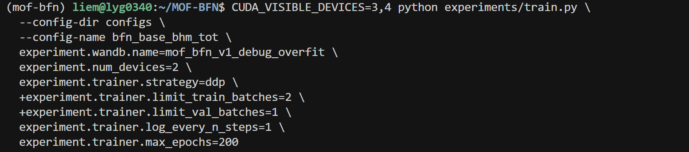
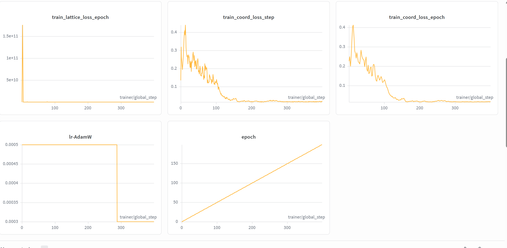
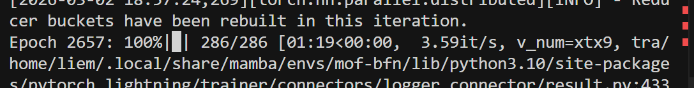

小样本测试收敛性



使用原代码测试对照：


第一次修改：

1. 


延续论文提供的chpt的训练：




### 接下来的方向：

发现两点：

1. ==他的每个epoch训练时间很短只有一两分钟，而我白天训练时需要30min ，晚上训练的时候又变成了10分钟？==
2. 经过几千次训练后，他的晶格loss仍然很大，根据源代码：晶格 loss 里叠加了体积 L2 + 体积下界惩罚，如果预测体积和真值差距大，或者预测体积太小，会给 lattice_loss 加一个很大的正则项。

> ==这一点与实验结果一致：很多不合格的晶体就是因为晶胞大小太小。==

* 现在代码里已经有针对晶胞体积的惩罚项了：

  ```python
  # discrete time loss
          t_index_per_atom = t_index.repeat_interleave(num_atoms, dim=0).unsqueeze(-1)
          lattice_loss = self.dtime4continuous_loss(
              i=t_index.unsqueeze(-1),
              N=self.dtime_loss_steps,
              sigma1=self.sigma1_lattice,
              x_pred=lattice_pred,
              x=lattices,
              segment_ids=None,
              mult_constant=self.mult_constant,
              wn = self.hparams.norm_weight
          )
          # --- Volume / density regularization ---
          # compute predicted and ground-truth cell volumes from lattice paramization
          try:
              def params_to_lengths_angles(x):
                  # x[..., :3] are log(lengths); x[..., 3:] are tan(angle - pi/2)
                  lengths = torch.exp(x[..., :3])
                  angles = torch.rad2deg(torch.atan(x[..., 3:]) + math.pi / 2)
                  return lengths, angles
  
              def volume_from_lengths_angles(lengths, angles_deg):
                  # lengths: (...,3), angles_deg: (...,3)
                  a, b, c = lengths[..., 0], lengths[..., 1], lengths[..., 2]
                  angles = torch.deg2rad(angles_deg)
                  alpha, beta, gamma = angles[..., 0], angles[..., 1], angles[..., 2]
                  cosA = torch.cos(alpha); cosB = torch.cos(beta); cosG = torch.cos(gamma)
                  # formula: V = a*b*c*sqrt(1 + 2*cosα*cosβ*cosγ - cos^2α - cos^2β - cos^2γ)
                  inner = 1 + 2 * cosA * cosB * cosG - cosA ** 2 - cosB ** 2 - cosG ** 2
                  inner = torch.clamp(inner, min=1e-9)
                  vol = a * b * c * torch.sqrt(inner)
                  return vol
  
              pred_lengths, pred_angles = params_to_lengths_angles(lattice_pred)
              gt_lengths = lengths
              gt_angles = angles
              pred_vol = volume_from_lengths_angles(pred_lengths, pred_angles)
              gt_vol = volume_from_lengths_angles(gt_lengths, gt_angles)
  
              # L2 volume matching
              vol_l2 = ((pred_vol - gt_vol) ** 2).mean()
  
              # lower-bound penalty (prevent cell collapsed). use scale factor from config if provided
              vol_min_scale = self.hparams.vol_min_scale if 'vol_min_scale' in self.hparams.keys() else 0.8
              vol_min = gt_vol * vol_min_scale
              vol_lower = torch.relu(vol_min - pred_vol).mean()
  
              vol_loss_weight = self.hparams.vol_loss_weight if 'vol_loss_weight' in self.hparams.keys() else 1.0
              vol_loss = vol_loss_weight * (vol_l2 + vol_lower)
              # add to lattice loss
              lattice_loss = lattice_loss + vol_loss
  ```

* 先确认“问题在哪里”，lattice_loss这么大，主导项是什么？

* 从密度方向改进？

* 准备检查训练集里的 gt_vol 分布，如果本身跨好几个数量级，单一的 L2 会很难兼顾所有尺度。

  