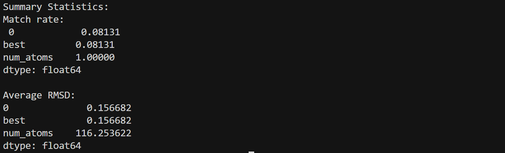

## 环境配置

* 创建能够复现ATOMMOF的mamba虚拟环境
* 下载处理后的data和ckpt

## 复现

* 先复现一个small case

```bash
CUDA_VISIBLE_DEVICES=3,4 python src/predict.py   data=bwdb   ckpt_path=logs/bwdb/small.ckpt   trainer.devices=2   predict_args.num_samples=1   predict_args.sampling_steps=10   data.predict_split=test   data.max_num_atoms=400


python src/evaluation/collate_predictions.py \
  --pred_dir /home/liem/AtomMOF/logs/predictions/test_samples-1_steps-10_refine-False_sde_coords-False_fk_steering-False

python src/evaluation/rmsd.py \
  --pred_dir /home/liem/AtomMOF/logs/predictions/test_samples-1_steps-10_refine-False_sde_coords-False_fk_steering-False \
  --num_cpus 8 \
  --stol 0.3 \
  --ltol 0.3 \
  --angle_tol 10
```




