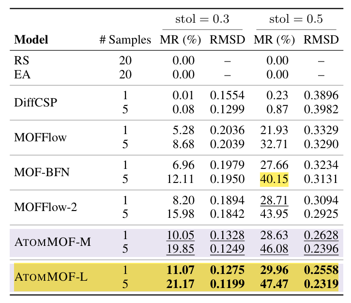
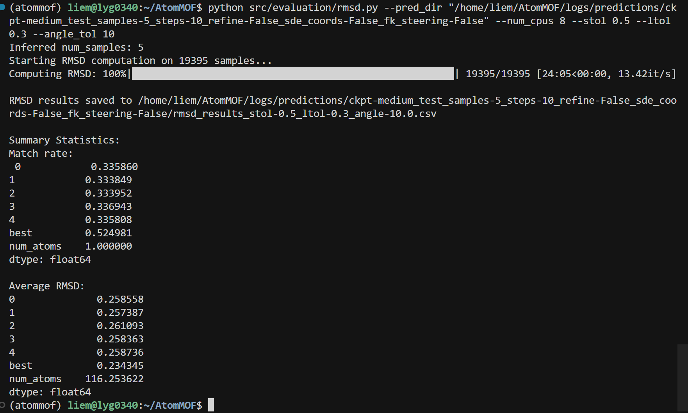
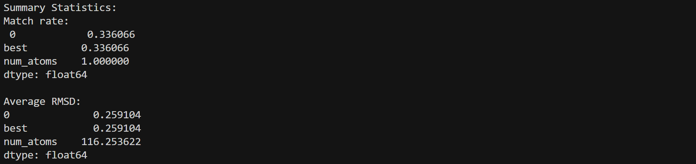
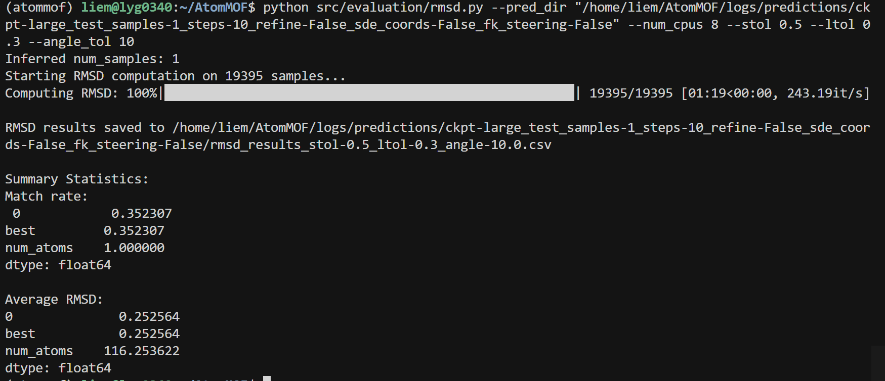
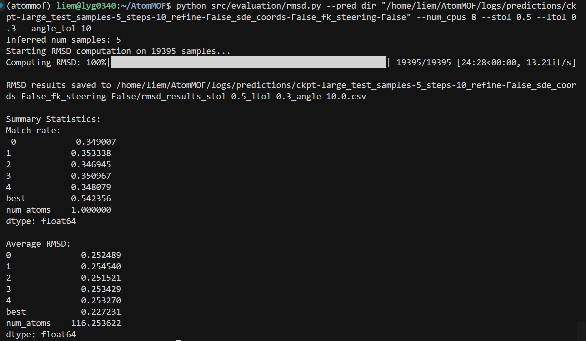

## 复现table1

| **模型 (Model)** | **样本数 (# Samples)** | **stol 设定** | **Match Rate (MR)** | **Average RMSD** |
| ---------------- | ---------------------- | ------------- | ------------------- | ---------------- |
| **AtomMOF-M**    | 1                      | 0.3           | 12.30%              | 0.1328           |
| **AtomMOF-M**    | 5                      | 0.3           | 23.91%              | 0.1253           |
| **AtomMOF-M**    | 1                      | 0.5           | 33.61%              | 0.2591           |
| **AtomMOF-M**    | 5                      | 0.5           | 52.50%              | 0.2343           |
| **AtomMOF-L**    | 1                      | 0.3           | 13.41%              | 0.1282           |
| **AtomMOF-L**    | 5                      | 0.3           | 25.49%              | 0.1196           |
| **AtomMOF-L**    | 1                      | 0.5           | 35.23%              | 0.2526           |
| **AtomMOF-L**    | 5                      | 0.5           | 54.24%              | 0.2272           |

mid sample = 1，stol = 0.5

