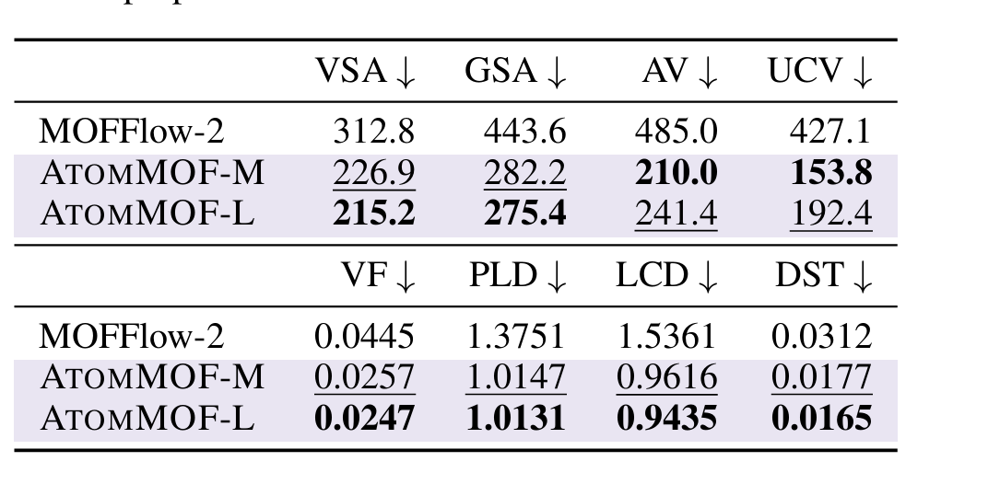
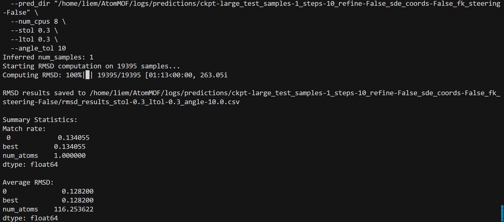
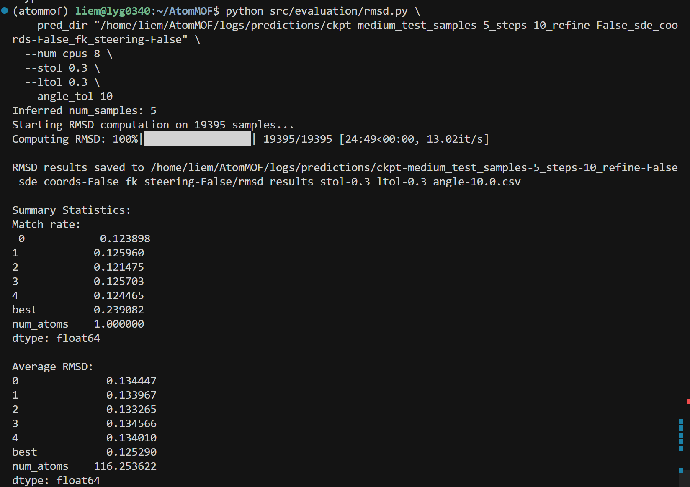
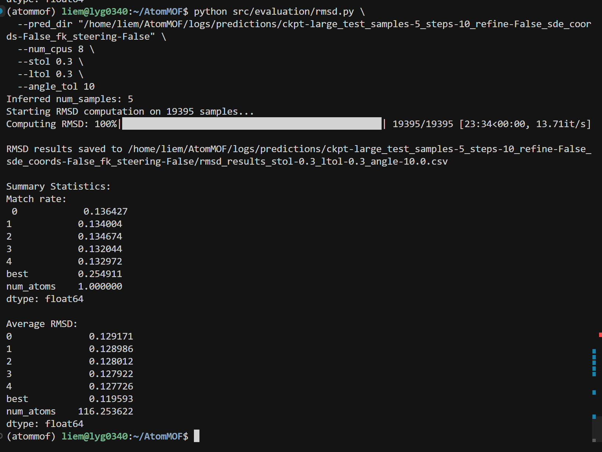
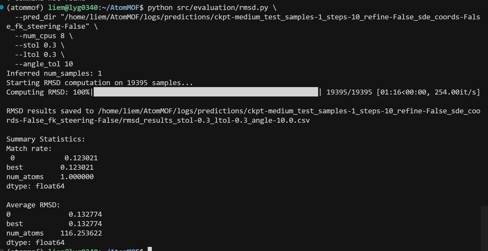

## 复现任务总览

**统一环境**：`cd /home/liem/AtomMOF && source atommof/bin/activate`  
**统一 GPU**：卡 1 和 3，即 `CUDA_VISIBLE_DEVICES=1,3`、`trainer.devices=2`

| 任务 ID | 内容 | 预测次数 | 评估 | 说明 |
|--------|------|----------|------|------|
| MR-RMSD | Match Rate & RMSD（论文主表） | 8 | rmsd.py (stol=0.3 / 0.5) | M & L × sample 1 & 5 × stol 0.3 & 0.5，OED=10 |
| PROP | Property Evaluation (Table 2) | 4 | property.py (Zeo++) | M & L × 无/有 steering，OED=50（property 用 50 步） |
| SCALE | Scaling (Figure 4) | 3 | collate → rmsd | S / M / L 无 steering，OED=10，stol=0.3 |
| TABLE4 | Table 4（FK steering 前后） | 2 | validity, structure_validity, mlip_energy | 无 steering + 有 steering（M），各 collate 后跑三项评估 |
| FK-PROP | Table 2 有 steering | 2 | property.py | M & L 有 steering 预测（可与 TABLE4 共用预测） |
| RUNTIME | Runtime scaling | 14 | 记时 | 1000 样本，OED=1,2,...,10,20,50,100，用 `time` 包或脚本记时 |
| ABLATION | Figure 6 超参敏感性 | 多组 | validity, structure_validity | 1000 样本，有 steering，改 num_particles / λ / resample / start_time / potential_mode |

**取最新预测目录**（predict 输出在 `logs/predictions/<run_name>/`）：
```bash
PRED_DIR=$(ls -dt /home/liem/AtomMOF/logs/predictions/*/ 2>/dev/null | head -1)
echo $PRED_DIR
```

---

## 一、MR & RMSD（论文主表）

* dataset: BW dataset  
* model: M & L  
* sample: 1 或 5（每个系统采样数）  
* **OED = 10**（论文：10 integration steps）

1. stol=0.5, angle_tol=10  
2. stol=0.3, angle_tol=10  

→ **8 次预测**：M/L × sample=1/5 × 两种 stol 各跑一次 rmsd 评估（预测可复用：M sample1、M sample5、L sample1、L sample5 各 1 次预测，然后对同一 pred_dir 分别跑 `--stol 0.3` 和 `--stol 0.5`）。


---

## 二、Property Evaluation（Table 2）

* model: M & L  
* 无 steering / 有 steering 各一组  
* **OED = 50**（property 评估用 50 步）

→ **4 次预测**：M 无 steering、M 有 steering、L 无 steering、L 有 steering。每次预测后 collate，再跑 `property.py`。



---

## 三、Scaling Law

### 3.1 Parameter scaling（Figure 4）

* model: S → M → L  
* **OED = 10**  
* **stol = 0.3**  
* 无 steering  

→ 3 次预测（S/M/L 各一次），每次 collate 后跑 rmsd（stol=0.3）。

### 3.2 Runtime scaling

* sample_number = 1000（`data.sample_limit_dict.predict=1000`）  
* stol = 0.3  
* OED = 1, 2, 3, 4, 5, 6, 7, 8, 9, 10, 20, 50, 100  

→ **14 次预测**（每种步数一次）。Runtime：在每条 predict 命令外包 `time` 或脚本内 `import time` 记录 wall time 即可（例如 `time ( CUDA_VISIBLE_DEVICES=1,3 python src/predict.py ... )`）。


---

## 四、Feynman-Kac Steering 相关

### 4.1 Table 2：Property evaluation（VSA, GSA, AV, UCV, VF, PLD, LCD, DST）

- 含义：用 Zeo++ 算 GT vs 生成结构的几何/孔道属性 RMSE。
- 复现思路：对 无 steering 和 有 steering 的预测各跑一遍 property 评估（脚本相同，只是 `--pred_dir` 不同）。

| 实验                     | 预测配置                                                     | 评估脚本                  |
| :----------------------- | :----------------------------------------------------------- | :------------------------ |
| AtomMOF-M 无 steering    | 下面「无 steering 预测」用 `ckpt_path=logs/bwdb/medium.ckpt` | `collate` → `property.py` |
| AtomMOF-M 有 steering    | 下面「有 steering 预测」用 medium.ckpt                       | 同上                      |
| AtomMOF-L 无/有 steering | 同上，仅把 ckpt 改为 `large.ckpt`                            | 同上                      |

- 论文还对比了 MOFFlow-2；若你没有其预测结果，可只复现 AtomMOF-M / AtomMOF-L 两行。

### 4.2 Table 4 + 正文：Steering 前后对比（formation energy、validity、structural validity）

- 含义：
  - Formation energy error：从 0.127 → 0.020 eV/atom（约 84% 下降）。
  - MOF validity (MOFChecker)：34.16% → 37.87%。
  - Structural validity：81.70% → 91.70%。
- 复现思路：同一套 test 数据，跑两种预测 → 分别 collate → 分别跑三种评估。

| 实验                    | 预测                     | Collate                  | 评估 1：Formation energy | 评估 2：MOF validity      | 评估 3：Structure validity |
| :---------------------- | :----------------------- | :----------------------- | :----------------------- | :------------------------ | :------------------------- |
| 无 steering（baseline） | 见下「无 steering 预测」 | `collate_predictions.py` | `mlip_energy.py`         | `validity.py`（需 Zeo++） | `structure_validity.py`    |
| 有 steering             | 见下「有 steering 预测」 | 同上                     | 同上                     | 同上                      | 同上                       |

- 论文用的是 200 步 + 16 particles 等（见下），为和正文/Table 4 对齐，建议先用这套默认超参。

------

### 4.3 Figure 4：Model scaling（Small / Medium / Large）

- 含义：看模型规模对结构质量的影响（无 steering 即可）。
- 复现思路：用同一 `data.predict_split=test`、同一 `max_num_atoms`，分别用 small / medium / large 各跑一遍无 steering 预测，然后对每个 `pred_dir` 做：
  - `collate_predictions.py`
  - `rmsd.py`（和/或 property、structure validity 等，按你关心的指标选）。

| 实验      | 预测                                          | 评估                                           |
| :-------- | :-------------------------------------------- | :--------------------------------------------- |
| AtomMOF-S | `ckpt_path=logs/bwdb/small.ckpt`，无 steering | collate → rmsd / property / structure_validity |
| AtomMOF-M | medium.ckpt，无 steering                      | 同上                                           |
| AtomMOF-L | large.ckpt，无 steering                       | 同上                                           |

------

### 4.4 Figure 6：Steering 超参敏感性（ablation）

- 含义：在约 1000 个随机 test 样本上，固定其它条件，单独改：particles、λ、resampling interval、start time、potential。
- 复现思路：
  - 用 `data.predict_split=test` + 限制样本数（若代码支持 `sample_limit` 或类似，设为 1000；否则需要从 test 中选 1000 个，或跑全量再在评估时子采样，取决于代码接口）。
  - 对每个超参做一次「有 steering」预测（只改一个超参），然后对每个 `pred_dir` 跑 validity + structure_validity（以及可选 formation energy）。

| 超参                   | 论文默认  | Ablation 取值示例（其它固定为默认）           |
| :--------------------- | :-------- | :-------------------------------------------- |
| num_particles          | 16        | 例如 4, 8, 16, 32                             |
| fk_lambda (λ)          | 2.0       | 例如 1.0, 2.0, 4.0                            |
| fk_resampling_interval | 5         | 例如 1, 5, 10                                 |
| fk_start_time          | 0.8       | 例如 0.5, 0.8, 0.9                            |
| potential_mode         | immediate | immediate, difference, max, sum（若代码支持） |

每个设置一个 `pred_dir`，便于和 Figure 6 的曲线/表格对照。

---

## 五、具体命令（GPU 卡 1 和 3）

以下均在项目根目录、已激活环境时执行：  
`cd /home/liem/AtomMOF && source atommof/bin/activate`

### 5.1 无 steering 预测（MR-RMSD / SCALE / Table 4 baseline / Property 无 steering）

**OED=10（论文主表）**——用于 MR-RMSD、Scaling：

```bash
# Small（Figure 4）
CUDA_VISIBLE_DEVICES=1,3 python src/predict.py \
  data=bwdb \
  ckpt_path=logs/bwdb/small.ckpt \
  trainer.devices=2 \
  predict_args.num_samples=1 \
  predict_args.sampling_steps=10 \
  data.predict_split=test \
  data.max_num_atoms=400

# Medium（同上，改 ckpt）
CUDA_VISIBLE_DEVICES=1,3 python src/predict.py \
  data=bwdb \
  ckpt_path=logs/bwdb/medium.ckpt \
  trainer.devices=2 \
  predict_args.num_samples=1 \
  predict_args.sampling_steps=10 \
  data.predict_split=test \
  data.max_num_atoms=400

# Large（同上，改 ckpt）
CUDA_VISIBLE_DEVICES=1,3 python src/predict.py \
  data=bwdb \
  ckpt_path=logs/bwdb/large.ckpt \
  trainer.devices=2 \
  predict_args.num_samples=1 \
  predict_args.sampling_steps=10 \
  data.predict_split=test \
  data.max_num_atoms=400
```

**MR-RMSD 的 sample=5**：把上面三条里的 `predict_args.num_samples=1` 改为 `predict_args.num_samples=5`，再各跑一次 M 和 L（共 2 次）。


**Property / Table 4 无 steering（OED=50）**：用 medium（或 large），步数改为 50：

```bash
CUDA_VISIBLE_DEVICES=1,3 python src/predict.py \
  data=bwdb \
  ckpt_path=logs/bwdb/medium.ckpt \
  trainer.devices=2 \
  predict_args.num_samples=1 \
  predict_args.sampling_steps=50 \
  data.predict_split=test \
  data.max_num_atoms=400
```

预测输出在 `logs/predictions/<run_name>/`，取最新目录：
```bash
PRED_DIR=$(ls -dt /home/liem/AtomMOF/logs/predictions/*/ 2>/dev/null | head -1)
echo $PRED_DIR
```

### 5.2 有 steering 预测（Table 4、Table 2 有 steering、Figure 6）

需先下载 MLIP：`esen_sm_odac25_full.pt` 放到 `logs/`（见 README）。

```bash
# Medium 有 steering（Table 4、Table 2）
CUDA_VISIBLE_DEVICES=1,3 python src/predict.py \
  data=bwdb \
  ckpt_path=logs/bwdb/medium.ckpt \
  trainer.devices=2 \
  predict_args.num_samples=1 \
  predict_args.sampling_steps=200 \
  data.predict_split=test \
  data.max_num_atoms=400 \
  predict_args.use_sde_coords=true \
  predict_args.steering_args.fk_steering=true \
  predict_args.steering_args.num_particles=16 \
  predict_args.steering_args.fk_lambda=2.0 \
  predict_args.steering_args.fk_resampling_interval=5 \
  predict_args.steering_args.fk_start_time=0.80 \
  predict_args.steering_args.potential_mode=immediate

# Large 有 steering（Table 2）：同上，仅改 ckpt_path=logs/bwdb/large.ckpt
# 显存不足可加：data.dynamic.max_num_atoms_square=200000
```

**Figure 6 ablation（1000 样本）**：加 `data.sample_limit_dict.predict=1000`，并依次改一个超参（num_particles=4/8/16/32、fk_lambda=1.0/2.0/4.0、fk_resampling_interval=1/5/10、fk_start_time=0.5/0.8/0.9、potential_mode=immediate 等）。

**Runtime scaling（3.2）**：1000 样本、无 steering，步数分别 1,2,...,10,20,50,100，每条命令前加 `time` 记录时间。

### 5.3 Collate（每个 pred_dir 跑一次）

```bash
# 将 PRED_DIR 设为上一步得到的路径，或直接写完整路径
PRED_DIR=/home/liem/AtomMOF/logs/predictions/test_samples-1_steps-10_refine-False_sde_coords-False_fk_steering-False

python src/evaluation/collate_predictions.py --pred_dir "/home/liem/AtomMOF/logs/predictions/ckpt-small_test_samples-1_steps-10_refine-False_sde_coords-False_fk_steering-False"
```

### 5.4 评估脚本

**RMSD（MR-RMSD、Scaling）**——论文主表用 stol=0.3，Section D 用 stol=0.5：

```bash
python src/evaluation/rmsd.py \
  --pred_dir "/home/liem/AtomMOF/logs/predictions/ckpt-medium_test_samples-5_steps-10_refine-False_sde_coords-False_fk_steering-False" \
  --num_cpus 8 \
  --stol 0.3 \
  --ltol 0.3 \
  --angle_tol 10

# stol=0.5 时只改 --stol 0.5
python src/evaluation/rmsd.py --pred_dir "/home/liem/AtomMOF/logs/predictions/ckpt-large_test_samples-5_steps-10_refine-False_sde_coords-False_fk_steering-False" --num_cpus 8 --stol 0.5 --ltol 0.3 --angle_tol 10
```

**Property（Table 2）**——需 Zeo++：

```bash
export ZEO_PATH=/path/to/zeo++/network
python src/evaluation/property.py --pred_dir "$PRED_DIR" --num_cpus 8
```

**Table 4 - Formation energy**：

```bash
python -m src.evaluation.mlip_energy \
  --pred_dir "$PRED_DIR" \
  --mlip_model esen \
  --mlip_ckpt_dir /home/liem/AtomMOF/logs
```

**Table 4 - MOF validity (MOFChecker)**：

```bash
export PATH="/path/to/zeo++:$PATH"
python -m src.evaluation.validity --pred_dir "$PRED_DIR" --num_cpus 8
```

**Table 4 - Structural validity**：

```bash
python -m src.evaluation.structure_validity --pred_dir "$PRED_DIR" --num_cpus 8
```

---

## 六、总览：要复现什么 → 用什么配置

| 目标 | 预测 | Collate | 评估 |
|------|------|--------|------|
| MR-RMSD | M/L × sample 1 & 5，OED=10 | 每 pred_dir 一次 | rmsd.py（--stol 0.3 与 0.5） |
| Table 2 | M/L 无 steering + 有 steering，OED=50 | 每 pred_dir 一次 | property.py |
| Figure 4 | S / M / L 无 steering，OED=10 | 各一次 | rmsd.py --stol 0.3 |
| Table 4 | 无 steering + 有 steering（M） | 各一次 | mlip_energy, validity, structure_validity |
| Runtime scaling | 1000 样本，OED=1,2,...,10,20,50,100 | 各一次 | 用 time 记时 |
| Figure 6 | 1000 样本，有 steering，改超参 | 每配置一次 | validity, structure_validity |


Table1










mid sample = 1，stol = 0.5


| **模型 (Model)** | **样本数 (# Samples)** | **stol 设定** | **Match Rate (MR)** | **Average RMSD** | **日志来源** |
| ---------------- | ---------------------- | ------------- | ------------------- | ---------------- | ------------ |
| **AtomMOF-M**    | 1                      | 0.3           | 12.30%              | 0.1328           |              |
| **AtomMOF-M**    | 5                      | 0.3           | 23.91%              | 0.1253           |              |
| **AtomMOF-M**    | 1                      | 0.5           | 33.61%              | 0.2591           |              |
| **AtomMOF-M**    | 5                      | 0.5           | 52.50%              | 0.2343           |              |
| **AtomMOF-L**    | 1                      | 0.3           | 13.41%              | 0.1282           |              |
| **AtomMOF-L**    | 5                      | 0.3           | 25.49%              | 0.1196           |              |
| **AtomMOF-L**    | 1                      | 0.5           | 35.23%              | 0.2526           |              |
| **AtomMOF-L**    | 5                      | 0.5           | 54.24%              | 0.2272           |              |


| **模型**      | **样本数** | **stol** | **平均 RMSD (1-5 样本)** | **最佳 RMSD (Best)** | **数据来源** |
| ------------- | ---------- | -------- | ------------------------ | -------------------- | ------------ |
| **AtomMOF-M** | 1          | 0.3      | 0.1328                   | 0.1328               | Page 2       |
| **AtomMOF-M** | 5          | 0.3      | 0.1341 (均值)            | **0.1253**           | Page 1       |
| **AtomMOF-M** | 1          | 0.5      | 0.2591                   | 0.2591               | Page 3       |
| **AtomMOF-M** | 5          | 0.5      | 0.2588 (均值)            | **0.2343**           | Page 3       |
| **AtomMOF-L** | 1          | 0.3      | 0.1282                   | 0.1282               | Page 1       |
| **AtomMOF-L** | 5          | 0.3      | 0.1284 (均值)            | **0.1196**           | Page 2       |
| **AtomMOF-L** | 1          | 0.5      | 0.2526                   | 0.2526               | Page 3       |
| **AtomMOF-L** | 5          | 0.5      | 0.2530 (均值)            | **0.2272**           | Page 4       |