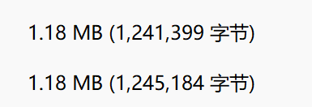
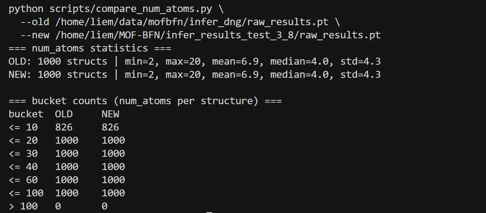
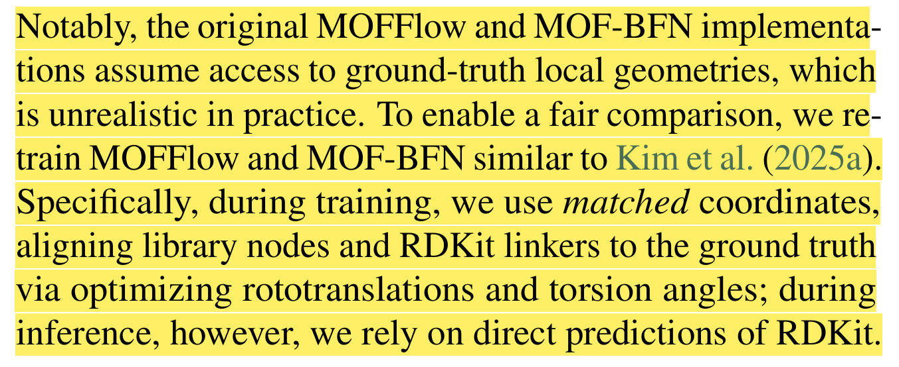
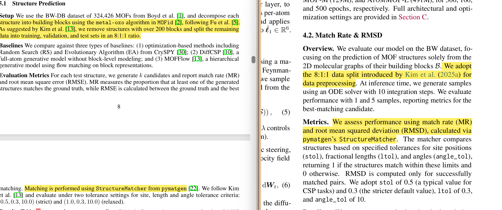
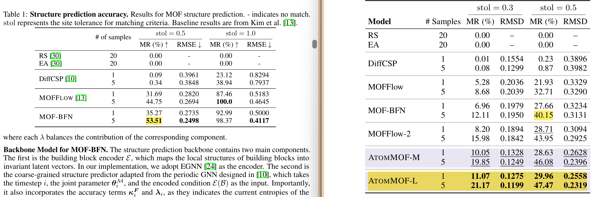

## Debug

1. 我猜测是新模型生成的 `raw_results.pt`里有更多参数，结果发现连个文件一样大。



2. 我猜测是新模型生成的 `raw_results.pt` 里，每个样本的 block/atom 数量、拓扑复杂度、距离计算量 比老模型大很多，结果各项数据一致。



3. 从连通性来考虑

- 新模型生成的结构里，图的连通性非常差，`connect_check` 在做图搜索 / 骨架判定时，会遍历一堆碎片、失败路径，导致计算过程变长；
- 旧模型里，大部分结构都是“一两次 DFS/BFS 就能覆盖整张图的 3D 网络”，图搜索非常顺利，所以很快。

## 接下来

* 探索在不破坏已有性能的前提下，引入更物理合理的约束，转向更稳健的几何/体积约束。

#### 引入 lattice 体积的下限约束（体积 hinge 正则）

- 在 `models/crysbfn_bhm.py` 的 `loss_one_step` 中新增：
  - 从 `lattice_pred` 和 `lattices` 恢复长度 (a,b,c) 和角度 (\alpha,\beta,\gamma)，按晶体体积公式计算 log V。
  - 定义 体积下限 hinge：
    - 只在 `logV_gt - logV_pred > margin` 时才产生惩罚（即预测体积明显小于 gt 时）；
    - `vol_hinge_loss = mean(relu(logV_gt - logV_pred - margin)^2)`；
    - 通过权重 `cost_volume` 加到原有 `lattice_loss` 上。
  - 为了安全：
    - 所有数值操作包在 `try/except` 内，异常时退回原始 `lattice_loss`；
    - 新增超参默认值设为 0，即当前 baseline 行为完全不变。
- 配套超参设计：
  - 在 `bfn_model_bhm_tot.yaml` 之外，用 Hydra override 方式控制：
    - `model.cost_volume`：体积惩罚权重（从 0.05–0.1 试起）；
    - `model.volume_hinge_margin`：允许预测体积比 gt 小的容忍度（例如 0.05，对应 (\log V)）。


## 对照试验

### 原版 baseline（无体积正则）

```bash
cd /home/liem/MOF-BFN

export PYTHONPATH=.
export LD_LIBRARY_PATH="${HOME}/.local/share/mamba/envs/mof-bfn/lib:${LD_LIBRARY_PATH}"
export CUDA_VISIBLE_DEVICES=1
nohup python experiments/train.py \
  experiment.num_devices=1 \
  experiment.trainer.strategy=ddp \
  experiment.wandb.project=mof_bfn_volume \
  experiment.wandb.name=baseline_no_vol \
  \> logs/baseline_no_vol.log 2>&1 &
```

------

### 卡 3：体积 hinge 正则版本

```bash
cd /home/liem/MOF-BFN

export PYTHONPATH=.
export LD_LIBRARY_PATH="${HOME}/.local/share/mamba/envs/mof-bfn/lib:${LD_LIBRARY_PATH}"
export CUDA_VISIBLE_DEVICES=3
nohup python experiments/train.py \
  experiment.num_devices=1 \
  experiment.trainer.strategy=ddp \
  experiment.wandb.project=mof_bfn_volume \
  experiment.wandb.name=vol_hinge_005_005 \
  model.cost_volume=0.05 \
  model.volume_hinge_margin=0.05 \
  \> logs/vol_hinge_005_005.log 2>&1 &
```


## Question

* 今天我读了 ATOMMOF ，他觉得mof-bfn的粗粒化以及block刚体假设是有局限的，并且也做出了更好的结果，我在想是否只有像 ATOMMOF 这样从底层逻辑进行的架构重构才具有学术意义？
* 两篇论文用的相同的data，ATOMMOF去掉了 MOF-BFN 使用“已知构建块形状”的假设，让mof-bfn的效果变差了，这样合理吗？如果按MOF-BFN原本的思路，还是BFN的效果更好呀。
* 
* 
* 