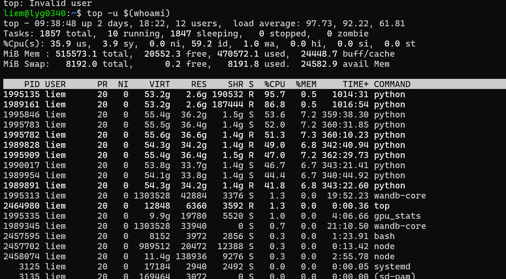
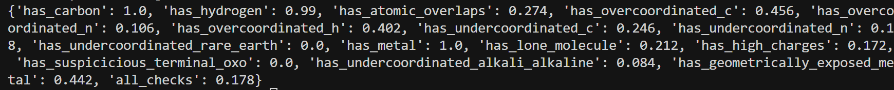
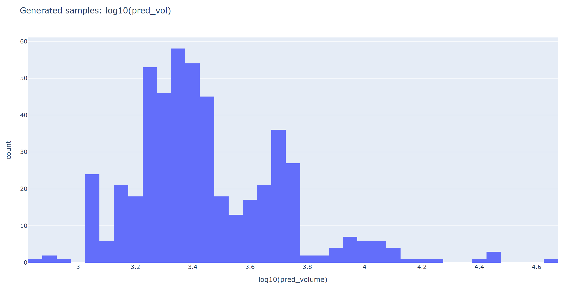
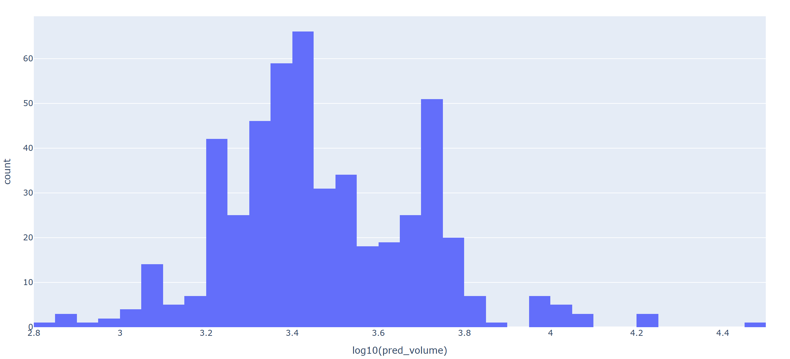

## 3.11 实验日报（MOF-BFN 体积惩罚）

### 1. 资源与环境记录

- **内存情况**：推理与后处理阶段显存 / 内存占用如图所示，需持续关注峰值占用，避免后续扩展 batch / 并发时 OOM。



---

### 2. 实验设置与运行命令

本次对比 **Baseline（无体积惩罚）** 与 **Vol_Hinge（体积惩罚 0.05 / 0.05）**，主要流程包括：

1. 使用指定 ckpt 进行推理。
2. 对推理结果进行组装、连通性检查与有效性检查。

#### 2.1 使用的 ckpt

```bash
# baseline（无体积惩罚）
# /home/liem/data/mofbfn/checkpoints/logs/mof_bfn_volume/baseline_no_vol/ckpt/epoch_368-step_210699-loss_12.8870.ckpt

# vol_hinge（体积惩罚）
# /home/liem/data/mofbfn/checkpoints/logs/mof_bfn_volume/vol_hinge_005_005/ckpt/epoch_377-step_215838-loss_13.1542.ckpt
```

#### 2.2 推理与后处理命令

```bash
export LD_LIBRARY_PATH=/home/liem/.local/share/mamba/envs/mof-bfn/lib:$LD_LIBRARY_PATH

PYTHONPATH=. python -m experiments.infer \
  experiment.wandb.name=infer_dng_test \
  inference.ckpt_path=/home/liem/data/mofbfn/checkpoints/logs/mof_bfn_volume/vol_hinge_005_005/ckpt/epoch_377-step_215838-loss_13.1542.ckpt \
  inference.inference_dir=/home/liem/MOF-BFN/infer_results_test_3_11_vol_hinge

python -m postprocess.assemble \
  --res_path /home/liem/MOF-BFN/infer_results_test_3_11_vol_hinge/raw_results.pt \
  --bb_z_path /home/liem/data/mofbfn/datasets/dng/bb_emb_space_tot_z.pt \
  --bb_blocks_path /home/liem/data/mofbfn/datasets/dng/bb_emb_space_tot_blocks_processed.lmdb \
  --max_process 500

# 检查连通性（是否形成完整 3D 骨架）
python -m evaluation.connect_check \
  --res_path /home/liem/MOF-BFN/infer_results_test_3_11_vol_hinge/raw_results.pt \
  --bb_z_path /home/liem/data/mofbfn/datasets/dng/bb_emb_space_tot_z.pt \
  --bb_blocks_path /home/liem/data/mofbfn/datasets/dng/bb_emb_space_tot_blocks_processed.lmdb \
  --max_process 500

# 有效性检查（Validity Check）
python -m evaluation.validity_check \
  --res_path /home/liem/MOF-BFN/infer_results_test_3_11_vol_hinge/samples \
  --max_process 500
```

推理日志中关于 connect 与 validity 的摘要可视化如下。

---

### 3. 结构连通性结果对比（connect）

#### 3.1 Baseline 结果

- **connect**：0.858


#### 3.2 Vol_Hinge 结果

- **connect**：0.850



#### 3.3 结构质量指标对比

| **检查项目 (Metric)**                    | **Baseline (基准)** | **Vol_Hinge (优化)** | **趋势要求** |
| ---------------------------------------- | ------------------- | -------------------- | ------------ |
| **has_carbon**                           | 1.0                 | 1.0                  | **↑**        |
| **has_hydrogen**                         | 0.97                | **0.99**             | **↑**        |
| **has_atomic_overlaps**                  | 0.282               | **0.274**            | **↓**        |
| **has_overcoordinated_c**                | **0.438**           | 0.456                | **↓**        |
| **has_overcoordinated_n**                | 0.108               | **0.106**            | **↓**        |
| **has_overcoordinated_h**                | **0.368**           | 0.402                | **↓**        |
| **has_undercoordinated_c**               | **0.242**           | 0.246                | **↓**        |
| **has_undercoordinated_n**               | **0.16**            | 0.18                 | **↓**        |
| **has_undercoordinated_rare_earth**      | 0.0                 | 0.0                  | **↓**        |
| **has_metal**                            | 1.0                 | 1.0                  | **↑**        |
| **has_lone_molecule**                    | **0.168**           | 0.212                | **↓**        |
| **has_high_charges**                     | 0.184               | **0.172**            | **↓**        |
| **has_suspicious_terminal_oxo**          | 0.0                 | 0.0                  | **↓**        |
| **has_undercoordinated_alkali_alkaline** | 0.086               | **0.084**            | **↓**        |
| **has_geometrically_exposed_metal**      | **0.426**           | 0.442                | **↓**        |
| **all_checks (总通过率)**                | **0.194**           | 0.178                | **↑**        |

**小结：**

- connect 指标从 0.858 略降至 0.850，表明体积惩罚对整体连通性没有明显提升，甚至有轻微负面影响。
- 某些局部几何 / 电荷相关指标略有改善（如 `has_hydrogen`、`has_high_charges`），但 `all_checks` 总通过率整体变差。

---

### 4. 体积分布分析：惩罚对生成晶体大小的影响

为定量分析体积惩罚对生成晶体大小分布的影响，对推理得到的 CIF 文件统计体积分布：

```bash
/home/liem/.local/share/mamba/envs/mof-bfn/bin/python - <<'PY'
import glob
import numpy as np

cifs = sorted(glob.glob('/home/liem/MOF-BFN/infer_results_test_3_11_vol_hinge/samples/pred_*.cif'))
print('cif_count', len(cifs))

vols = []
bad = []

# Prefer pymatgen for robust CIF parsing
try:
    from pymatgen.core.structure import Structure
except Exception as e:
    raise RuntimeError(f'pymatgen import failed: {e}')

for p in cifs:
    try:
        s = Structure.from_file(p)
        vols.append(float(s.lattice.volume))
    except Exception as e:
        bad.append((p, str(e)))

vols = np.asarray(vols, dtype=np.float64)
print('parsed', vols.size, 'failed', len(bad))
if bad:
    print('first_fail', bad[0][0], bad[0][1][:200])

if vols.size:
    print('mean', vols.mean(), 'std', vols.std(), 'min', vols.min(), 'max', vols.max())
    for p in [0,1,5,25,50,75,95,99,100]:
        print(f'p{p:>3}', np.percentile(vols, p))
    logv = np.log10(vols)
    print('log10(V) p1/p50/p99', np.percentile(logv,1), np.percentile(logv,50), np.percentile(logv,99))

    # plotly html
    try:
        import plotly.express as px
        fig = px.histogram(x=logv, nbins=80, labels={'x':'log10(pred_volume)'}, title='Generated samples: log10(pred_vol)')
        out = '/home/liem/data/mofbfn/infer_dng/samples/pred_log10vol_hist.html'
        fig.write_html(out)
        print('saved', out)
    except Exception as e:
        print('plotly failed/absent:', e)
PY
```

#### 4.1 体积分布可视化

##### baseline



##### vol_hinge



##### train data


#### 4.2 统计指标对比

| **统计指标**                  | **Baseline (基准)** | **Vol_Hinge (优化)**   | **训练集参考 (GT)** |
| ----------------------------- | ------------------- | ---------------------- | ------------------- |
| **平均值 (Mean)**             | 3546.18             | **3450.71**            | 5375.56             |
| **标准差 (Std)**              | 3671.51             | **2446.84**            | 6563.75             |
| **最小值 (Min)**              | 718.47              | 700.93                 | 534.48              |
| **最大值 (Max)**              | 44705.89            | **29846.67**           | 193341.75           |
| **P50 (中位数)**              | 2483.23             | 2667.05                | 3389.28             |
| **P99 (百分位)**              | 16945.17            | **12037.74**           | 33802.72            |
| **$\log_{10}V$ (P1/P50/P99)** | 3.05 / 3.40 / 4.23  | 2.98 / 3.43 / **4.08** | 2.90 / 3.53 / 4.53  |

**观察：**

- 与训练集相比，Baseline 与 Vol_Hinge 的体积整体都偏小，尾部分布明显被压缩。
- 引入 Vol_Hinge 后：
  - 平均体积从 3546 → 3451，**整体略有变小**；
  - 标准差从 3672 → 2447，**分布被明显收缩，更集中在中间区域**；
  - 最大体积与 P99 均明显变小，尾部大体积样本被压制更严重。

---

### 5. 结论与改进思路

#### 5.1 结论

- 初衷：希望通过体积惩罚让生成晶体 **变大一点**，向训练集的体积分布靠近。
- 实际效果：
  - 体积惩罚（相对 gt 的 hinge + lattice MSE）在当前设置下，**反而使分布整体略微变小，且方差更小**；
  - 直觉上，这是因为相对 gt 的 hinge 项 + lattice MSE 共同作用，把预测体积「拉向中间」，使得模型在体积上更保守，抑制了大体积样本。

#### 5.2 后续改进方向

- **目标**：
  - 不再「相对每个样本的 gt」去惩罚，而是对「过小体积」设置一个**全局下界**，只惩罚过小样本，使分布在下方抬升，而不过度压缩整体分布。

- **方案：新增“固定下界”体积惩罚模式**

  1. **新增配置项：`volume_logv_floor`**
     - 单位：自然对数 \(\ln(V)\)，而不是 \(\log_{10} V\)。

  2. **惩罚形式：**
     - 当 \(\log V_{\text{pred}} < \text{volume\_logv\_floor}\) 时，加惩罚：
       \[
       (\text{volume\_logv\_floor} - \log V_{\text{pred}})^2
       \]
     - 梯度只作用在「过小」的预测体积上，把它往上推；
     - 不依赖当前样本的 gt，也不强迫晶格与 gt 完全对齐，因而更不容易把整体分布压缩向中间。

  3. **兼容原有 gt-relative hinge：**
     - 当 `volume_logv_floor = null` 时，仍使用原来的
       \[
       \log V_{\text{gt}} - \log V_{\text{pred}} - \text{margin}
       \]
       那一套逻辑；旧配置不会报错。
     - 在文档 / 注释中说明：该模式容易导致分布收缩、整体变小，**后续使用需谨慎**。

  4. **配置：**
     - 在 `configs/bfn_model_bhm_tot.yaml` 中新增：
       - `volume_logv_floor: null`
     - 建议将 `volume_logv_floor` 设为训练集 \(\ln(V)\) 的约 P25：
       - 训练集统计：P25 体积 \(\approx 2012.34\)，则 \(\ln(V_{\text{P25}}) \approx 7.607\)。
     - 后续可以尝试 P25 / P30 / P40 等档位，观察体积分布与结构质量的折衷。

#### 5.3 后续实验计划

使用新的体积下界惩罚配置，启动下一轮训练实验：

```bash
export PYTHONPATH=.
export LD_LIBRARY_PATH="${HOME}/.local/share/mamba/envs/mof-bfn/lib:${LD_LIBRARY_PATH}"
export CUDA_VISIBLE_DEVICES=4,5
nohup python experiments/train.py \
  experiment.num_devices=2 \
  experiment.trainer.strategy=ddp \
  experiment.wandb.project=mof_bfn_volume \
  experiment.wandb.name=vol_floor_75 \
  model.cost_volume=0.1 \
  model.volume_logv_floor=7.5 \
  > logs/vol_floor_75.log 2>&1 &
```

计划在后续日报中对 `vol_floor_75` 的连通性、有效性和体积分布进行同样的对比与分析。


