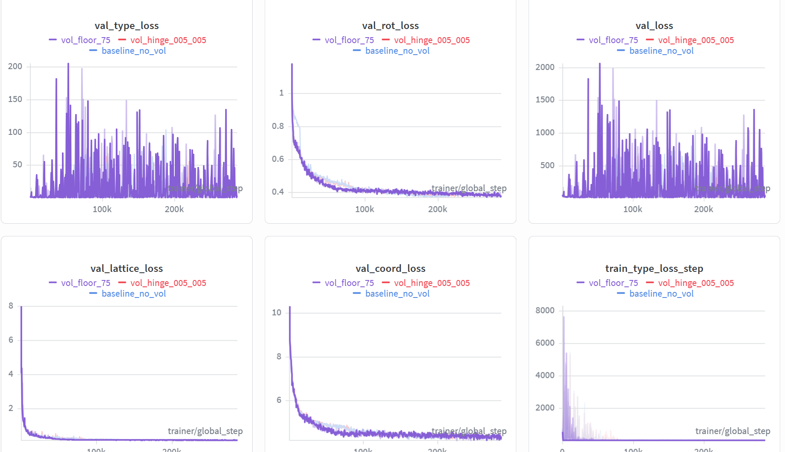
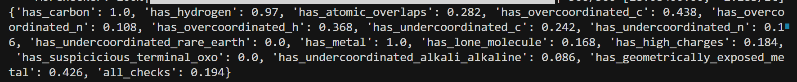
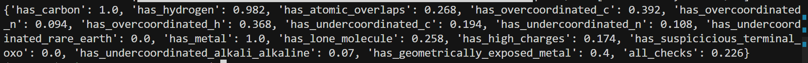
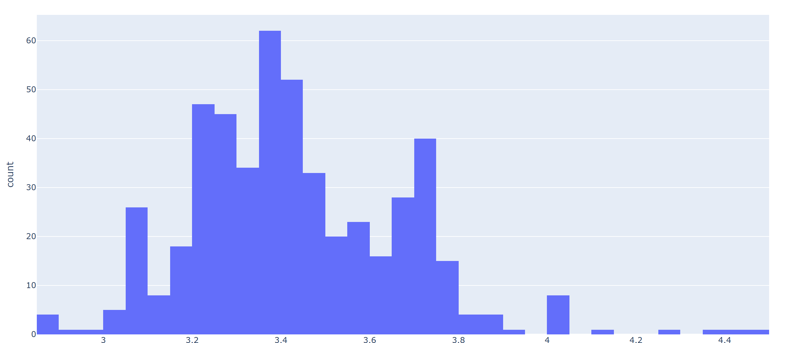

## 实验结果



* loss曲线比baseline要高一些，主要是val_type_loss的影响

```python
# /home/liem/data/mofbfn/checkpoints/logs/mof_bfn_volume/vol_floor_75/ckpt/epoch_887-step_253968-loss_13.3176.ckpt
```

#### 2.2 推理与后处理命令

```bash
export LD_LIBRARY_PATH=/home/liem/.local/share/mamba/envs/mof-bfn/lib:$LD_LIBRARY_PATH

PYTHONPATH=. python -m experiments.infer \
  experiment.wandb.name=infer_dng_test \
  inference.ckpt_path=/home/liem/data/mofbfn/checkpoints/logs/mof_bfn_volume/vol_floor_75/ckpt/epoch_887-step_253968-loss_13.3176.ckpt \
  inference.inference_dir=/home/liem/MOF-BFN/infer_results_test_3_12_vol_hinge

python -m postprocess.assemble \
  --res_path /home/liem/MOF-BFN/infer_results_test_3_12_vol_hinge/raw_results.pt \
  --bb_z_path /home/liem/data/mofbfn/datasets/dng/bb_emb_space_tot_z.pt \
  --bb_blocks_path /home/liem/data/mofbfn/datasets/dng/bb_emb_space_tot_blocks_processed.lmdb \
  --max_process 500

# 检查连通性（是否形成完整 3D 骨架）
python -m evaluation.connect_check \
  --res_path /home/liem/MOF-BFN/infer_results_test_3_12_vol_hinge/raw_results.pt \
  --bb_z_path /home/liem/data/mofbfn/datasets/dng/bb_emb_space_tot_z.pt \
  --bb_blocks_path /home/liem/data/mofbfn/datasets/dng/bb_emb_space_tot_blocks_processed.lmdb \
  --max_process 500

# 有效性检查（Validity Check）
python -m evaluation.validity_check \
  --res_path /home/liem/MOF-BFN/infer_results_test_3_12_vol_hinge/samples \
  --max_process 500
```

推理日志中关于 connect 与 validity 的摘要可视化如下。

---

### 3. 结构连通性结果对比（connect）

#### 3.1 Baseline 结果

- **connect**：0.858



#### 3.2 Vol_floor_75 结果

- **connect:** 0.886



#### 3.3 结构质量指标对比

| **指标 (Metric)**                   | **趋势** | **Baseline** | **Vol_floor_75** |
| ----------------------------------- | -------- | ------------ | ---------------- |
| **connect**                         | ↑        | 0.858        | **0.886**        |
| **has_carbon**                      | -        | 1.000        | 1.000            |
| **has_hydrogen**                    | ↑        | 0.970        | **0.982**        |
| **has_atomic_overlaps**             | ↓        | 0.282        | **0.268**        |
| **has_overcoordinated_c**           | ↓        | 0.438        | **0.392**        |
| **has_overcoordinated_n**           | ↓        | 0.108        | **0.094**        |
| **has_overcoordinated_h**           | -        | 0.368        | 0.368            |
| **has_undercoordinated_c**          | ↓        | 0.242        | **0.194**        |
| **has_undercoordinated_n**          | ↓        | **0.106**    | 0.108            |
| **has_lone_molecule**               | ↑        | 0.168        | **0.258**        |
| **has_high_charges**                | ↓        | 0.184        | **0.174**        |
| **has_geometrically_exposed_metal** | ↓        | 0.426        | **0.400**        |
| **all_checks (通过率)**             | ↑        | 0.194        | **0.226**        |

目前效果还不错，我想要继续训练试试。


### 4. 体积分布分析：惩罚对生成晶体大小的影响

为定量分析体积惩罚对生成晶体大小分布的影响，对推理得到的 CIF 文件统计体积分布：

```bash
/home/liem/.local/share/mamba/envs/mof-bfn/bin/python - <<'PY'
import glob
import numpy as np

cifs = sorted(glob.glob('/home/liem/MOF-BFN/infer_results_test_3_12_vol_hinge/samples/pred_*.cif'))
print('cif_count', len(cifs))

vols = []
bad = []

# Prefer pymatgen for robust CIF parsing
try:
    from pymatgen.core.structure import Structure
except Exception as e:
    raise RuntimeError(f'pymatgen import failed: {e}')

for p in cifs:
    try:
        s = Structure.from_file(p)
        vols.append(float(s.lattice.volume))
    except Exception as e:
        bad.append((p, str(e)))

vols = np.asarray(vols, dtype=np.float64)
print('parsed', vols.size, 'failed', len(bad))
if bad:
    print('first_fail', bad[0][0], bad[0][1][:200])

if vols.size:
    print('mean', vols.mean(), 'std', vols.std(), 'min', vols.min(), 'max', vols.max())
    for p in [0,1,5,25,50,75,95,99,100]:
        print(f'p{p:>3}', np.percentile(vols, p))
    logv = np.log10(vols)
    print('log10(V) p1/p50/p99', np.percentile(logv,1), np.percentile(logv,50), np.percentile(logv,99))

    # plotly html
    try:
        import plotly.express as px
        fig = px.histogram(x=logv, nbins=80, labels={'x':'log10(pred_volume)'}, title='Generated samples: log10(pred_vol)')
        out = '/home/liem/data/mofbfn/infer_dng/samples/pred_log10vol_hist.html'
        fig.write_html(out)
        print('saved', out)
    except Exception as e:
        print('plotly failed/absent:', e)
PY
```

#### 4.1 体积分布可视化

##### vol_floor_75



生成的分布符合正态分布，和trian data的吻合度也较高，但为什么仍然会有特别小的晶体？

##### train data


#### 4.2 统计指标对比

| **统计指标**                  | **Baseline (基准)** | **Vol_Hinge (优化)**  | **训练集参考 (GT)** |
| ----------------------------- | ------------------- | --------------------- | ------------------- |
| **平均值 (Mean)**             | 3546.18             | 3208.05               | 5375.56             |
| **标准差 (Std)**              | 3671.51             | **2625.26**           | 6563.75             |
| **最小值 (Min)**              | 718.47              | 710.05                | 534.48              |
| **最大值 (Max)**              | 44705.89            | **30431.21**          | 193341.75           |
| **P50 (中位数)**              | 2483.23             | 2504.75               | 3389.28             |
| **P99 (百分位)**              | 16945.17            | **11152.35**          | 33802.72            |
| **$\log_{10}V$ (P1/P50/P99)** | 3.05 / 3.40 / 4.23  | 2.97 / 3.40/ **4.05** | 2.90 / 3.53 / 4.53  |

不知为什么整体变得更小了。

