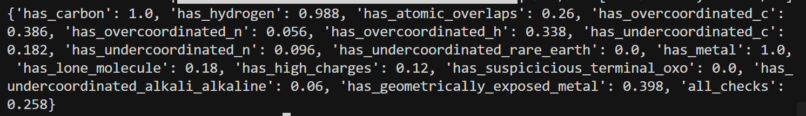
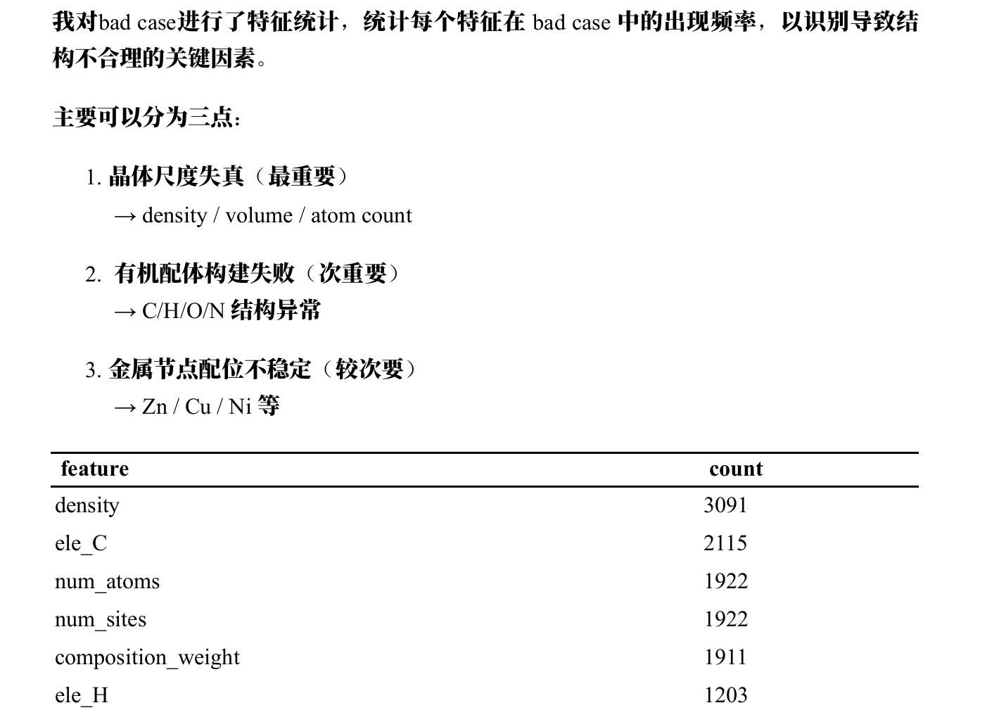
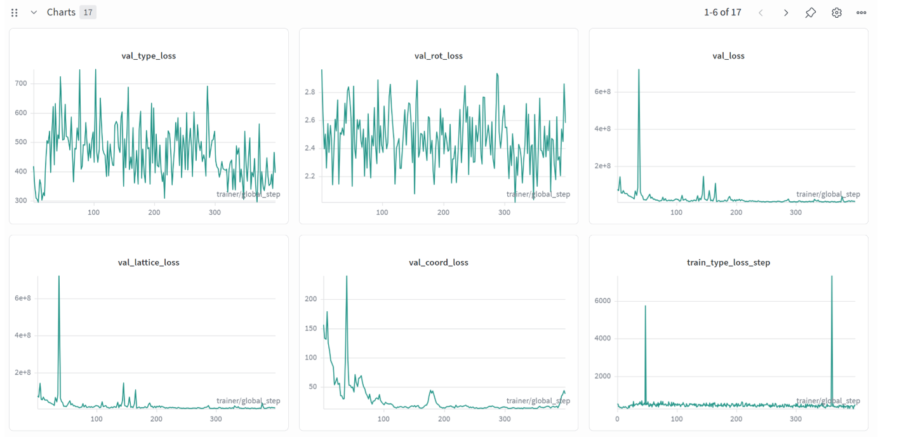
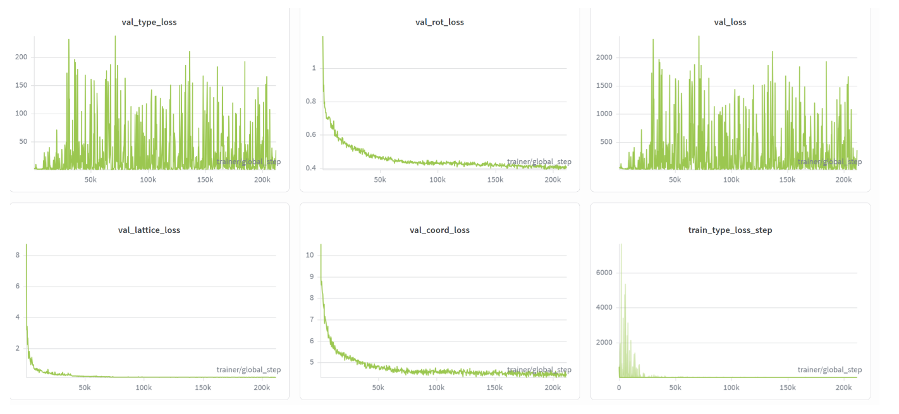

## 上一次训练的实验结果

- **Connect 通过率**：0.942  
- 充分训练之后，结果仍然没有 baseline 好。

---

## 分析 BFN 各 loss 与 MOFChecker 指标的关系

### Loss 指标含义

| Loss | 形式 | 直接优化的量 | 含义 |
|------|------|--------------|------|
| **lattice_loss** | `dtime4continuous_loss`：按时间步加权的 **MSE(x_pred, x_gt)** | 晶格参数与 GT 的匹配 | 6 维：`(log(a), log(b), log(c), tan(α-π/2), ...)`，即晶胞边长与夹角 |
| **coord_loss** | `dtime4circular_loss`：**周期坐标**上的误差 | 分数坐标与 GT 的匹配 | 每个 building block 中心的分数坐标 (x,y,z) ∈ [0,1) |
| **rot_loss** | `dtime4quat_loss`：**1 - (q_pred·q_gt)²**（四元数） | 每个 block 的朝向与 GT 的匹配 | 旋转/取向 |
| **type_loss** | `dtime4continuous_loss`：**MSE(type_pred, type_gt)**（连续嵌入空间） | block 类型嵌入与 GT 的匹配 | 当前是哪种 building block（节点/配体等） |
| **vol 正则**（后添加） | hinge/floor on **log(V)** | 惩罚「体积过小」 | 只约束晶胞体积下界，不直接约束具体键长/配位 |

总 loss = `cost_lattice*lattice + cost_coord*coord + cost_rot*rot + cost_type*type`（再加可选 vol 项）。

**要点：**

- 所有 loss 都是**对 GT 的拟合**（MSE 或等价的匹配），没有直接写「不要重叠」「配位数要对」等规则。
- 重叠、配位、孔隙等，只能**通过学到的分布**间接影响：模型学得好 → 生成结构更像训练集 → 理论上更易通过 MOFChecker。

### Loss 与 MOFChecker 的假设对应关系

| MOFChecker 指标 | 最可能相关的 Loss / 预测 | 简要理由 |
|-----------------|--------------------------|----------|
| has_atomic_overlaps | **coord_loss** + **lattice_loss** | 重叠 = 原子太近 → 位置错或晶胞太小/扭曲；体积正则只约束总体积，不直接约束键长 |
| has_overcoordinated | **coord_loss** + **type_loss** | 配位数由「谁和谁成键」决定 → 位置 + 类型；rot 影响键角，间接影响配位判定 |
| has_lone_molecule | **coord_loss** + **type_loss** | 孤立分子 = 连通性断裂 → 哪些 block 放哪、是否连成骨架 |
| is_porous | **lattice_loss** + **vol 正则** | 孔隙与晶胞大小、体积、形状强相关；coord 决定原子占位，也影响孔道 |
| has_carbon / has_hydrogen / has_metal | **type_loss** | 成分是否包含 C/H/金属 → 主要看 block 类型预测 |
| has_high_charges / suspicious_terminal_oxo / exposed_metal | **type_loss** + **coord/rot** | 化学/几何异常 → 类型与局部几何（位置+取向） |

**假设小结：**

- **coord_loss** 和 **lattice_loss** 很可能对 overlaps、配位、连通性、孔隙都有影响。
- **type_loss** 主要对成分和部分化学检查有影响。
- **rot_loss** 更多通过键角/几何间接影响配位和暴露金属等。
- 单独调 **vol 正则** 主要作用在体积/孔隙相关，对重叠/配位的直接作用有限，需要和 lattice/coord 一起看。

---

## 验证假设

### 1. 对 baseline 进行分析

#### 各检查通过率（Baseline）

| 检查项 | 通过率 | 说明 |
|--------|--------|------|
| has_carbon | 1.00 | 全部含 C |
| has_metal | 1.00 | 全部含金属 |
| has_undercoordinated_rare_earth / has_suspicious_terminal_oxo | 1.00 | 无此类问题 |
| has_hydrogen | 0.99 | 约 1% 缺 H |
| has_overcoordinated_n / has_undercoordinated_alkali_alkaline | 0.98 | 配位/碱金属问题很少 |
| has_high_charges | 0.94 | 约 6% 高电荷 |
| **has_atomic_overlaps** | **0.91** | 约 9% 有原子重叠 |
| has_overcoordinated_h / has_undercoordinated_n | 0.85 | 约 15% H/N 配位异常 |
| has_overcoordinated_c | 0.84 | 约 16% C 配位过高 |
| has_undercoordinated_c | 0.76 | 约 24% C 配位不足 |
| **has_lone_molecule** | **0.75** | 约 25% 存在孤立分子（连通性差），但 connect check 通过率却是 98% |
| **has_geometrically_exposed_metal** | **0.65** | 约 35% 几何暴露金属 |
| **all_checks** | **0.31** | 仅约 **31%** 同时通过全部检查 |

#### connect_check (98%) 与 has_lone_molecule (75%) 为何不一致？

两者定义不同：connect_check 可能基于图连通性或阈值较松的成键判定；has_lone_molecule 可能对「孤立分子」有更严格的几何/化学判定。因此会出现 connect 通过率高而 lone_molecule 通过率较低的情况。

#### 主要短板

- **has_geometrically_exposed_metal (0.65)**：暴露金属最多。
- **has_lone_molecule (0.75)**：约 1/4 存在孤立分子，说明 3D 连通性不足。
- **has_undercoordinated_c (0.76)**：C 配位不足。
- **has_overcoordinated_c (0.84)**、**has_undercoordinated_n / has_overcoordinated_h** (0.85)：C/N/H 配位略差。
- **has_atomic_overlaps (0.91)**。

#### 按体积分桶：has_atomic_overlaps（无重叠）通过率

| 体积桶 (ų) | 通过率 | 样本数 |
|-------------|--------|--------|
| 573 ~ 1527 | 1.00 | 20 |
| 1527 ~ 2310 | 0.90 | 20 |
| 2310 ~ 3090 | 0.85 | 20 |
| 3090 ~ 5232 | 1.00 | 20 |
| 5232 ~ 58840 | 0.80 | 20 |

「体积小」并没有带来更多原子重叠，反而是最大的体积桶最差，可能与晶胞过大、原子排布更散或相对位置误差更大有关。

#### 按原子数分桶：has_lone_molecule（无孤立分子）通过率

| 原子数桶 | 通过率 | 样本数 |
|----------|--------|--------|
| 26 ~ 58 | 0.76 | 21 |
| 58 ~ 74 | 0.85 | 20 |
| 74 ~ 99 | 0.74 | 19 |
| 99 ~ 135 | 0.80 | 20 |
| **135 ~ 444** | **0.60** | 20 |

**原子数最多的一桶**（135–444）通过率明显最低（**0.60**）：结构越大、block 越多，越容易出现孤立分子或连通性断裂。

---

### 2. 阅读 MOFChecker 源代码

| MOFChecker 指标 | 主要依赖的 loss | 说明 |
|-----------------|-----------------|------|
| has_atomic_overlaps | **coord, lattice** | 纯距离：重叠 = dist < min(cov_r) |
| has_overcoordinated | **coord, type, rot** | 配位数来自图；图由距离+类型建边；键角来自 rot |
| has_geometrically_exposed_metal | **coord, rot** | 配位锥角由配体位置+取向决定 |
| has_lone_molecule | **coord, type, lattice** | 连通分量是否跨 PBC，由成键图决定 |
| has_3d_connected_graph | **coord, type, lattice** | 同上，图连通性 |
| is_porous | **lattice, coord, 体积** | 孔由晶胞与占位决定；zeo++ PLD≥2.4 |
| has_high_charges | type, coord, rot | 电荷由成分与几何间接决定 |
| has_carbon / has_hydrogen / has_metal | **type** | 成分 |
| has_suspicious_terminal_oxo | **coord, rot, type** | 局部化学环境 |

---

### 3. 消融实验设计（验证「哪个 loss 驱动哪个指标」）

思路：在**固定数据、固定其他 cost** 下，**单变量**放大某一 cost，训到相近步数/epoch，同一套推理+评估，看 MOFChecker 各通过率与 connect_check 的变化。

| Run | all_checks | has_atomic_overlaps | has_lone_molecule | has_geometrically_exposed_metal | has_overcoordinated_c | has_undercoordinated_c | connect_check |
|-----|------------|---------------------|-------------------|--------------------------------|------------------------|-------------------------|---------------|
| baseline | 0.31 | 0.91 | 0.75 | 0.65 | 0.84 | 0.76 | 0.98 |
| abl_baseline_small | 0.00 | 0.49 | **0.97** | 0.72 | 0.39 | 0.21 | 0.39 |
| abl_type_low_02_small | 0.00 | 0.65 | 0.95 | **0.80** | **0.77** | 0.51 | 0.28 |
| abl_type_15_small | 0.00 | **0.70** | 0.90 | 0.75 | 0.51 | **0.08** | 0.32 |
| abl_coord_2_small | 0.00 | 0.55 | 0.81 | 0.63 | 0.53 | 0.30 | 0.38 |
| abl_lattice_2_small | **0.01** | 0.58 | 0.87 | 0.72 | 0.56 | 0.13 | 0.34 |
| abl_rot_15_small | 0.00 | 0.57 | 0.95 | 0.74 | 0.54 | 0.21 | 0.35 |

#### 六组消融解读

小规模短训下 all_checks 多为 0，仅 **abl_lattice_2_small** 为 0.01（1 条全过）；相对变化足以区分各 cost 的效应。

| 指标 | 最优 run |
|------|----------|
| all_checks | abl_lattice_2_small |
| has_atomic_overlaps / has_undercoordinated_c | abl_type_15_small |
| has_lone_molecule | abl_baseline_small |
| has_geometrically_exposed_metal / has_overcoordinated_c / 成分 | abl_type_low_02_small |

**小结**：type_low_02 在暴露金属、成分、overcoordinated_c 最好；type_15 在 overlaps、undercoordinated_c 最好；lattice_2 唯一 all_checks>0。coord_2 本批中连通性与暴露金属最差，需长训或改 cost_coord 再验证。后续可试 cost_type 中间值（0.5～2）或 type_low + lattice 组合。

#### 从消融实验得出的 Loss 与 MOFChecker 指标关系

根据六组消融（改单一 cost_*）与 MOFChecker/connect_check 的对应，归纳如下。与上文「假设」一致处已用「✓」标出；不一致或需进一步验证的也标出。

| Loss（调节 cost_*） | 消融中主要影响的 MOFChecker 指标 | 方向（权重↑时） | 与源码/假设是否一致 |
|---------------------|----------------------------------|-----------------|----------------------|
| **type_loss** | has_atomic_overlaps、has_undercoordinated_c、has_overcoordinated_c、has_geometrically_exposed_metal、has_carbon/hydrogen、has_lone_molecule、connect_check | type 权重大 → overlaps↑、undercoordinated_c↑、connect 略↓；权重小 → exposed_metal↑、overcoordinated_c↑、成分↑、undercoordinated_c↓ | ✓ 成分/配位与 type 对应；压 type 后 exposed_metal/overcoordinated_c 变好，与「让 coord/rot 多占梯度」一致 |
| **coord_loss** | has_lone_molecule、has_geometrically_exposed_metal | coord 权重↑（本批）→ lone_molecule↓、exposed_metal↓ | 与「coord 主导连通性/重叠」的假设相反，可能与小规模/步数或权重 2.0 有关，需全文或更长训再验证 |
| **lattice_loss** | all_checks、has_atomic_overlaps、has_undercoordinated_c | lattice 权重↑ → 唯一 all_checks>0，overlaps/undercoordinated_c 中等偏好 | ✓ 与「lattice 影响体积/重叠/孔隙」一致；对「全项通过」有边际帮助 |
| **rot_loss** | 各项较均衡；has_lone_molecule、has_geometrically_exposed_metal 中等 | rot 权重↑ → 连通性与暴露金属居中，无单项最差 | ✓ 与「rot 影响配位几何/键角、间接影响暴露金属」一致 |

**简要结论：**

- **想提 has_geometrically_exposed_metal、has_overcoordinated_c、成分**：适当压低 cost_type（如 0.2）或保持中等，让 coord/rot 梯度更足。
- **想提 has_atomic_overlaps、has_undercoordinated_c**：可适当提高 cost_type（如 15）或配合 lattice；注意 cost_type 过高会损 has_lone_molecule 与 connect_check。
- **想提 all_checks / 全项通过**：本批消融中加大 cost_lattice（lattice_2）是唯一出现 all_checks>0 的设定，可保留或与 type 中间权重组合。
- **has_lone_molecule / connect_check**：本批中 baseline 与 rot_15 较好；coord_2 最差。若全文/长训下仍如此，则不宜单方面大幅提高 cost_coord，需与 type、lattice 一起调。

以上关系基于当前小规模、短训消融；全文或更长训可能部分修正。

---

## 根据实验后的改进想法

### 1. 重新平衡 type 权重

- **现象**：默认 cost_type=10 时 val_type_loss 量级远大于 coord/rot/lattice，总 loss 被 type 主导，几何/连通性学不足。
- **做法**：把 **cost_type 从 10 降到 0.5～2**，让 type 与 coord/lattice/rot 的加权贡献同量级。
- **预期**：val_loss 更稳，has_geometrically_exposed_metal、has_overcoordinated_c、成分有机会提升。
- **实施**：在现有训练命令上加 `model.cost_type=1.0`（或 0.5），其余 cost 不变，用全文数据训一版，对比 baseline 的 validity 与 connect_check。

### 2. 适当加大 lattice 权重

- **现象**：消融里唯一 all_checks>0 的是 abl_lattice_2_small；lattice 对重叠、undercoordinated_c、全项通过都有边际帮助。
- **做法**：在 type 已 rebalance 的前提下，把 **cost_lattice 从 1 提到 1.2～1.5**，避免过度挤压其他项。
- **预期**：all_checks、has_atomic_overlaps、has_undercoordinated_c 可能略有提升。
- **实施**：与上一条同跑或作为第二版，例如 `model.cost_type=1.0 model.cost_lattice=1.2`。

### 3. coord / rot 权重

- **coord**：本批消融中 cost_coord=2 使 has_lone_molecule、has_geometrically_exposed_metal 变差，全文/长训下是否反转未验证。建议**先不改或只微调**（如 1.0→1.2），等 type/lattice 调稳后再单独试 cost_coord。
- **rot**：rot_15 各项均衡，当前 cost_rot=10 可维持；若想加强配位几何，可试 cost_rot=12～15，优先级低于 type/lattice。

---

## 反思总结

1. **半个月前的优化方向有偏差**：当时发现 bad case 里密度问题最多，且 lattice loss 很大，于是从「约束晶体大小、加密度惩罚项」等角度优化，结果忽视了 MOFChecker 里的主要短板（如 has_geometrically_exposed_metal、has_lone_molecule、has_undercoordinated_c 等）。

2. **缺乏经验导致误判**：因为是第一次跑实验，看到 loss 曲线后不清楚什么是重点。第一次跑实验时 lattice_loss 曾到 10^8^ 量级；第二次复现时发现 **val_type_loss 才是真正没有收敛、并主导 val_loss 的原因**。

   - 第一次实验图像：

   

   - 第二次复现图像：

   
