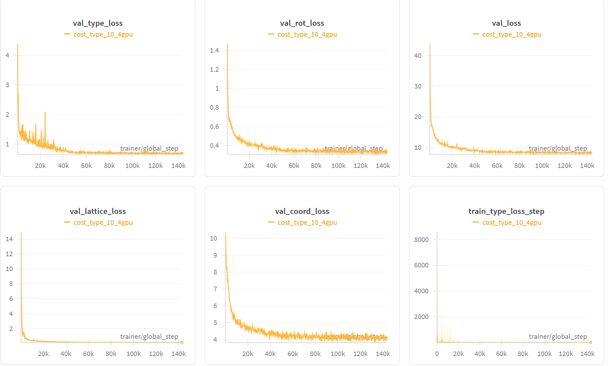
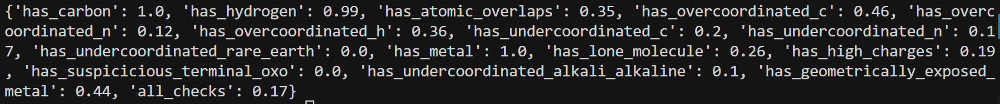
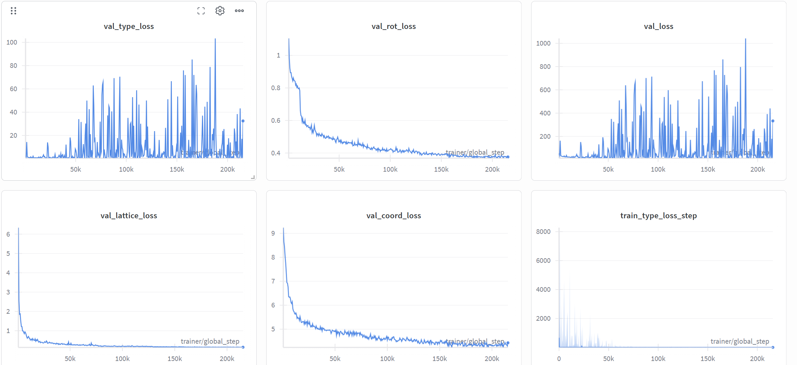
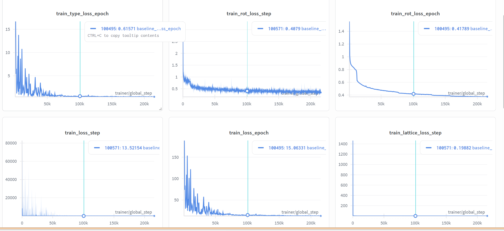
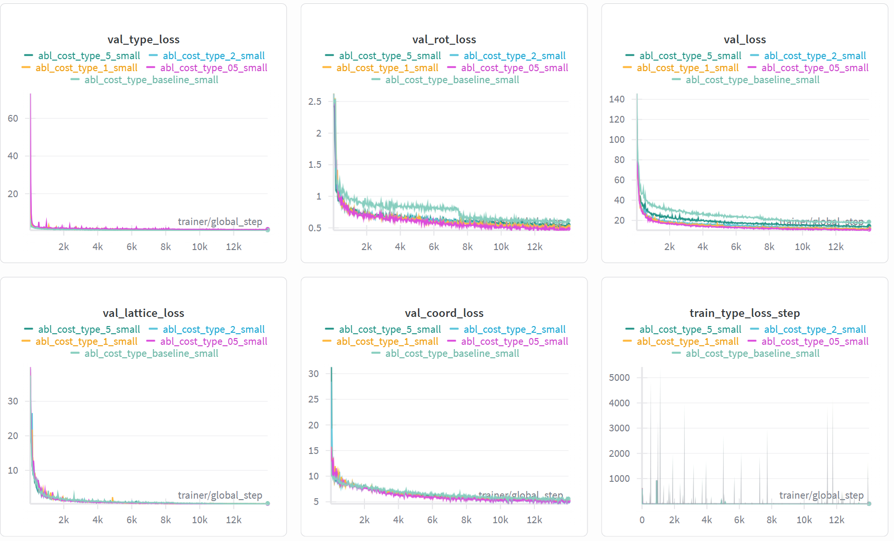

## 师兄的建议

1. 小规模训练需要先在训练 / 验证上收敛，结果才更有说服力。  
2. 分析并解决 type loss 长期降不下来的问题。  
3. 考虑分阶段训练：先区分有机 / 金属，再区分具体类型（当前有机和金属已经可以较好区分，接下来主要关注第二阶段的细分类）。  
4. 在 validation 上对 type loss 做错误分析：区分是大类（有机 / 金属）错，还是细分类（具体 building block）错。（已完成）  

## 昨天的实验结果

- **调低 type loss 权重后，val_type_loss 有所下降**：  
  即把 **cost_type 从 10 降到 1**，让 type 与 coord / lattice / rot 的加权贡献处于同一量级，可以看到 `val_type_loss` 有明显下降趋势。



```bash
# /home/liem/MOF-BFN/ablation_ckpts/logs/mof_bfn_volume/cost_type_10_4gpu/ckpt/epoch_737-step_105534-loss_8.1659.ckpt
export LD_LIBRARY_PATH=/home/liem/.local/share/mamba/envs/mof-bfn/lib:$LD_LIBRARY_PATH

PYTHONPATH=. python -m experiments.infer \
  paths.save_dir=/home/liem/MOF-BFN/ablation_ckpts \
  experiment.wandb.name=infer_dng_test \
  inference.ckpt_path=/home/liem/MOF-BFN/ablation_ckpts/logs/mof_bfn_volume/cost_type_10_4gpu/ckpt/epoch_737-step_105534-loss_8.1659.ckpt \
  inference.inference_dir=/home/liem/MOF-BFN/infer_results_test_3_16_type_loss_down

python -m postprocess.assemble \
  --res_path /home/liem/MOF-BFN/infer_results_test_3_16_type_loss_down/raw_results.pt \
  --bb_z_path /home/liem/data/mofbfn/datasets/dng/bb_emb_space_tot_z.pt \
  --bb_blocks_path /home/liem/data/mofbfn/datasets/dng/bb_emb_space_tot_blocks_processed.lmdb \
  --max_process 100

# 检查连通性（是否形成完整 3D 骨架）
python -m evaluation.connect_check \
  --res_path /home/liem/MOF-BFN/infer_results_test_3_16_type_loss_down/raw_results.pt \
  --bb_z_path /home/liem/data/mofbfn/datasets/dng/bb_emb_space_tot_z.pt \
  --bb_blocks_path /home/liem/data/mofbfn/datasets/dng/bb_emb_space_tot_blocks_processed.lmdb \
  --max_process 100

# 有效性检查（Validity Check）
python -m evaluation.validity_check \
  --res_path /home/liem/MOF-BFN/infer_results_test_3_16_type_loss_down/samples \
  --max_process 100
```

connect：0.84



- 虽然图像上的 loss 曲线已经比较收敛，但从生成结构的质量来看，整体效果仍然不理想。


## 区分有机/金属

```bash
PYTHONPATH=. python scripts/analyze_type_errors.py \
  --ckpt_path /home/liem/data/mofbfn/checkpoints/dng/60882304_last.ckpt \
  --config_path configs/bfn_base_bhm_tot.yaml \
  --cache_dir /home/liem/data/mofbfn/datasets/dng \
  --bb_z_path /home/liem/data/mofbfn/datasets/dng/bb_emb_space_tot_z.pt \
  --bb_blocks_path /home/liem/data/mofbfn/datasets/dng/bb_emb_space_tot_blocks_processed.lmdb \
  --max_batches 50
```

### 实验结果

- **总 building block 数（val）**：103658  

**【1】大类（有机 vs 金属）**

- 大类准确率（预测的 organic / metal 与 GT 一致）：0.9800（101583 / 103658）  

**【2】细类（具体 building block 索引）**

- 细类准确率（`pred_bb_idx == gt_bb_idx`）：0.1035（10728 / 103658）  

**【3】大类对、细类错**

- 大类做对但细类做错：90855（87.65%）  
- 在大类做对的样本中，细类错误占比：89.44%  

**小结：** 有机 / 金属的大类判别已经较好，当前主要短板在于 **细类**（具体 building block 的区分）。


## 探究为什么 type_loss 降不下来





### loss 曲线现象分析

- `train_type_loss`（含 step / epoch）：一开始很高（step 上曾到 ~8000），前几千 step 内快速下降，之后长期维持在较低水平（epoch 约 0.5–0.6）。  
  → **训练集上 type loss 随 step 明显下降并收敛。**
- `val_type_loss`：整体没有明显向下趋势，而是长期剧烈震荡、尖峰很多，中后段仍出现尖峰到 60、甚至 100+（约 180k step 附近）。  
  → **验证集上 type loss 几乎不降且非常不稳定，符合“type loss 降不下来”的现象。**


### 观察 building block 的情况

```bash
cd /home/liem/MOF-BFN && PYTHONPATH=. python scripts/analyze_bb_embedding_separability.py \
  --bb_z_path /home/liem/data/mofbfn/datasets/dng/bb_emb_space_tot_z.pt \
  --n_sample 20000 --k 10

# 带有机 / 金属纯度
python scripts/analyze_bb_embedding_separability.py \
  --bb_z_path /home/liem/data/mofbfn/datasets/dng/bb_emb_space_tot_z.pt \
  --bb_blocks_path /home/liem/data/mofbfn/datasets/dng/bb_emb_space_tot_blocks_processed.lmdb \
  --n_sample 5000 --k 10
```

- 嵌入空间整体很拥挤、细类很难分开：  
  - 1‑NN（1‑nearest neighbor）距离：均值 0.40，但分位数 25% = 0.0005，50% = 0.0043，75% = 0.0132，说明至少 75% 的 BB 最近邻几乎“贴在一起”（1e‑3～1e‑2 量级）。  
  - 5‑NN、11‑NN 距离均值分别约 0.97、1.30，远大于典型的 1‑NN 距离 → 大部分点在一个很小的球里就有很多近邻。  
- 最近两个候选非常接近，细类之间高度可混淆：  
  - ratio(1NN / 2NN) 的均值 0.72，median 0.85，且 ratio < 1.1 的占比 100%，说明对所有采样点来说，最近和第二近的两个候选 BB 距离差别都不大。  
  - → 从几何上看，模型在「最可能的两个 BB」之间本身就很难做出明确区分，这与细类准确率只有 ~10% 非常一致。  
- 大类（有机 / 金属）在嵌入空间中是分得开的：  
  - 有机 / 金属纯度：mean = 0.9524，std ≈ 0.21，接近 1。  
  - → 在 GT 嵌入空间里，同一个点的 k 近邻中，约 95% 与它在 organic / metal 上是同一类，说明有机 / 金属大类在 embedding 中已经被很好地区分开，**问题主要出在细类**。

### 消融实验



| 指标 / Run                             | baseline (10) | cost_type_5l (5) | cost_type_2 (2) | cost_type_1 (1) | cost_type_05 (0.5) |
| -------------------------------------- | ------------- | ---------------- | --------------- | --------------- | ------------------ |
| connect_check ↑                        | 0.75          | **0.83**         | 0.63            | 0.65            | 0.66               |
| has_carbon ↑                           | **1.00**      | **1.00**         | **1.00**        | **1.00**        | **1.00**           |
| has_hydrogen ↑                         | 0.93          | **0.99**         | **0.99**        | **0.99**        | **0.99**           |
| has_atomic_overlaps ↓                  | 0.29          | **0.21**         | 0.40            | 0.37            | 0.32               |
| has_overcoordinated_c ↓                | 0.31          | **0.24**         | 0.40            | 0.40            | 0.31               |
| has_overcoordinated_n ↓                | 0.06          | 0.06             | 0.12            | 0.06            | **0.04**           |
| has_overcoordinated_h ↓                | 0.27          | 0.25             | 0.34            | 0.36            | **0.21**           |
| has_undercoordinated_c ↓               | 0.28          | **0.21**         | 0.25            | 0.26            | 0.29               |
| has_undercoordinated_n ↓               | 0.17          | **0.12**         | 0.13            | 0.16            | 0.19               |
| has_undercoordinated_rare_earth ↓      | **0.00**      | **0.00**         | **0.00**        | **0.00**        | **0.00**           |
| has_metal ↑                            | 0.97          | **1.00**         | **1.00**        | **1.00**        | **1.00**           |
| has_lone_molecule ↓                    | 0.58          | 0.53             | 0.39            | 0.44            | **0.33**           |
| has_high_charges ↓                     | 0.13          | **0.05**         | 0.16            | 0.24            | 0.15               |
| has_suspicicious_terminal_oxo ↓        | **0.00**      | **0.00**         | **0.00**        | **0.00**        | **0.00**           |
| has_undercoordinated_alkali_alkaline ↓ | **0.00**      | 0.03             | 0.08            | 0.07            | 0.04               |
| has_geometrically_exposed_metal ↓      | 0.49          | 0.49             | 0.49            | 0.52            | **0.37**           |
| all_checks ↑                           | 0.15          | **0.19**         | 0.15            | 0.08            | **0.19**           |

- **结论与后续计划：**  
  - 适当减小 `cost_type` 可以明显提升整体结构质量指标，在 `cost_type = 5` 时表现最好。  
  - 昨天直接从 10 缩放到 1 过于激进，导致效果反而变差；今天可以考虑用 `cost_type = 5` 做全数据实验。  
  - 在 `has_geometrically_exposed_metal` 这一项上，`cost_type = 0.5` 效果最好，说明当 type 的影响减小时，模型可以更好地学习 rot 和 coord 相关的 loss，这一点可以根据任务需求进一步权衡。  
