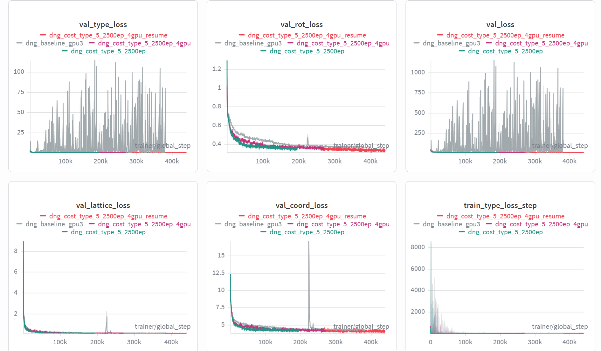

* 昨天已经发现模型可以分清是有机还是金属，但是具体的block，在数据集上很相似，所以模型很难分清，因此今天来检查一下预测的block和gt的相似度。

## 1. 背景与目标

当前评估流程为三阶段：

- **S1（粗粒度）**：金属/有机类别是否一致
- **S2（中粒度）**：WL 图哈希（拓扑/骨架）是否一致
- **S3（细粒度）**：`pred_idx == gt_idx`

新增评估：

- **Top-k（k=5）**：GT 是否落在候选 top-5
- **S3_eq（等价类）**：按 `(WL hash + edge fingerprint)` 比较是否一致

---

## 2. 关键结果摘要（合并多日志，重复指标只陈述一次）

### 2.1 三阶段主指标（多跑次一致）

在 **106k** 与 **103.7k** 两类运行中，下列指标高度一致（代表值 + 典型波动）：

- **S1（金属/有机）**：约 **0.980**
- **S2（WL 骨架）**：约 **0.810**
- **S3_idx（`pred_idx == gt_idx`）**：约 **0.105**

- Tanimoto 均值 **0.9241**，中位数 **1.0000**，`Tanimoto=1` **84.45%**。

### 2.2 Top-k 与 WL 唯一性分组（来自 conditional_topk 系列）

在 `S1✓ & S2✓` 内，**按「该 GT 的 WL 在数据中出现过的 unique(gt_idx) 数」分组**后（`conditional_topk.log` 为代表）：

- `unique(gt_idx)==1`（约 **1.40×10⁴** 样本）：S3_idx 约 **0.67～0.68**，Top-5 约 **0.87**。

- `unique(gt_idx)>=2`（约 **7.0×10⁴** 样本）：S3_idx 约 **0.018～0.020**，Top-5 约 **0.052～0.053**。

  >[!NOTE]
  >
  > 原始 idx 层面的失败，高度集中在「同一 WL 下存在大量不同 gt_idx」的区域；WL「在样本里看似唯一」的那部分，idx 预测明显好很多。

### 2.3 Tanimoto 与误分类（来自 full + conditional_topk_tanimoto）

- 全体：**Tanimoto 中位数 ≈ 1**，`Tanimoto=1` 比例约 **84.3%～84.5%**（`full.log` 与 `conditional_topk_tanimoto.log` 一致）。
- 在 `S1✓ & S2✓` 内：无论 S3_idx 对错，Tanimoto 的 mean/median 在日志中均为 **1.0**；误分类子集上 **Tanimoto≥任意高阈值（含 1）≈ 100%**（详见 `conditional_topk_tanimoto.log`）。

### 2.4 等价类 S3_eq（仅 `similarity_check_eqclass.log`）

- **S3_eq Top-1 ≈ 0.8096**，与 **S2 ≈ 0.8096** 对齐 → 说明在 `(WL + edge fingerprint)` 定义下，**Top-1 预测与 GT 的等价类几乎与「骨架对上」同概率**；原始 S3_idx 低主要是 **idx 过细/重复**。
- **S3_eq Top-5 ≈ 0.8335**，远高于 **S3_idx Top-5 ≈ 0.173**。

### 2.5 一句话总结论

>[!IMPORTANT]
>
> **当前大量 S3_idx「错误」在边集 Tanimoto 与等价类意义下多为「同结构不同编号」；真正结构/骨架层面的对齐主要由 S2 与 S3_eq 反映；优化分类标准与标签体系应优先于单纯刷 `pred_idx==gt_idx`。**

---

## 3. 现象解读：为什么 S3 很低但unique(gt_idx)==1时的通过率足够高

### 3.1 指标矛盾的统一解释

观察到：

- S2 高（~0.81）说明骨架/拓扑已对齐
- S3 很低（~0.10）说明 `pred_idx` 和 `gt_idx` 不一致
- 但 Tanimoto 在误分类中几乎全是 1

这组现象共同指向：

1. 模型在结构层面（至少在当前指纹定义下）大多预测正确；
2. 同一结构等价类里存在多个离散 idx；
3. 评估使用 `pred_idx == gt_idx` 作为唯一成功标准，导致“结构正确但编号不同”被大量计为失败。

---

## 4. 关于“是真一模一样，还是指纹不够强”的判断

当前证据能确认的是：

- 在现有 `edge fingerprint + WL` 定义下，误分类与正确样本几乎不可区分。

但仍需注意：

- 现有 edge fingerprint 是边类型集合，判别力有限；
- 即使 Tanimoto=1，也不必然代表化学/几何完全一致；
- 但由于同时 WL 一致且 S3_eq 与 S2 对齐，工程上已足够支持“原始 idx 过细/重复”的判断。

## 5. 最终结论

基于所有 `similarity_check` 的一致结果，本项目当前瓶颈不是“模型不会选结构”，而是“细粒度 idx 标签与结构等价关系不一致”。

因此应把分类标准从“严格 idx 一致”升级为“等价类一致（S3_eq）”，并围绕等价类重构训练与评估流程。  
这样可以让指标真实反映模型能力，并为后续下游生成优化提供正确方向。

## 实验结果

```bash

# /home/liem/MOF-BFN/ablation_ckpts/logs/mof_bfn_volume/dng_cost_type_5_2500ep_4gpu_resume/ckpt/epoch_2098-step_429429-loss_9.6298.ckpt

export LD_LIBRARY_PATH=/home/liem/.local/share/mamba/envs/mof-bfn/lib:$LD_LIBRARY_PATH

PYTHONPATH=. python -m experiments.infer \
  paths.save_dir=/home/liem/MOF-BFN/ablation_ckpts \
  experiment.wandb.name=infer_dng_test \
  inference.ckpt_path=/home/liem/MOF-BFN/ablation_ckpts/logs/mof_bfn_volume/dng_cost_type_5_2500ep_4gpu_resume/ckpt/epoch_2098-step_429429-loss_9.6298.ckpt\
  inference.inference_dir=/home/liem/MOF-BFN/infer_results_test_3_19_dng_cost_type_5

python -m postprocess.assemble \
  --res_path /home/liem/MOF-BFN/infer_results_test_3_19_dng_cost_type_5/raw_results.pt \
  --bb_z_path /home/liem/data/mofbfn/datasets/dng/bb_emb_space_tot_z.pt \
  --bb_blocks_path /home/liem/data/mofbfn/datasets/dng/bb_emb_space_tot_blocks_processed.lmdb \
  --max_process 100

# 检查连通性（是否形成完整 3D 骨架）
python -m evaluation.connect_check \
  --res_path /home/liem/MOF-BFN/infer_results_test_3_19_dng_cost_type_5/raw_results.pt \
  --bb_z_path /home/liem/data/mofbfn/datasets/dng/bb_emb_space_tot_z.pt \
  --bb_blocks_path /home/liem/data/mofbfn/datasets/dng/bb_emb_space_tot_blocks_processed.lmdb \
  --max_process 100

# 有效性检查（Validity Check）
python -m evaluation.validity_check \
  --res_path /home/liem/MOF-BFN/infer_results_test_3_19_dng_cost_type_5/samples \
  --max_process 100

```

connect = 0.92

{'has_carbon': 1.0, 'has_hydrogen': 0.99, 'has_atomic_overlaps': 0.24, 'has_overcoordinated_c': 0.4, 'has_overcoordinated_n': 0.08, 'has_overcoordinated_h': 0.35, 'has_undercoordinated_c': 0.3, 'has_undercoordinated_n': 0.15, 'has_undercoordinated_rare_earth': 0.0, 'has_metal': 1.0, 'has_lone_molecule': 0.23, 'has_high_charges': 0.14, 'has_suspicicious_terminal_oxo': 0.0, 'has_undercoordinated_alkali_alkaline': 0.06, 'has_geometrically_exposed_metal': 0.4, 'all_checks': 0.24}



结果仍然没有baseline好，但是发现一个问题，我只调小了type_cost的权重，为什么它的整体形状会变化那么多——直接收敛了，完全没有像baseline的波动。


