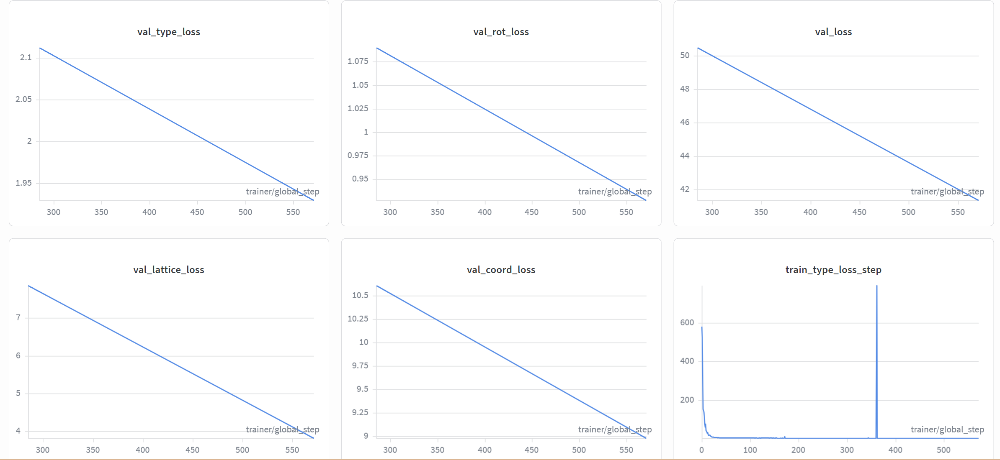
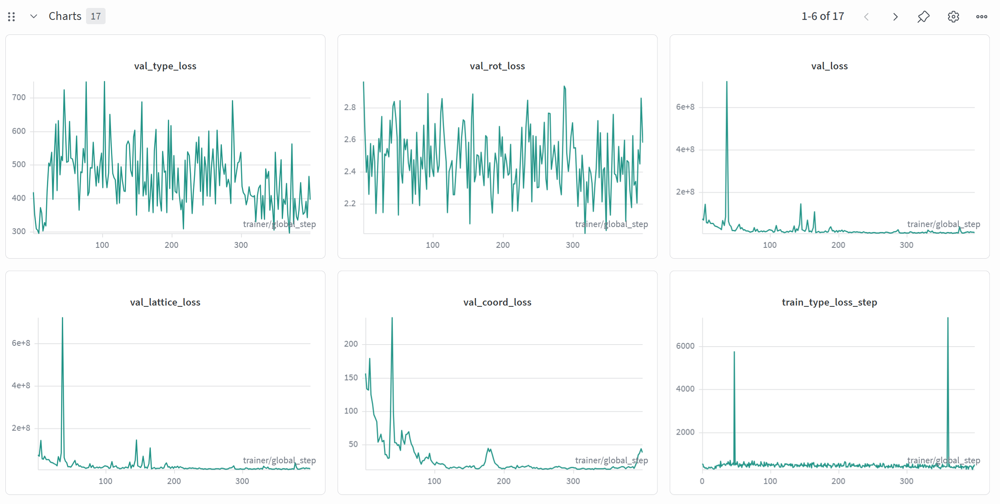
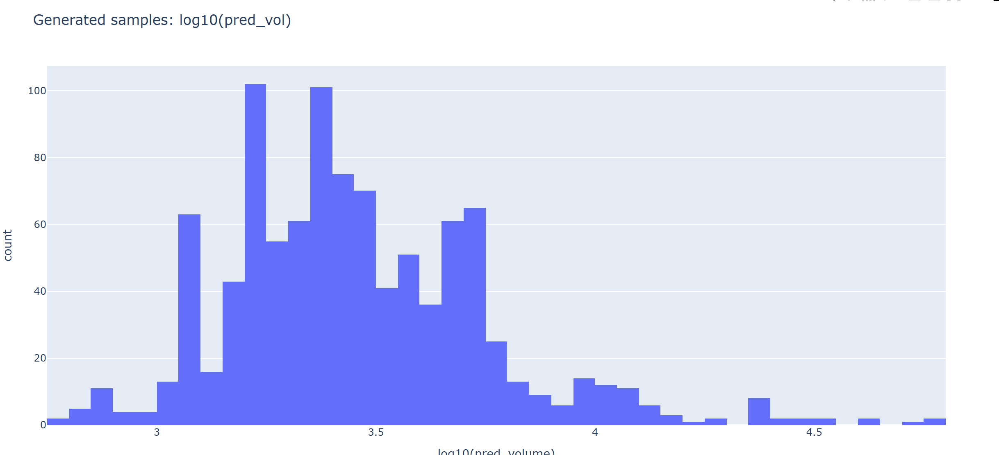
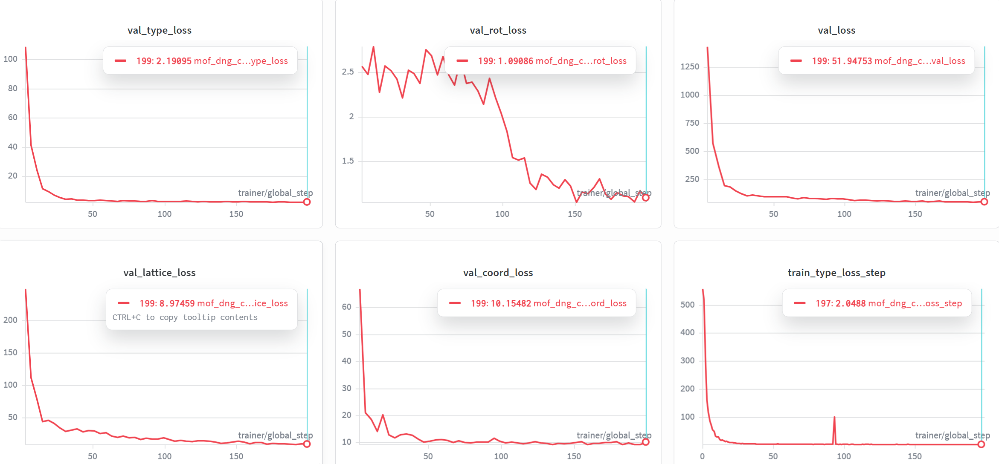
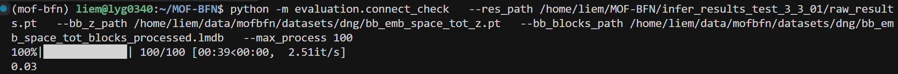
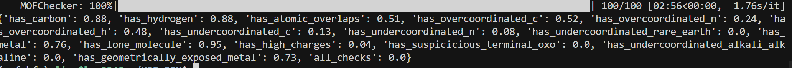
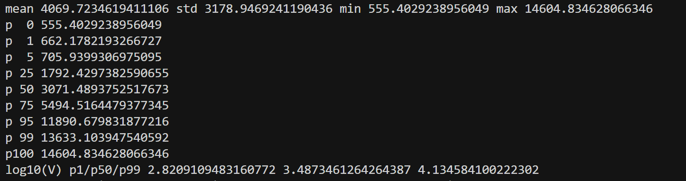
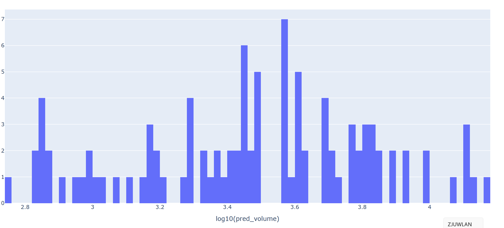

## 1. 判断lattice_loss主导项

* 在 loss_one_step 里，lattice_loss 实际上是两块相加：

  * A. 扩散回归主项：dtime4continuous_loss(...)

  - B. 体积正则项：vol_loss = vol_loss_weight * (vol_l2 + vol_lower)，再加回 lattice_loss

* 实验方法：把 vol_loss_weight 临时设为 0 跑一小段验证

```bash
PYTHONPATH=. LD_LIBRARY_PATH=/home/liem/.local/share/mamba/envs/mof-bfn/lib:$LD_LIBRARY_PATH \
CUDA_VISIBLE_DEVICES=3,4 python experiments/train.py \
  --config-dir configs \
  --config-name bfn_base_bhm_tot \
  experiment.num_devices=2 \
  experiment.trainer.strategy=ddp \
  +model.vol_loss_weight=0.0 #手动置零
```

### vol_loss_weight = 0的情况



### 论文原本情况



* ==对比看出loss显著下降，因此vol_loss是主导项== 

## 2. 检查训练集里的 gt_vol 分布

```python
python - <<'PY'
import math, pickle
import numpy as np
import lmdb
import torch
from tqdm import tqdm

lmdb_path = "/home/liem/data/mofbfn/datasets/dng/MetalOxo_bb_preprocessed.lmdb"
idx_path  = "/home/liem/data/mofbfn/datasets/dng/train_bb.idx"

def volume_from_lengths_angles(lengths, angles_deg):
    a, b, c = map(float, lengths)
    alpha, beta, gamma = np.deg2rad(list(map(float, angles_deg)))
    cosA, cosB, cosG = math.cos(alpha), math.cos(beta), math.cos(gamma)
    inner = 1 + 2*cosA*cosB*cosG - cosA*cosA - cosB*cosB - cosG*cosG
    inner = max(inner, 1e-12)
    return a * b * c * math.sqrt(inner)

with open(idx_path, "rb") as f:
    idxs = pickle.load(f)

env = lmdb.open(lmdb_path, subdir=False, readonly=True, lock=False, readahead=False)

vols = []
missing = 0
with env.begin() as txn:
    for i in tqdm(idxs, desc="scan train gt_vol"):
        raw = txn.get(str(i).encode())
        if raw is None:
            missing += 1
            continue
        dp = pickle.loads(raw)
        lat = dp["lattice_1"]
        if torch.is_tensor(lat):
            lat = lat.detach().cpu().numpy()
        lat = np.asarray(lat).reshape(-1)
        lengths, angles = lat[:3], lat[3:]
        vols.append(volume_from_lengths_angles(lengths, angles))

vols = np.asarray(vols, dtype=np.float64)
print("N =", vols.size, "missing_keys =", missing)
print("mean =", vols.mean(), "std =", vols.std(), "min =", vols.min(), "max =", vols.max())
for p in [0, 1, 5, 25, 50, 75, 95, 99, 100]:
    print(f"p{p:>3} =", np.percentile(vols, p))

logv = np.log10(vols)
print("log10(V) p1/p50/p99 =", np.percentile(logv, 1), np.percentile(logv, 50), np.percentile(logv, 99))

try:
    import matplotlib.pyplot as plt
    plt.figure(figsize=(6,4))
    plt.hist(logv, bins=100)
    plt.xlabel("log10(gt_volume)")
    plt.ylabel("count")
    plt.tight_layout()
    plt.savefig("train_gt_log10vol_hist.png", dpi=200)
    print("saved: train_gt_log10vol_hist.png")
except Exception as e:
    print("matplotlib not available, skip plot:", e)
PY
```


- 绝大多数训练样本的体积在 \(10^3\) ～ 几 \(10^4\)，这是模型应该重点拟合的主区间。

- 少量极大体积样本是“长尾”，在当前是按普通 L2 参与体积 loss 的，这些长尾样本一旦预测偏差大，会强烈拉高 vol_l2，从而放大 lattice_loss。


### 检查生成晶体的 gt_vol 分布

```python
/home/liem/.local/share/mamba/envs/mof-bfn/bin/python - <<'PY'
import glob
import numpy as np

cifs = sorted(glob.glob('/home/liem/data/mofbfn/infer_dng/samples/pred_*.cif'))
print('cif_count', len(cifs))

vols = []
bad = []

# Prefer pymatgen for robust CIF parsing
try:
    from pymatgen.core.structure import Structure
except Exception as e:
    raise RuntimeError(f'pymatgen import failed: {e}')

for p in cifs:
    try:
        s = Structure.from_file(p)
        vols.append(float(s.lattice.volume))
    except Exception as e:
        bad.append((p, str(e)))

vols = np.asarray(vols, dtype=np.float64)
print('parsed', vols.size, 'failed', len(bad))
if bad:
    print('first_fail', bad[0][0], bad[0][1][:200])

if vols.size:
    print('mean', vols.mean(), 'std', vols.std(), 'min', vols.min(), 'max', vols.max())
    for p in [0,1,5,25,50,75,95,99,100]:
        print(f'p{p:>3}', np.percentile(vols, p))
    logv = np.log10(vols)
    print('log10(V) p1/p50/p99', np.percentile(logv,1), np.percentile(logv,50), np.percentile(logv,99))

    # plotly html
    try:
        import plotly.express as px
        fig = px.histogram(x=logv, nbins=80, labels={'x':'log10(pred_volume)'}, title='Generated samples: log10(pred_vol)')
        out = '/home/liem/data/mofbfn/infer_dng/samples/pred_log10vol_hist.html'
        fig.write_html(out)
        print('saved', out)
    except Exception as e:
        print('plotly failed/absent:', e)
PY
```


- 统计（pred_vol）：

- mean = 3896.08，std = 5008.68

- min = 572.60，max = 58839.85

- p50（中位数） = 2606.34

- p1 / p99 = 723.04 / 25647.10

- log10(V) p1/p50/p99 = 2.859 / 3.416 / 4.409



### 对比结果

训练集 gt_vol 中位数约 3389，而你生成样本 pred_vol 中位数约 2606：整体偏小（有塌缩倾向），但仍然有长尾到 10^4^～10^5^ 量级。


## 3.尝试改进

### 改进思路

* 换成 log-volume / 相对误差，而不是直接 (V~pred~−V~gt~)^2^

当前：

- 用的是 绝对体积的 L2，大体积样本（上万、十万）一旦差一点，惩罚就爆炸。

可以改为在 log 空间做约束，例如：

- 用 (log⁡V~pred~−log⁡V~gt~)^2^


改进代码：/home/liem/MOF-BFN/models/crysbfn_bhm.py中的loss_one_step

```python
     # # --- Volume / density regularization ---
        # # compute predicted and ground-truth cell volumes from lattice paramization
        # try:
        #     def params_to_lengths_angles(x):
        #         # x[..., :3] are log(lengths); x[..., 3:] are tan(angle - pi/2)
        #         lengths = torch.exp(x[..., :3])
        #         angles = torch.rad2deg(torch.atan(x[..., 3:]) + math.pi / 2)
        #         return lengths, angles

        #     def volume_from_lengths_angles(lengths, angles_deg):
        #         # lengths: (...,3), angles_deg: (...,3)
        #         a, b, c = lengths[..., 0], lengths[..., 1], lengths[..., 2]
        #         angles = torch.deg2rad(angles_deg)
        #         alpha, beta, gamma = angles[..., 0], angles[..., 1], angles[..., 2]
        #         cosA = torch.cos(alpha); cosB = torch.cos(beta); cosG = torch.cos(gamma)
        #         # formula: V = a*b*c*sqrt(1 + 2*cosα*cosβ*cosγ - cos^2α - cos^2β - cos^2γ)
        #         inner = 1 + 2 * cosA * cosB * cosG - cosA ** 2 - cosB ** 2 - cosG ** 2
        #         inner = torch.clamp(inner, min=1e-9)
        #         vol = a * b * c * torch.sqrt(inner)
        #         return vol

        #     pred_lengths, pred_angles = params_to_lengths_angles(lattice_pred)
        #     gt_lengths = lengths
        #     gt_angles = angles
        #     pred_vol = volume_from_lengths_angles(pred_lengths, pred_angles)
        #     gt_vol = volume_from_lengths_angles(gt_lengths, gt_angles)

        #     # L2 volume matching
        #     vol_l2 = ((pred_vol - gt_vol) ** 2).mean()

        #     # lower-bound penalty (prevent cell collapsed). use scale factor from config if provided
        #     vol_min_scale = self.hparams.vol_min_scale if 'vol_min_scale' in self.hparams.keys() else 0.8
        #     vol_min = gt_vol * vol_min_scale
        #     vol_lower = torch.relu(vol_min - pred_vol).mean()

        #     vol_loss_weight = self.hparams.vol_loss_weight if 'vol_loss_weight' in self.hparams.keys() else 1.0
        #     vol_loss = vol_loss_weight * (vol_l2 + vol_lower)
        #     # add to lattice loss
        #     lattice_loss = lattice_loss + vol_loss
        # except Exception:
        #     # if any numerical/shape error occurs, skip vol penalty to keep training robust
        #     pass
        # --- Volume / density regularization (Improved: Log-scale & Soft-bound) ---
        # --- Volume regularization (Log-scale & Soft-bound) ---
        try:
            def params_to_lengths_angles(x):
                lengths = torch.exp(x[..., :3])
                angles = torch.rad2deg(torch.atan(x[..., 3:]) + math.pi / 2)
                return lengths, angles

            def volume_from_lengths_angles(lengths, angles_deg):
                a, b, c = lengths[..., 0], lengths[..., 1], lengths[..., 2]
                angles = torch.deg2rad(angles_deg)
                cosA, cosB, cosG = torch.cos(angles[..., 0]), torch.cos(angles[..., 1]), torch.cos(angles[..., 2])
                inner = 1 + 2 * cosA * cosB * cosG - cosA ** 2 - cosB ** 2 - cosG ** 2
                # 弹窗保护：防止无效几何导致开方 NaN
                inner = torch.clamp(inner, min=1e-7)
                return a * b * c * torch.sqrt(inner)

            pred_lengths, pred_angles = params_to_lengths_angles(lattice_pred)
            pred_vol = volume_from_lengths_angles(pred_lengths, pred_angles)
            gt_vol = volume_from_lengths_angles(lengths, angles)

            # 1. Log-scale Loss: 对长尾分布极其鲁棒
            log_pred = torch.log(pred_vol + 1e-6)
            log_gt = torch.log(gt_vol + 1e-6)
            vol_loss_main = F.mse_loss(log_pred, log_gt)

            # 2. Softplus Lower-bound: 解决塌缩问题的“缓冲垫”
            v_min_scale = self.hparams.get('vol_min_scale', 0.85)
            threshold = gt_vol * v_min_scale
            # 计算相对塌缩程度
            diff = (threshold - pred_vol) / (threshold + 1e-6)
            # 使用 softplus 提供平滑梯度
            vol_loss_lower = torch.nn.functional.softplus(diff * 5.0).mean()

            # 3. 动态权重叠加
            v_weight = self.hparams.get('vol_loss_weight', 0.1)
            # 如果想做简单的 Warmup，可以参考 t_per_mol 的值
            vol_loss = v_weight * (vol_loss_main + 0.5 * vol_loss_lower)

            lattice_loss = lattice_loss + vol_loss

        except Exception:
            pass
```

### 小样本测试

```
PYTHONPATH=. LD_LIBRARY_PATH=/home/liem/.local/share/mamba/envs/mof-bfn/lib:$LD_LIBRARY_PATH \
CUDA_VISIBLE_DEVICES=3,4 python experiments/train.py \
  --config-name bfn_base_bhm_tot \
  +model.vol_loss_weight=0.1 \
  +model.vol_min_scale=0.85 \
  +experiment.trainer.limit_train_batches=4 \
  +experiment.trainer.limit_val_batches=2 \
  experiment.trainer.max_epochs=50 \
  experiment.trainer.strategy=ddp
```




由图片可以看出，这次的loss都明显下降，并且收敛了。

```bash
# 设置环境变量以防库冲突
export LD_LIBRARY_PATH=/home/liem/.local/share/mamba/envs/mof-bfn/lib:$LD_LIBRARY_PATH

PYTHONPATH=. python -m experiments.infer \
  experiment.wandb.name=infer_dng_test \
  inference.ckpt_path=/home/liem/data/mofbfn/checkpoints/logs/mof-csp/mof_dng_cif_200_inf/ckpt/epoch_49-step_200-loss_51.9475.ckpt \
  inference.inference_dir=/home/liem/MOF-BFN/infer_results_test_3_3_01
  
  

python -m postprocess.assemble \
  --res_path /home/liem/MOF-BFN/infer_results_test_3_3_01/raw_results.pt \
  --bb_z_path /home/liem/data/mofbfn/datasets/dng/bb_emb_space_tot_z.pt \
  --bb_blocks_path /home/liem/data/mofbfn/datasets/dng/bb_emb_space_tot_blocks_processed.lmdb \
  --max_process 100
  
  # 检查连通性 (是否形成了完整的 3D 骨架)
python -m evaluation.connect_check \
  --res_path /home/liem/MOF-BFN/infer_results_test_3_3_01/raw_results.pt \
  --bb_z_path /home/liem/data/mofbfn/datasets/dng/bb_emb_space_tot_z.pt \
  --bb_blocks_path /home/liem/data/mofbfn/datasets/dng/bb_emb_space_tot_blocks_processed.lmdb \
  --max_process 16
  
  #有效性检查 (Validity Check)
  python -m evaluation.validity_check \
  --res_path /home/liem/MOF-BFN/infer_results_test_3_3_01/samples \
  --max_process 16
```





> [!NOTE]
>
> 随手测试一下，但是训练epoch太短了，效果不好很正常

重点关注晶胞大小：平均值和中位数与实验数据很相近，但是不符合正态分布





### 正式训练开始

```bash
PYTHONPATH=. \
LD_LIBRARY_PATH=/home/liem/.local/share/mamba/envs/mof-bfn/lib:$LD_LIBRARY_PATH \
CUDA_VISIBLE_DEVICES=3,4 \
python experiments/train.py \
    --config-dir configs \
    --config-name bfn_base_bhm_tot \
    experiment.num_devices=2 \
    experiment.trainer.strategy=ddp \
    experiment.trainer.gradient_clip_val=0.5 \
    experiment.trainer.max_epochs=500 \
    +model.vol_loss_weight=0.01 \
    +model.vol_min_scale=0.85
```

