## 1.“炼丹”速度迎来重大突破

之前我不断尝试训练指令时留下大量僵尸进程在GPU中，导致了训练一个epoch要10分钟，这次我清理干净之后再运行，速度显著变快了！！！！！！

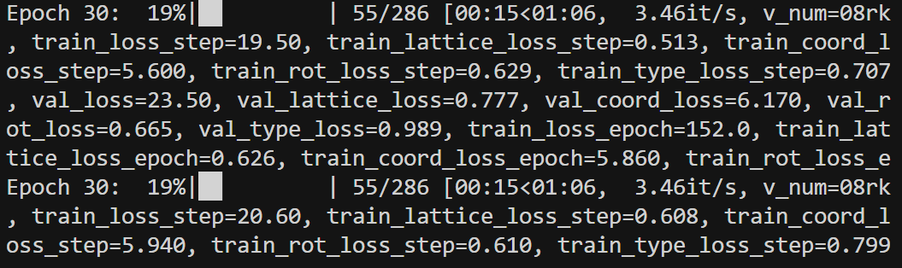


## 2.训练完成

### 2.1训练过程loss图示

前半段

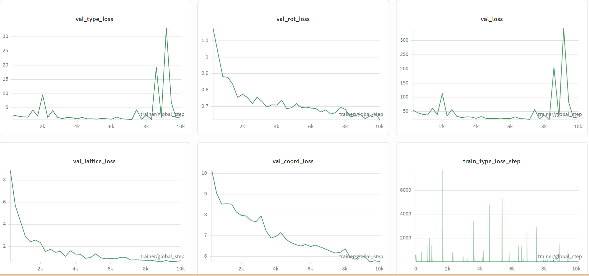

后半段

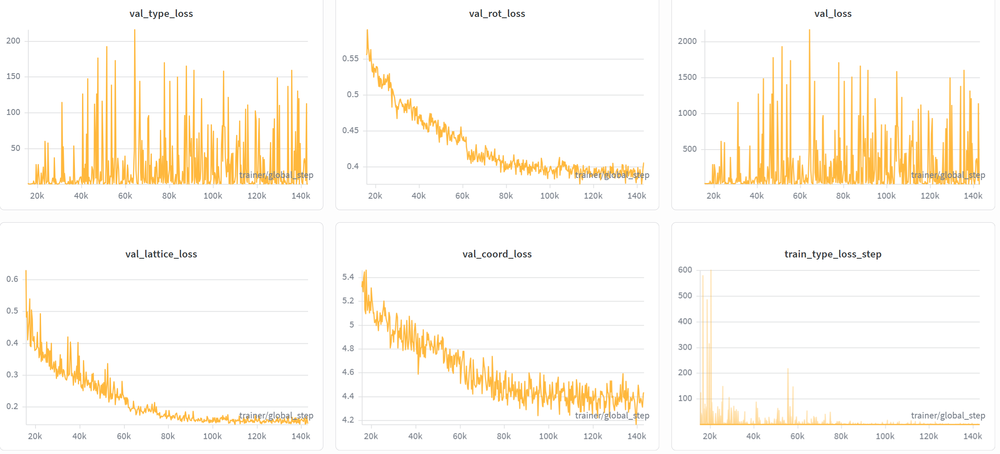

与论文提供的chpt对比

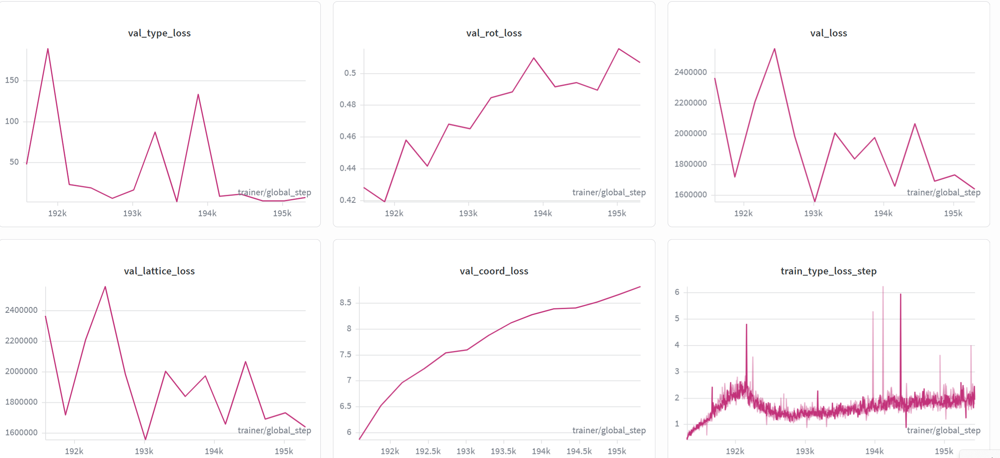

#### 训练过程 Loss 曲线分析

* **收敛瓶颈**：`val_lattice_loss`（晶格 Loss）在训练中后期进入平原期，波动极小。这解释了为什么模型倾向于预测“安全”的平均体积，因为这样可以获得稳定的低 Loss，但失去了对极端值的敏感度。
* **异常跳变**：`val_type_loss` 在后期出现剧烈刺状跳变，
* 可能原因：
  - building block 类型嵌入不稳定
  - 分类 head 学习率偏高？
  - 不平衡类别导致 loss 爆发

### 2.2选择min val_loss的ckpt以及last ckpt进行测试

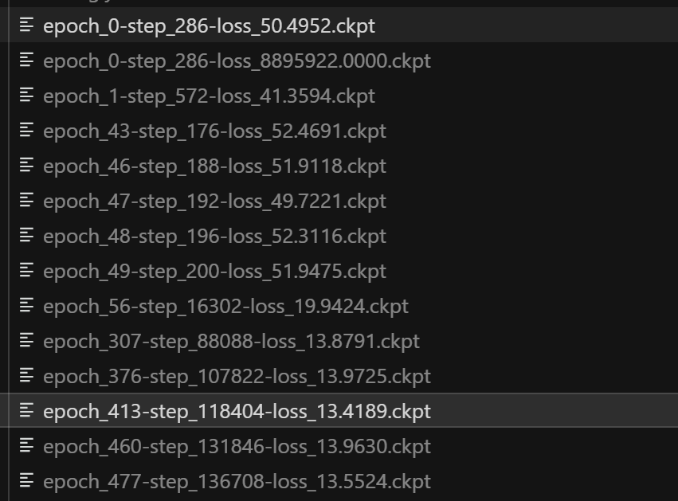

#### 测试代码

```bash

#/home/liem/data/mofbfn/checkpoints/logs/mof-csp/mof_dng_cif_200_inf/ckpt/epoch_413-step_118404-loss_13.4189.ckpt

#/home/liem/data/mofbfn/checkpoints/logs/mof-csp/mof_dng_cif_200_inf/ckpt/epoch_477-step_136708-loss_13.5524.ckpt


# 设置环境变量以防库冲突
export LD_LIBRARY_PATH=/home/liem/.local/share/mamba/envs/mof-bfn/lib:$LD_LIBRARY_PATH

PYTHONPATH=. python -m experiments.infer \
  experiment.wandb.name=infer_dng_test \
  inference.ckpt_path=/home/liem/data/mofbfn/checkpoints/logs/mof-csp/mof_dng_cif_200_inf/ckpt/epoch_477-step_136708-loss_13.5524.ckpt \
  inference.inference_dir=/home/liem/MOF-BFN/infer_results_test_3_4_last_ckpt
  
  

python -m postprocess.assemble \
  --res_path /home/liem/MOF-BFN/infer_results_test_3_4_last_ckpt/raw_results.pt \
  --bb_z_path /home/liem/data/mofbfn/datasets/dng/bb_emb_space_tot_z.pt \
  --bb_blocks_path /home/liem/data/mofbfn/datasets/dng/bb_emb_space_tot_blocks_processed.lmdb \
  --max_process 1000
  
  # 检查连通性 (是否形成了完整的 3D 骨架)
python -m evaluation.connect_check \
  --res_path /home/liem/MOF-BFN/infer_results_test_3_4_last_ckpt/raw_results.pt \
  --bb_z_path /home/liem/data/mofbfn/datasets/dng/bb_emb_space_tot_z.pt \
  --bb_blocks_path /home/liem/data/mofbfn/datasets/dng/bb_emb_space_tot_blocks_processed.lmdb \
  --max_process 1000
  
  #有效性检查 (Validity Check)
  python -m evaluation.validity_check \
  --res_path /home/liem/MOF-BFN/infer_results_test_3_4_last_ckpt/samples \
  --max_process 1000
  

```

#### 测试结果截图

##### min val_loss的ckpt

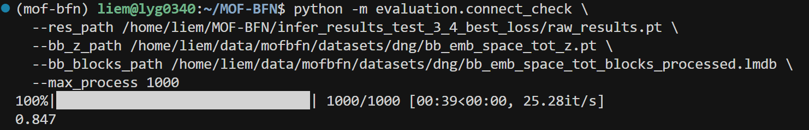

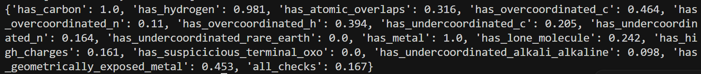

##### last ckpt

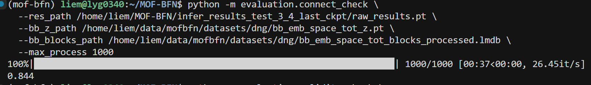

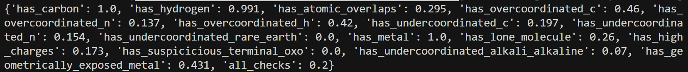

#### validity效果对比

| 检查项 (Metric)                        | val_loss最小的ckpt | last ckpt | 论文最佳值 (Bold) |
| :------------------------------------- | :----------------: | :-------: | :---------------: |
| has_carbon ↑                           |     **1.000**      |   1.000   |       1.000       |
| has_hydrogen ↑                         |       0.981        | **0.991** |       0.975       |
| has_atomic_overlaps ↓                  |       0.316        |   0.295   |   ==**0.115**==   |
| has_overcoordinated_c ↓                |       0.464        |   0.460   |   ==**0.193**==   |
| has_overcoordinated_n ↓                |       0.110        |   0.137   |   ==**0.049**==   |
| has_overcoordinated_h ↓                |       0.394        |   0.420   |   ==**0.180**==   |
| has_undercoordinated_c ↓               |       0.205        |   0.197   |     **0.182**     |
| has_undercoordinated_n ↓               |       0.164        | **0.154** |     **0.154**     |
| has_undercoordinated_rare_earth ↓      |       0.000        |   0.000   |       0.000       |
| has_metal ↑                            |     **1.000**      | **1.000** |     **1.000**     |
| has_lone_molecule ↓                    |       0.242        |   0.260   |     **0.186**     |
| has_high_charges ↓                     |       0.161        |   0.173   |     **0.069**     |
| has_suspicious_terminal_oxo ↓          |       0.000        |   0.000   |       0.000       |
| has_undercoordinated_alkali_alkaline ↓ |       0.098        |   0.070   |     **0.027**     |
| has_geometrically_exposed_metal ↓      |       0.453        |   0.431   |     **0.304**     |
| all_checks (通过率) ↑                  |       0.167        |   0.200   |     **0.350**     |

* 修改后模型效果明显不如原来的模型

* 过多结构异常：

  - has_atomic_overlaps 明显偏高
  - has_overcoordinated_c/n/h 高
  - has_geometrically_exposed_metal 偏高
  - has_lone_molecule 偏高

  说明：

  > 模型在几何一致性与配位约束上明显弱于论文模型

#### 晶胞大小分布测试

```py
  #晶胞大小分布
/home/liem/.local/share/mamba/envs/mof-bfn/bin/python - <<'PY'
import glob
import numpy as np

cifs = sorted(glob.glob('/home/liem/MOF-BFN/infer_results_test_3_4_last_ckpt/samples/pred_*.cif'))
print('cif_count', len(cifs))

vols = []
bad = []

# Prefer pymatgen for robust CIF parsing
try:
    from pymatgen.core.structure import Structure
except Exception as e:
    raise RuntimeError(f'pymatgen import failed: {e}')

for p in cifs:
    try:
        s = Structure.from_file(p)
        vols.append(float(s.lattice.volume))
    except Exception as e:
        bad.append((p, str(e)))

vols = np.asarray(vols, dtype=np.float64)
print('parsed', vols.size, 'failed', len(bad))
if bad:
    print('first_fail', bad[0][0], bad[0][1][:200])

if vols.size:
    print('mean', vols.mean(), 'std', vols.std(), 'min', vols.min(), 'max', vols.max())
    for p in [0,1,5,25,50,75,95,99,100]:
        print(f'p{p:>3}', np.percentile(vols, p))
    logv = np.log10(vols)
    print('log10(V) p1/p50/p99', np.percentile(logv,1), np.percentile(logv,50), np.percentile(logv,99))

    # plotly html
    try:
        import plotly.express as px
        fig = px.histogram(x=logv, nbins=80, labels={'x':'log10(pred_volume)'}, title='Generated samples: log10(pred_vol)')
        out = '/home/liem/MOF-BFN/infer_results_test_3_4_last_ckpt/samples/pred_log10vol_hist.html'
        fig.write_html(out)
        print('saved', out)
    except Exception as e:
        print('plotly failed/absent:', e)
PY
```

##### min val_loss晶胞分布

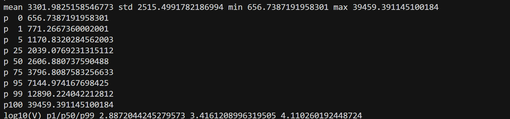

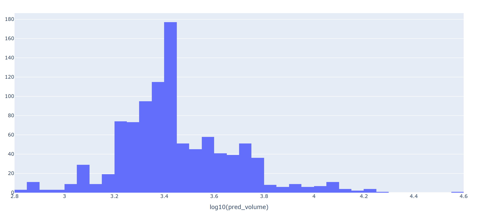

##### last ckpt 晶胞分布

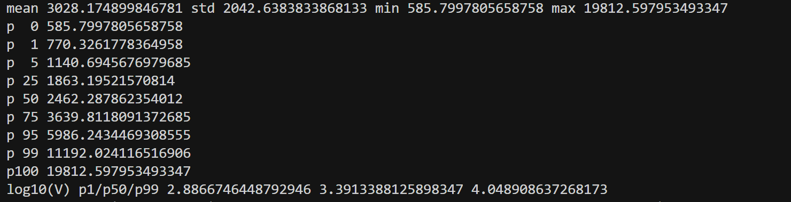

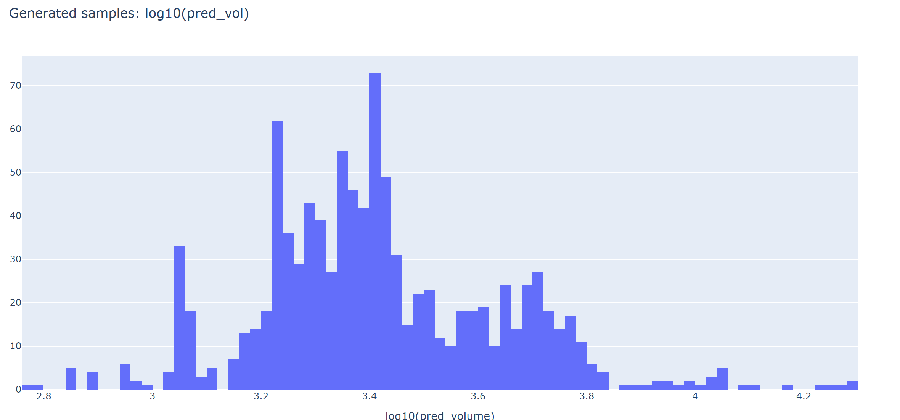

##### train data 晶胞分布 

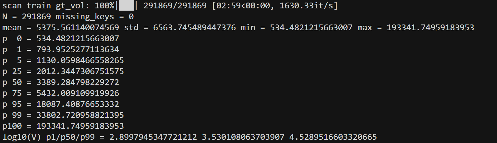

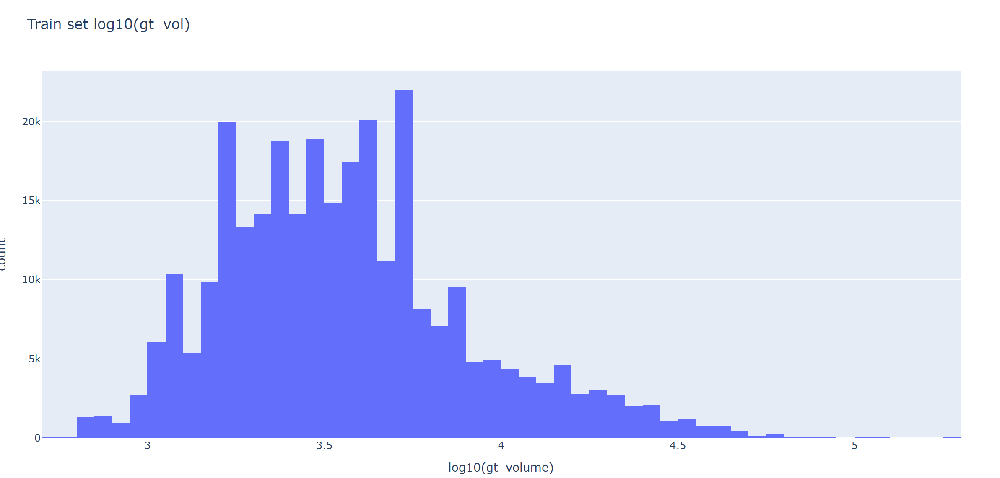

#### 晶胞大小分布对比

训练数据：

- 分布更宽
- 长尾存在大体积结构

我的模型：

- 分布塌缩
- 极端值缺失

### 总结

* 可能是因为我对体积的惩罚过重，导致模型过于保守，不敢预测大晶胞

  

## 第一次实验最终总结

本轮实验的核心发现：

1. 模型成功收敛但出现分布塌缩以及局部剧烈刺状跳变
2. 可能是几何约束导致模型风险规避
3. Validity 低于论文结果
4. 生成晶胞体积较小问题没有改善，拓扑合法性倒是出现看新问题。

Q1：有没有可能是因为训练轮数不够多？因为论文给的ckpt是两千多个epoch

* 师兄答： 我觉得说修改之后表现差还为时过早，毕竟现在看起来只有lattice loss有收敛了的样子，其他的几个还在接着下降；现在在log空间做val loss还是很保守本质上还是MSE loss的问题，可以换成log-normal来试试；
  多目标的模型优化本身就是牵一发而动全身，我们目前要关注能不能通过改lattice loss来单纯优化lattice这一个指标，其他的loss得通过高级点的方法（比如说各个loss算grad然后正则），暂时不用考虑太多


## 3. 第二次实验准备

### 目标

* 跑1000个epoch，让每一项loss都收敛

* 在log空间做val loss还是很保守，本质上还是MSE loss的问题，换成log-normal

  
