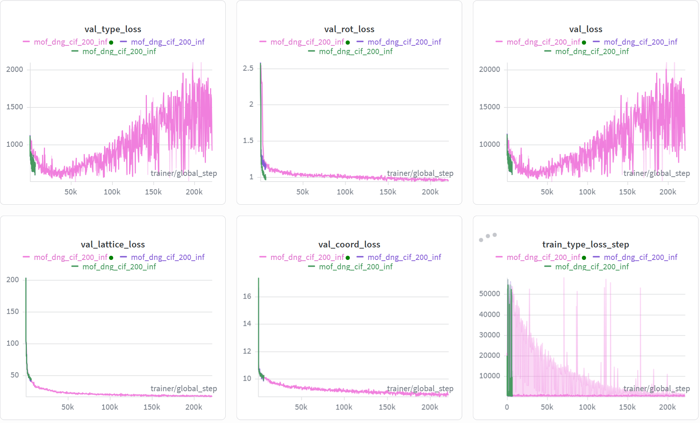
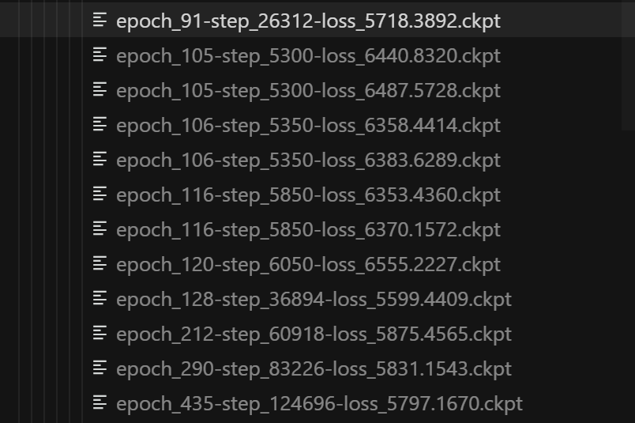
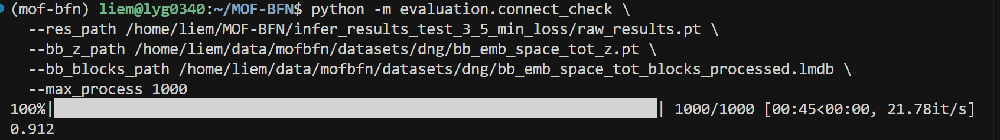
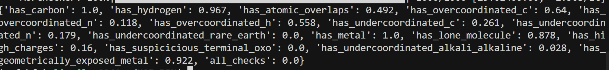
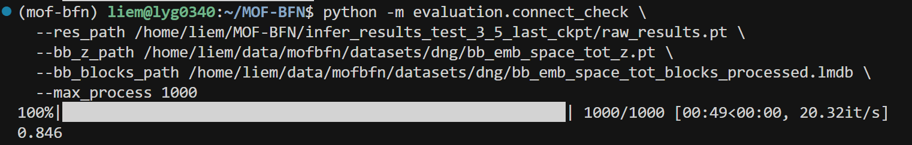
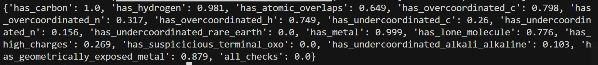

## loss曲线分析



**`val_type_loss` & `val_loss` (剧烈上升与震荡)**：

这两项损失在 $100k$ step 之后呈现明显的指数级上升趋势，并伴随剧烈的刺状震荡。这意味着模型在**原子类型预测（type）**上已经完全失去了泛化能力，验证集上的表现正在迅速恶化。

**`val_lattice_loss` & `val_coord_loss` (过早平原化)**： 这两项代表晶格和坐标的损失虽然没有上升，但在很早阶段就进入了极平的平原期。结合体积预测范围缩小的现象 ，说明模型在几何空间上已经“停止学习”，陷入了局部最优解。

**`train_type_loss_step` (训练端极度不稳定)**：

训练损失图谱中出现了大量极高数值的脉冲（Spikes），最高甚至触及 $50,000$ 以上。这种不稳定的梯度流会直接破坏权重，导致模型在后续推理（Infer）时产生大量畸变结构。

### 2.2选择min val_loss的ckpt以及last ckpt进行测试



#### 测试代码

```bash
#/home/liem/data/mofbfn/checkpoints/logs/mof-csp-exp2/mof_dng_cif_200_inf/ckpt/epoch_128-step_36894-loss_5599.4409.ckpt

#/home/liem/data/mofbfn/checkpoints/logs/mof-csp-exp2/mof_dng_cif_200_inf/ckpt/epoch_435-step_124696-loss_5797.1670.ckpt

# 设置环境变量以防库冲突

PYTHONPATH=. python -m experiments.infer --config-name=bfn_infer_bhm_cond \
  experiment.wandb.name=mof-csp-exp2 \
  inference.ckpt_path=/home/liem/data/mofbfn/checkpoints/logs/mof-csp-exp2/mof_dng_cif_200_inf/ckpt/epoch_128-step_36894-loss_5599.4409.ckpt \
  inference.inference_dir=/home/liem/MOF-BFN/infer_results_test_3_5_min_loss
  
  

python -m postprocess.assemble \
  --res_path /home/liem/MOF-BFN/infer_results_test_3_5_min_loss/raw_results.pt \
  --bb_z_path /home/liem/data/mofbfn/datasets/dng/bb_emb_space_tot_z.pt \
  --bb_blocks_path /home/liem/data/mofbfn/datasets/dng/bb_emb_space_tot_blocks_processed.lmdb \
  --max_process 1000
  
  # 检查连通性 (是否形成了完整的 3D 骨架)
python -m evaluation.connect_check \
  --res_path /home/liem/MOF-BFN/infer_results_test_3_5_min_loss/raw_results.pt \
  --bb_z_path /home/liem/data/mofbfn/datasets/dng/bb_emb_space_tot_z.pt \
  --bb_blocks_path /home/liem/data/mofbfn/datasets/dng/bb_emb_space_tot_blocks_processed.lmdb \
  --max_process 1000
  
  #有效性检查 (Validity Check)
  python -m evaluation.validity_check \
  --res_path /home/liem/MOF-BFN/infer_results_test_3_5_min_loss/samples \
  --max_process 1000
  

```

#### 测试结果截图

##### min val_loss的ckpt





##### last ckpt





### 总结

* 通过率都为0，需要后续进一步改进……
