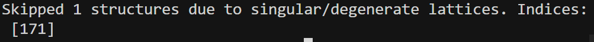
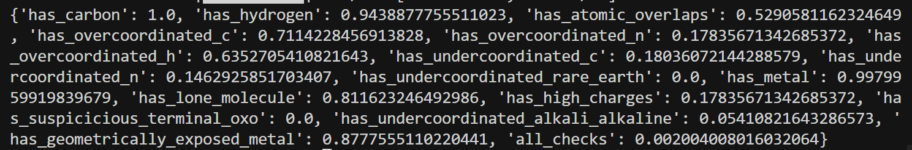

## 修改代码详情

#### 1. `crysbfn/pl_modules/bfn_base.py`

- `dtime4continuous_loss` 增加参数：`use_lognormal`, `lognormal_dims`, `lognormal_scale`。
- 当 `use_lognormal=True` 且 `lognormal_dims>0` 时：前 `lognormal_dims` 维用 log-normal NLL，其余维仍用 MSE；时间权重逻辑不变。
#### 2.`models/crysbfn_bhm.py`

- Lattice loss：从 config/kwargs 读 `lattice_use_lognormal`、`lattice_lognormal_scale`，调用 `dtime4continuous_loss` 时传入，对前 3 维（log lengths）用 log-normal。
- Volume 正则:
  - 原先：先 `params_to_lengths_angles` → 算 `pred_vol`/`gt_vol` → `log(pred_vol)`/`log(gt_vol)` 再算 log-normal NLL；下界在「体积空间」；整体包在 `try: ... except: pass` 里。
  - 现在：全程 log 空间：用 `log(V)=log(a)+log(b)+log(c)+0.5*log(inner)` 直接算 `log_vol_pred` / `log_vol_gt`，不再先乘出 V 再取 log；下界改为 `log_vol_min = log_vol_gt + log(v_min_scale)`，惩罚 `log_vol_pred < log_vol_min`；异常改为 `except Exception as e` 并打 warning + traceback，不再静默 `pass`。
- Init：从 kwargs 里取并保存 `lattice_use_lognormal`、`lattice_lognormal_scale`、`vol_lognormal_scale`（以及之前就有的 `vol_loss_weight`、`vol_min_scale` 等）。
#### 3.`configs/bfn_model_bhm_cond.yaml`

* 在 model 下增加：vol_loss_weight、vol_min_scale。
* 在 model.BFN 下增加：lattice_use_lognormal: true，lattice_lognormal_scale: 1.2，vol_lognormal_scale: 1.2。(略微调大，来区别MSE)
* 在 model.decoder 下增加：condition_conf: ${conditions}（给 CSPNet 用）。


## 第三次测试结果


```bash
#/home/liem/data/mofbfn/checkpoints/logs/mof-csp-exp2/mof_dng_cif_200_inf/ckpt/epoch_234-step_33605-loss_4933.0728.ckpt

# 设置环境变量以防库冲突

PYTHONPATH=. python -m experiments.infer --config-name=bfn_infer_bhm_cond \
  experiment.wandb.name=mof-csp-exp2 \
  inference.ckpt_path=/home/liem/data/mofbfn/checkpoints/logs/mof-csp-exp2/mof_dng_cif_200_inf/ckpt/epoch_234-step_33605-loss_4933.0728.ckpt \
  inference.inference_dir=/home/liem/MOF-BFN/infer_results_test_3_6_min_loss
  
  

python -m postprocess.assemble \
  --res_path /home/liem/MOF-BFN/infer_results_test_3_6_min_loss/raw_results.pt \
  --bb_z_path /home/liem/data/mofbfn/datasets/dng/bb_emb_space_tot_z.pt \
  --bb_blocks_path /home/liem/data/mofbfn/datasets/dng/bb_emb_space_tot_blocks_processed.lmdb \
  --max_process 500
  
  # 检查连通性 (是否形成了完整的 3D 骨架)
python -m evaluation.connect_check \
  --res_path /home/liem/MOF-BFN/infer_results_test_3_6_min_loss/raw_results.pt \
  --bb_z_path /home/liem/data/mofbfn/datasets/dng/bb_emb_space_tot_z.pt \
  --bb_blocks_path /home/liem/data/mofbfn/datasets/dng/bb_emb_space_tot_blocks_processed.lmdb \
  --max_process 500
  
  #有效性检查 (Validity Check)
  python -m evaluation.validity_check \
  --res_path /home/liem/MOF-BFN/infer_results_test_3_6_min_loss/samples \
  --max_process 500
  

```

* 组装时出现应该体积是0的坏结构



连通性：0.802 在可以接受的程度



有效性的效果太可怜。


* 下一步的想法：我准备先用源代码训练一遍，看看他训练的loss曲线，有没有我修改后代码遇到的问题。

