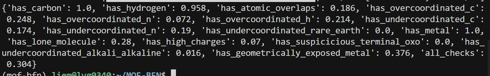
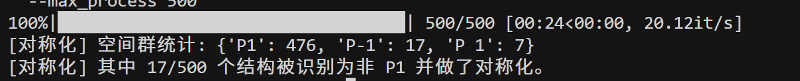
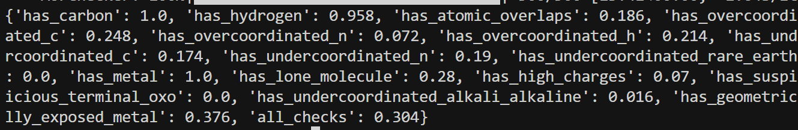
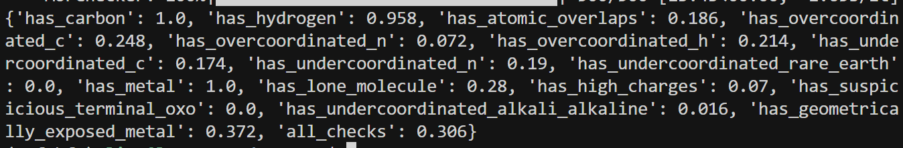

## 论文原代码复现

* 去除数据中的过剩字符串


* 开始训练

```bash
cd /home/liem/MOF-BFN
export PYTHONPATH=.
export LD_LIBRARY_PATH="${HOME}/.local/share/mamba/envs/mof-bfn/lib:${LD_LIBRARY_PATH}"
export CUDA_VISIBLE_DEVICES=3,4
mkdir -p logs

nohup python experiments/train.py \
    experiment.num_devices=2 \
    experiment.wandb.name=dng_from_scratch \
    experiment.trainer.strategy=ddp \
    > logs/dng_from_scratch.log 2>&1 &
```

### loss曲线分析


#### 1. val_type_loss (类型分类验证损失)

- **绿色 (原论文):** 表现为高频震荡，但底部始终压在 **0 附近**。这种形状通常意味着模型在大多数样本上已经找准了方向，只有少数困难样本引起了波动。
- **橙色 (修改后):** 震荡幅度极大，且整体中值抬高到了 **500-600**。
- **分析:** 我的修改可能破坏了分类层（Type Classifier）的特征提取，或者分类损失函数（如 CrossEntropy）的权重设置得太低，导致模型对物体类型的判断能力大幅下降。

#### 2. val_rot_loss (旋转矩阵/角度验证损失)

- **绿色 (原论文):** 初始值在 **1.2** 左右，迅速下降并在 50k 步后稳定在 **0.4** 附近，曲线非常平滑。
- **橙色 (修改后):** 初始值高达 **2.5**，虽然有下降趋势，但在 50k 步时仍停留在 **1.0** 以上。

#### 3. val_lattice_loss (晶格参数验证损失)

- **绿色 (原论文):** 表现极佳，从 8 迅速跌至 **0.5** 以下，几乎完全收敛。
- **橙色 (修改后):** 这是一个巨大的异常点。Loss 始终在 **280 - 380** 之间徘徊。

#### 4. val_coord_loss (坐标预测验证损失)

- **绿色 (原论文):** 从 10 平滑下降到 **4.5** 左右。
- **橙色 (修改后):** 虽然曲线形状相似，但最终停留在 **9.5** 附近。
- **分析:** 坐标预测依赖于局部的几何特征。橙色的收敛速度明显慢于绿色，且精度损失了近一倍，说明修改后的模型对局部空间位置的感知能力减弱。

### 5. train_type_loss_step (训练类型损失步进)

- **绿色 (原论文):** 在极短时间内（约 20k 步）就收敛到了趋于 **0** 的位置，几乎没有噪声。
- **橙色 (修改后):** 存在大量极高的尖峰（高达 **50000**），且直到 50k 步依然不稳定。
- **分析:** 这说明训练过程极其不稳定。高尖峰通常意味着**梯度爆炸**或者**学习率过高**。由于训练集都无法压低这个损失，说明模型在最基础的分类任务上都遇到了严重的梯度传导障碍


```bash
#/home/liem/data/mofbfn/checkpoints/logs/mof-csp/dng_from_scratch/ckpt/epoch_673-step_192764-loss_14.5719.ckpt

export LD_LIBRARY_PATH=/home/liem/.local/share/mamba/envs/mof-bfn/lib:$LD_LIBRARY_PATH

PYTHONPATH=. python -m experiments.infer \
  experiment.wandb.name=infer_dng_test \
  inference.ckpt_path=/home/liem/data/mofbfn/checkpoints/logs/mof-csp/dng_from_scratch/ckpt/epoch_673-step_192764-loss_14.5719.ckpt \
  inference.inference_dir=/home/liem/MOF-BFN/infer_results_test_3_7
  
  

python -m postprocess.assemble \
  --res_path /home/liem/MOF-BFN/infer_results_test_3_7/raw_results.pt \
  --bb_z_path /home/liem/data/mofbfn/datasets/dng/bb_emb_space_tot_z.pt \
  --bb_blocks_path /home/liem/data/mofbfn/datasets/dng/bb_emb_space_tot_blocks_processed.lmdb \
  --max_process 500
  
  # 检查连通性 (是否形成了完整的 3D 骨架)
python -m evaluation.connect_check \
  --res_path /home/liem/MOF-BFN/infer_results_test_3_7/raw_results.pt \
  --bb_z_path /home/liem/data/mofbfn/datasets/dng/bb_emb_space_tot_z.pt \
  --bb_blocks_path /home/liem/data/mofbfn/datasets/dng/bb_emb_space_tot_blocks_processed.lmdb \
  --max_process 500
  
  #有效性检查 (Validity Check)
  python -m evaluation.validity_check \
  --res_path /home/liem/MOF-BFN/infer_results_test_3_7/samples \
  --max_process 500
  

```

* connect_check = 0.878




## 进一步优化思路：MOF-BFN 对称性约束优化

当前代码仅有**隐含**的对称性处理（分数坐标 + Bingham 旋转），**没有**显式的空间群/Wyckoff 约束；生成 CIF 时统一写为 `P 1`。引入显式对称性约束能直接改善有效性、孔隙/密度一致性、收敛速度和性质预测。

| 现状描述           | 代码位置说明 |
|------------------------|--------------|
| 分数坐标 (Fractional)  | `crysbfn_bhm_module.py`：`cart_to_frac_coords` → `frac_coords` 送入 BFN |
| Bingham 处理旋转       | `crysbfn.py` / `crysbfn_bhm.py`：`rot_vecs`（四元数）对应旋转分布 |
| 无空间群预测/约束      | 全代码无 `space_group` / `wyckoff`；采样为 N 个 block 独立坐标 |
| 输出统一 P1            | `CifWriter(pred_structure)` 时 pymatgen 对无对称信息结构默认 P1 |

### 阶段一：后处理对称化

* 在 `postprocess/assemble.py`  写 CIF 之前，插入一步：先对称化再写，观察validity 与孔隙/性质是否提升

```py
# 写 CIF 前先对称化，减轻对称性破缺以提升 validity/弛豫稳定性
        if getattr(args, 'symmetrize', True):
            pred_structure, sg_symbol = symmetrize_structure(
                pred_structure,
                symprec=getattr(args, 'symprec', 0.05),
                angle_tolerance=getattr(args, 'angle_tolerance', 5.0),
            )
            space_groups.append(sg_symbol)
        # 分数坐标舍入可减轻浮点噪声，对 P1 或高对称结构都有帮助
        if getattr(args, 'round_frac_digits', 0) > 0:
            pred_structure = round_frac_coords(
                pred_structure, digits=args.round_frac_digits
            )
        # Write predicted structure
        writer = CifWriter(pred_structure)
        sample_dir = os.path.join(os.path.dirname(args.res_path), 'samples')
        os.makedirs(sample_dir, exist_ok=True)
        writer.write_file(os.path.join(sample_dir, f'pred_{i}.cif'))

    # 对称化时打印空间群统计：若几乎全是 P 1，则 get_symmetrized_structure 不会改坐标，可尝试 --symprec 0.1
    if getattr(args, 'symmetrize', True) and space_groups:
        sg_counts = Counter(space_groups)
        n_p1 = sg_counts.get("P 1", 0) + sg_counts.get("P1", 0)
        n_total = len(space_groups)
        print(f"[对称化] 空间群统计: {dict(sg_counts)}")
        if n_p1 == n_total:
            print(f"[对称化] 全部为 P1 → 未对坐标做对称变换。可尝试 --symprec 0.1 或 0.2 看是否有结构被识别为高对称。")
        else:
            print(f"[对称化] 其中 {n_total - n_p1}/{n_total} 个结构被识别为非 P1 并做了对称化。")
```




* connect_check = 0.878



* 修改后结果没有任何改变

```bash
python -m postprocess.assemble \
  --res_path /home/liem/MOF-BFN/infer_results_test_3_7/raw_results.pt \
  --bb_z_path /home/liem/data/mofbfn/datasets/dng/bb_emb_space_tot_z.pt \
  --bb_blocks_path /home/liem/data/mofbfn/datasets/dng/bb_emb_space_tot_blocks_processed.lmdb \
  --max_process 500 \
  --round_frac_digits 5

```

* connect_check = 0.878



对坐标的微调对结果有少量提升，但是微乎其微。


### 阶段二: Symmetry-Aware Conditioning

- **思路**：不改变“预测 N 个 block 的坐标”的范式，只在 BFN 的输入中把**空间群**作为条件。

- **实现要点**：
  1. **数据**：在 `data/dataset.py` 或 dataloader 中从 CIF/Structure 用 pymatgen 解析 `structure.get_space_group_info()`，得到空间群编号或 one-hot，加入 `batch`（如 `batch.space_group_id`）。
  2. **模型**：在 `CSPNet` 的输入或 `CrysBFN` 的 `loss_one_step` 所用特征里，拼接空间群 embedding。
  
  

```bash
export PYTHONPATH=.
export LD_LIBRARY_PATH="${HOME}/.local/share/mamba/envs/mof-bfn/lib:${LD_LIBRARY_PATH}"
export CUDA_VISIBLE_DEVICES=6,7

nohup python experiments/train.py \
    experiment.num_devices=2 \
    experiment.wandb.name=dng_sg_condition \
    experiment.trainer.strategy=ddp \
    > logs/dng_sg_condition.log 2>&1 &
```

### 具体修改

- **数据**：`data/dataloader_ori.py`、`data/dataset.py` — 增加 `space_group`字段。
- **模型**：`models/crysbfn_bhm.py`、`crysbfn/pl_modules/crysbfn.py` — 接收 `space_group` 条件；若做 Wyckoff 采样，需新分支或新 head 输出等价集与坐标。
- **推理/后处理**：`models/crysbfn_bhm_module.py` 的采样与写 CIF 处；`postprocess/assemble.py` — 对称化或 Wyckoff 展开。
- **评估**：`evaluation/validity_check.py`、`evaluation/property.py` — 增加“对称性满足程度”的统计以及 validity/PSD/ASA/性质对比。


目前看起来效果不错，整体loss（棕色线）比源代码（绿色线）要好看一些，期待明天早上的结果。
