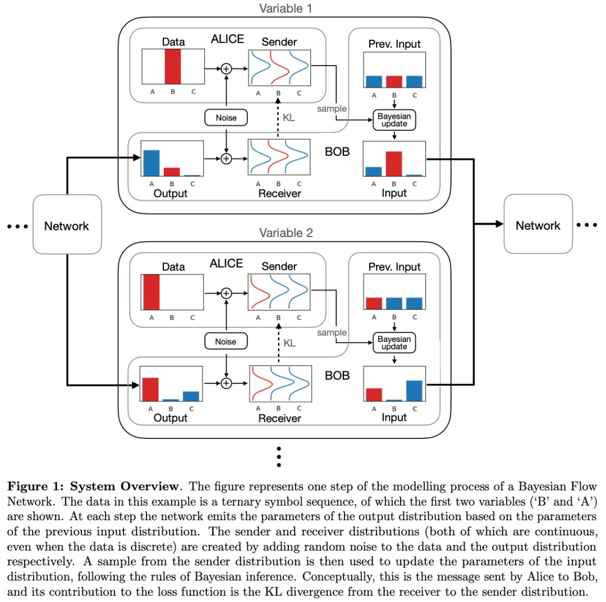
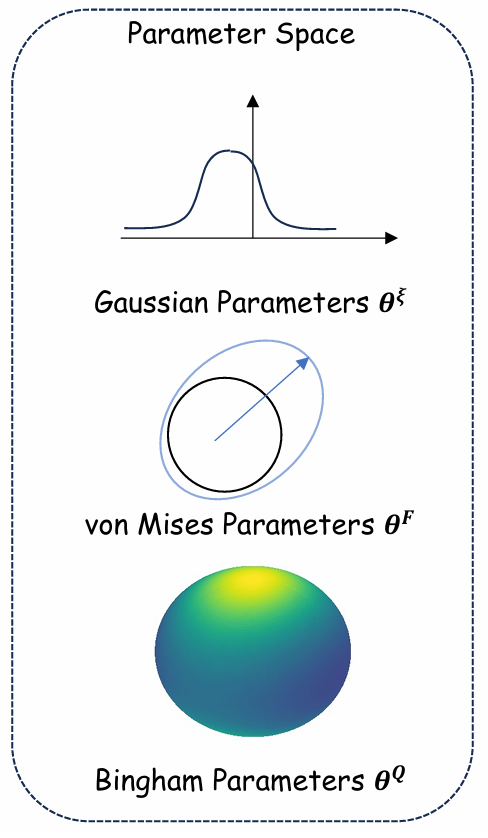
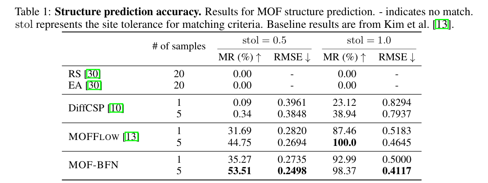
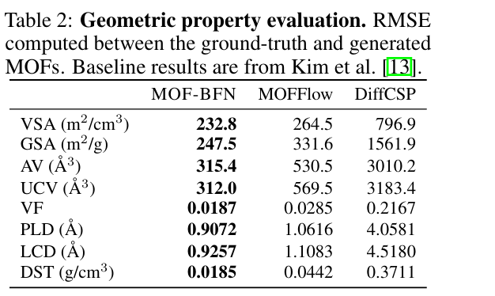
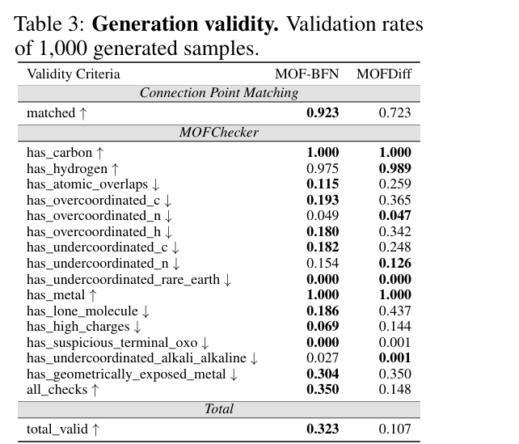
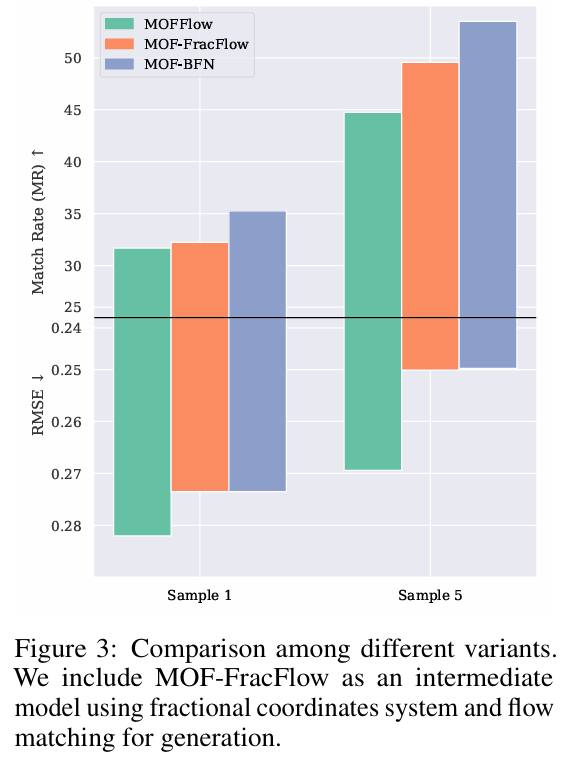

# MOF-BFN: Metal-Organic Frameworks Structure Prediction via Bayesian Flow Networks

## 1. 研究背景与核心挑战 (Background & Challenges)

- **MOF 的复杂性**：金属有机框架（MOFs）由金属节点和有机配体通过配位键组成，具有极高的比表面积和可调孔隙率。但其单胞（Unit Cell）内通常包含数百甚至上千个原子。
- **计算成本高**：传统的从头计算（如 DFT）或原子级生成模型在面对如此庞大的体系时，计算效率极低。
- **周期性与层级化**：MOF 本质上是**三维周期性**的，且具有明显的**层级结构**（即由建筑块拼装而成）。
- **现有模型缺陷**：
  - **离散化误差**：基于扩散（Diffusion）和流匹配（Flow Matching）的模型依赖 SDE/ODE 求解，采样时的数值离散化会产生累积误差。
  - **取向建模难**：现有的模型（如 MOFDiff）往往需要繁琐的后处理来优化建筑块的旋转取向。

------

## 2. 核心创新点 (Key Innovations)

这篇论文最主要的贡献是将**贝叶斯流网络（BFN）**引入 MOF 领域，并针对其物理特性进行了三大创新设计：

### ① 引入贝叶斯流网络 (BFN) 框架

- **创新逻辑**：不同于扩散模型在数据空间加噪，BFN 通过在**概率分布的参数空间**进行贝叶斯更新来细化生成结果。
- **优势**：完全绕过了 SDE/ODE 的数值求解，从根本上消除了采样过程中的**离散化截断误差**，使生成过程更稳定、更准确。

### ② 显式周期性建模：分数坐标系 (Fractional Coordinates)

- **创新逻辑**：模型不再直接预测原子的绝对笛卡尔坐标，而是预测相对于晶格矢量的分数坐标 $F \in [0, 1)^3$。
- **优势**：将坐标映射到 3D 环面（Torus）空间，自然地融入了**周期性边界条件（PBC）**，确保生成的结构在数学上符合晶体的无限延伸特性。

### ③ 旋转流形建模：Bingham BFN

- **创新逻辑**：这是本文的技术重难点。建筑块不仅有位置，还有旋转（朝向）。论文将旋转表示为**单位四元数（Unit Quaternions）**，并首次提出了 **Bingham BFN**。
- **优势**：Bingham 分布是定义在单位超球面上处理方向数据的理想分布。通过 Bingham BFN，模型能高效地在 4D 单位超球面上生成符合物理约束的旋转取向，解决了 $SO(3)$ 空间的建模难题。

## 3. 理论基础 (Theoretical Foundations)

### 3.1 MOF 的表示

#### 3.1.1 原子的全局表示法

在最基础的层面，一个 MOF 晶体可以被看作是三维空间中无限周期的原子排列。为了描述它，我们定义了一个**三元组 $M = (L, X, A)$**：

- **晶格矩阵 $L = [\mathbf{l}_1, \mathbf{l}_2, \mathbf{l}_3] \in \mathbb{R}^{3 \times 3}$**：

  它定义了单胞（Unit Cell）的大小和形状。

- **笛卡尔坐标矩阵 $X = [\mathbf{x}_i]_{i=1}^N \in \mathbb{R}^{3 \times N}$**：

  存储单胞内 $N$ 个原子的绝对空间位置。

- **原子类型矩阵 $A = [\mathbf{a}_i]_{i=1}^N \in \mathbb{R}^{h \times N}$**：

  通常使用 One-hot 编码表示每个原子的元素种类（如 C, O, Zn 等）。

**周期性公式：**

任何一个原子的位置都可以通过下式表达：$\{(a'_i, x'_i) \mid a'_i = a_i,\; x'_i = x_i + L t,\; \forall t \in \mathbb{Z}_3 \times 1 \}$

这里的 $\mathbf{t}$ 是整数向量，代表在三个晶格矢量方向上的偏移。

------

#### 3.1.2 不变晶格参数 $\xi$

直接预测矩阵 $L$ 往往比较困难，因为它包含旋转成分。为了简化建模，我们通常使用**不变晶格参数：

$$\xi = (a, b, c, \alpha, \beta, \gamma)$$  其中 $a, b, c$ 是边长，$\alpha, \beta, \gamma$ 是夹角。

**一种常见的构造方式（将 $l_1$ 置于 x 轴）：**

1. $l_1 = (a, 0, 0)$
2. $l_2 = (b\cos\gamma, b\sin\gamma, 0)$
3. $l_3 = (c\cos\beta, c\frac{\cos\alpha - \cos\beta\cos\gamma}{\sin\gamma}, c\sqrt{1 - \cos^2\beta - (\frac{\cos\alpha - \cos\beta\cos\gamma}{\sin\gamma})^2})$

通过这套公式，只要有了 6 个物理参数，就能唯一确定矩阵 $L$。

> **Trick**：在实际的生成模型（如 Lin 等人的研究）中，为了将这些正值或区间限制的参数映射到全实数空间 $\mathbb{R}^6$，会对长度取 $\log$，对角度取 $\tan$ 处理，这样更利于神经网络的收敛。

------

#### 3.1.3 核心：块级层次表示

由于 MOF 原子数巨大，直接生成所有原子坐标（$N$ 很大）会导致计算量爆炸。研究者提出了“**建筑块（Building Blocks）**”的概念。

我们将单胞描述为 $M_B = (L, X_B, R_B, B)$，其中：

- **$X_B$ (中心位置)**：每个建筑块（如金属簇或配体）的中心坐标。
- **$R_B \in SO(3)$ (旋转/取向)**：描述建筑块在空间中的朝向。
- **$B$ (本地结构)**：存储每个块自身的原子构成。

为了让位置信息不受晶格缩放的影响，我们使用分数坐标 $F$：$$\mathbf{f}_B = L^{-1}\mathbf{x}_B \in [0, 1)^3$$

这样，无论晶格多大，所有块的坐标都被归一化在 $[0, 1)$ 之间。

##### 本地结构中原子的表示：

###### (1) 局部坐标 $\mathbf{x}_r$ 的表示：PCA 规范化

在建筑块 $\mathcal{C}_j$ 内部，原子的位置 $\mathbf{x}_r$ 并不是随机分布的，而是采用了一种基于 **主成分分析 (PCA)** 的“规范局部坐标”（Canonical Local Coordinates）。

- **去中心化**：首先将块内所有原子的原始笛卡尔坐标减去该块的几何中心，使块的中心位于 $(0,0,0)$ 。

- **对齐标准轴**：通过 PCA 计算原子分布的特征向量矩阵 $R$（即主轴方向）。为了消除镜像对称导致的歧义，会根据块内原子的分布方向（向量 $v_j$）来确定主轴的正负符号 。

- **结果**：最终得到的 $\mathbf{x}_r$ 是该建筑块在“标准姿态”下的内部坐标 。这样，同一种类型的建筑块（如某种苯环配体）无论在哪个 MOF 中，其 $\mathbf{x}_r$ 的数值都是完全一致的常数 。

###### (2) 确定某个具体原子的全局位置

要确定 MOF 晶格中某个原子的具体绝对位置 $\mathbf{x}_{global}$，需要将预测出的各种参数带入以下逻辑：

1. **确定块中心（分数坐标 $\to$ 绝对坐标）**： 模型预测出每个块中心的分数坐标 $\mathbf{f}_j \in [0, 1)^3$ 。通过与晶格矩阵 $L$ 相乘，将其转回绝对空间位置 ：

   $$
   \text{块中心绝对位置} = L \mathbf{f}_j
   $$
   
2. **应用旋转（四元数 $\to$ 旋转矩阵）**： 模型预测出块的取向四元数 $q_j$ 。根据公式 (1)，将 $q_j$ 转换为 $3 \times 3$ 的旋转矩阵 $R(q_j)$ 。这个矩阵描述了该块相对于“标准姿态”旋转了多少。

3. **合成最终坐标**：

   对于块内第 $r$ 个原子，其最终位置为：$$\mathbf{x}_{global} = L \mathbf{f}_j + R(q_j) \mathbf{x}_r$$

   - $L \mathbf{f}_j$：确定块在单胞里的哪儿（由**分数坐标**决定）。
- $R(q_j) \mathbf{x}_r$：确定原子相对于块中心摆放在什么位置和角度 。

------

#### 3.2 旋转的数学：单位四元数 (Unit Quaternions)

描述建筑块的旋转（$R_B$）时，如果使用 $3 \times 3$ 矩阵会存在冗余（9个值描述3个自由度）。因此，模型通常采用**单位四元数 $q = [w, x, y, z]$**，满足 $\|q\| = 1$。

**从四元数到旋转矩阵的转换公式：**

$$
R(q) = \begin{pmatrix} 1 - 2(y^2 + z^2) & 2(xy - wz) & 2(xz + wy) \\ 2(xy + wz) & 1 - 2(x2 + z^2) & 2(yz - wx) \\ 2(xz - wy) & 2(yz + wx) & 1 - 2(x^2 + y^2) \end{pmatrix}
$$

这种表示法不仅紧凑，而且能有效避免“万向节死锁”问题，非常适合深度学习中的梯度下降。

------

#### 3.3 任务定义：生成式建模

有了上述表示方法，MOF 的结构预测和生成任务可以转化为对以下概率分布的建模：

1. **结构预测 (Structure Prediction)**：

   已知块类型 $B$，预测晶格和排列：$p(\xi, F, Q | B)$。

2. **从头生成 (De novo Generation)**：

   同时生成块类型及其空间排列：$p(\xi, F, Q, B)$。

​	这种表示法的精妙之处在于**化繁为简**：它将成千上万个原子的坐标问题，简化为了少量建筑块的“位置 ($F$) + 旋转 ($Q$) + 类型 ($B$)”问题，配合不变晶格参数 $\xi$，为大规模 MOF 筛选和 AI 设计奠定了数学基础。

### 3.4 贝叶斯流网络 (Bayesian Flow Networks)

贝叶斯流网络（Bayesian Flow Networks, BFNs）是该论文的核心生成算法。相比于传统的扩散模型（Diffusion Models）直接在数据空间加噪，BFN 的核心哲学是：**在概率分布的参数空间（Parameter Space）进行演化。**

我们可以将 BFN 的原理拆解为“发送者-接收者”博弈模型，通过以下四个关键数学阶段来理解：

------

#### 1. 发送者（Sender）：产生带噪声的观测

发送者知道真实的干净数据 $x$。在每一个步长 $i$，发送者根据预设的精度计划（Accuracy Schedule）$\alpha_i$，对 $x$ 进行“模糊化”处理，产生一个观测值 $y_i$。

$$
p_S(y_i|x; \alpha_i)
$$

- **解析**：$\alpha_i$ 是**精度计划（Accuracy Schedule）**。在 $i=1$ 时精度最低（噪声最大），到 $i=T$ 时精度最高。这描述了真相如何被污染成观测值的过程。你可以把它想象成：发送者在给接收者发送一封带有干扰电报，随着时间推移，干扰信号越来越弱。

#### 2. 接收者（Receiver）：基于贝叶斯的“信念更新”

* 接收者（Receiver）基于观察到的 $y_i$，不断修正对 $x$ 的看法（即更新概率分布的参数）。

$$
p_I(x|\theta_i) \propto p_I(x|\theta_{i-1}) p_S(y_i|x; \alpha_i) \tag{2}
$$

- **解析**：这是一个典型的贝叶斯推断过程：**后验 $\propto$ 先验 $\times$ 似然**。
  - $p_I(x|\theta_{i-1})$ 是接收者在第 $i-1$ 步的“信念”（先验）。
  - $p_S(y_i|x; \alpha_i)$ 是新观察到的证据（似然）。
  - 更新后的分布由参数 $\theta_i$ 参数化。

​	接收者不知道 $x$，它手里只有一套关于 $x$ 可能是什么的“信念”，即**参数 $\theta$**。接收者的目标是通过不断收到 $y_i$，利用**贝叶斯定理**来更新自己的信念。

$$
\theta_i = h(\theta_{i-1}, y_i, \alpha_i) \tag{3}
$$

- **公式解析：** 
  - $\theta_{i-1}$：上一时刻我对数据的认知（先验）。
  - $y_i$：这一时刻我收到的带噪观测。
  - $h$：$h$ 函数定义了参数如何“流动”。它本质上是计算 $p(x|\text{所有已观测到的 } y)$。

------

#### 3. 贝叶斯流（Bayesian Flow）：参数的轨迹

* 为了研究参数 $\theta_i$ 本身的统计特性，我们需要对所有可能的观测值 $y_i$ 进行边缘化（求期望）。

$$
p_U(\theta_i|\theta_{i-1}, x; \alpha_i) = \mathbb{E}_{y_i \sim p_S(y_i|x; \alpha_i)} \delta(\theta_i - h(\theta_{i-1}, y_i, \alpha_i)) \tag{4}
$$

- **解析**：$\delta$ 是狄拉克 $\delta$ 函数。这个公式表示：给定真相 $x$ 和上一时刻参数 $\theta_{i-1}$，由于 $y_i$ 是随机采样的，那么下一时刻更新出的 $\theta_i$ 也是一个随机变量。

* 为了让模型能够训练，我们需要知道在任意时刻 $i$，参数 $\theta_i$ 的分布情况。这就是**贝叶斯流分布 $p_F$**。

$$
p_F(\theta_i|x, [\alpha_j]_{j=1}^i) = \mathbb{E}_{p_U(\theta_1|\theta_0, x; \alpha_1)} \cdots \mathbb{E}_{p_U(\theta_{i-1}|\theta_{i-2}, x; \alpha_{i-1})} p_U(\theta_i|\theta_{i-1}, x; \alpha_i) \tag{5}
$$

- 这个复杂的积分链式公式表达的是：从初始状态 $\theta_0$（完全无知，通常是均匀分布或标准正态分布）开始，经过 $i$ 次贝叶斯更新后，参数 $\theta$ 演化到了哪里。
- **关键点：** 它是一个马尔可夫链的积分累积。在训练阶段，我们不需要真的一步步去迭代更新，通常 $p_F(\theta_i|x)$ 存在解析解，可以让我们直接从原始数据 $x$ 跳跃式地采样出中间状态 $\theta_i$。

#### 4. 神经网络的角色：模拟发送者

在推理（生成）阶段，我们没有真实数据 $x$，所以无法产生 $y_i$。这时神经网络 $\phi$ 登场了：

$$
p_O(\hat{x}|\phi(\theta_{i-1}, t_i)) = \delta(\hat{x} - \phi(\theta_{i-1}, t_i)) \tag{6}
$$

- **解析**：网络根据当前的认知参数 $\theta_{i-1}$ 和时间步 $t_i$，给出一个对原数据的最准确估计 $\hat{x}$。使用 $\delta$ 函数意味着模型输出是一个确定的点估计。

1. 神经网络查看当前的信念 $\theta_{i-1}$。
2. 它预测出一个“估计的干净数据” $\hat{x} = \phi(\theta_{i-1}, t_i)$。
3. 我们用这个预测出来的 $\hat{x}$ 来替代真实 $x$，模拟出一个接收者分布 $p_R$。

$$
p_R(y_i|\theta_{i-1}; t_i, \alpha_i) = \mathbb{E}_{p_O(\hat{x}|\phi(\theta_{i-1}, t_i))} p_S(y_i|\hat{x}; \alpha_i) \tag{7}
$$

#### 5. 训练目标：最小化传输损失

BFN 的训练不是直接预测噪声，而是最小化**发送者（拥有真相）**和**接收者（模型模拟）**之间的差异。

$$
\mathcal{L}(\phi) = \mathbb{E}_{x \sim p_{data}, i \sim U(1, T)} D_{KL}(p_S(\cdot|x; \alpha_i) \| p_R(\cdot|\theta_{i-1}; t_i, \alpha_i)) \tag{8}
$$

- **直观理解：** 
  - $p_S$ 是基于真相产生的真实噪声观测。
  - $p_R$ 是基于模型预测产生的虚拟噪声观测。
  - 如果模型 $\phi$ 预测得足够准（即 $\hat{x} \approx x$），那么这两个分布就会重合，KL 散度趋于 0。（对于连续变量，这个 KL 散度通常会退化为 **MSE（均方误差）** 损失；对于分类变量，它会退化为 **交叉熵** 损失。）

------

#### 总结：BFN vs 扩散模型

在 MOF 预测任务中，BFN 能够同时处理连续的晶格参数（$\xi$）和离散的块类型（$B$），这就是因为它将所有不同性质的数据都统一到了**参数演化**这一套数学框架下。

## 4. MOF-BFN 实现

这一节本质上是在说明：**MOF-BFN 如何在三个不同的流形空间上建立 Bayesian Flow Network：**

- 晶格参数：连续空间 $\mathbb{R}^6$
- 分数坐标：环面 $T^{3\times K}$
- 取向：四元数球面 $S^3$

### 4.1 晶格参数和坐标

#### 4.1.1 连续空间 $R^6$（晶格参数 $\xi$）

- **物理意义**：描述晶胞的大小和形状（3条边长 + 3个角度）。

- **数学模型**：使用高斯分布 $N(\xi; \mu, \rho^{-1}I)$。

- **更新公式 **：
  $$
  \{ \mu_i^\xi, \rho_i^\xi \} = \left( \frac{\rho_{i-1}^\xi \mu_{i-1}^\xi + \alpha_i^\xi y_i^\xi}{\rho_{i-1}^\xi + \alpha_i^\xi}, \rho_{i-1}^\xi + \alpha_i^\xi \right)
  $$
  
  - **理解**：这本质上是**加权平均**。新的均值 $\mu_i$ 是旧均值和新观测值 $y_i$ 的组合，权重取决于精度 $\rho$（精度的倒数是方差）。
  
  $$
  \mathcal{L}_\xi = \mathbb{E}_{i, \mu_{i-1}} \left[ \frac{\alpha_i^\xi T}{2} \|\xi - \phi_\xi(\theta_{i-1}^M, i)\|^2_2 \right]
  $$
  
- **训练目标 **：最小化预测值 $\phi_\xi$ 与真实值 $\xi$ 之间的均方误差（MSE）。

#### 4.1.2 环面空间 $T^{3 \times K}$（分数坐标 $F$）

- **物理意义**：原子在晶胞内的相对位置（0到1之间循环）。
- **数学模型**：使用 **von Mises 分布**（类似于圆周上的高斯分布）。
- **更新公式 (Eq. 12)**：

$$
c_i^F = c_{i-1}^F + \alpha_i^F e^{j 2\pi y_i^F}
$$

使用复数形式 $c_i = \kappa e^{i 2\pi m}$ 来处理周期性，通过累加复数向量来更新分布的中心和集中度。

------

### 4.2 针对四元数生成的 Bingham BFN

这是本文的创新点，解决了旋转对称性问题。

### Bingham 分布 (Eq. 15)

$$
p_B(q; M, \Lambda) = \frac{1}{Z(\Lambda)} \exp(q^\top M^\top \Lambda M q)
$$

- **核心逻辑**：旋转空间具有**对映对称性（Antipodal Symmetry）**，即四元数 $q$ 和 $-q$ 表示同一个旋转。Bingham 分布天然符合这一特性。
- **参数含义**：$M$ 是特征向量（决定旋转方向），$\Lambda$ 是特征值（决定分布在该方向上的集中程度）。

### 贝叶斯更新 

文中引入了 **Watson 分布** 作为共轭先验。

- **公式推导**：将 Bingham 的指数项与 Watson 的似然项相乘，结果仍然是一个 Bingham 分布。
- **更新规则 (Eq. 20)**：通过对“旧参数矩阵 + 新观测值的特征矩阵”进行**特征值分解（EigenDecomposition）**来获取更新后的 $M_i$ 和 $\Lambda_i$。

### 训练目标

$$
L_q = E [ \dots (1 - (q^\top \phi_q)^2) ]
$$

- **直观理解**：$q^\top \phi_q$ 是两个单位四元数的余弦相似度。平方项确保了无论预测的是 $q$ 还是 $-q$，只要方向一致，损失就小。

------

### 4.3 训练方案与损失设计

#### 4.3.1 合损失函数

$$
\mathcal{L}_{SP} = \gamma_\xi \mathcal{L}_\xi + \gamma_F \mathcal{L}_F + \gamma_q \mathcal{L}_q
$$

- **解读**：通过超参数 $\gamma$ 平衡三个流形的学习速率。

#### 4.3.2 扩展到生成任务 

$$
\mathcal{L}_{DNG} = \gamma_\xi \mathcal{L}_\xi + \gamma_F \mathcal{L}_F + \gamma_q \mathcal{L}_q + \gamma_B \mathcal{L}_B
$$

- **解读**：加入了 $\mathcal{L}_B$，即对建筑单元（Building Block）身份的学习，使其具备生成全新 MOF 的能力。

#### 4.3.3 模型骨干 (Backbone)

- 使用 **EGNN (E(n) Equivariant Graph Neural Networks)** 作为编码器，处理建筑单元（Building Blocks）的局部结构。
- 预测器不仅输入时间步 $t$ 和参数 $\theta$，还输入了**精度项 ($\kappa, \lambda$)**。这非常关键，因为精度告诉模型当前预测的不确定性有多少。

## 5. 实验结果 (Experiments)

### 1. 结构预测精度 (Structure Prediction)

MOF-BFN 在将建筑单元（Building Blocks）组装回原始 MOF 结构的测试中表现出色。

- **显著超越基线**：相比于传统的随机搜索（RS）、进化算法（EA）以及全原子模型（DiffCSP），MOF-BFN 展现了压倒性的优势。
- **对比 MOFFlow**：在最严格的匹配标准（stol=0.5）下，生成 5 个样本时，MOF-BFN 的匹配率（MR）从 **44.75% 提升至 53.51%**，且均方根误差（RMSE）显著降低。
- **结论**：块级（Block-level）建模结合 BFN 框架，能更高效地在大尺度搜索空间中定位正确结构。

------

### 2. 几何与物理性质评估 (Geometric Property)

模型不仅要“形似”，更要“神似”。研究者评估了与气体存储和分离相关的 8 项关键物理指标（如表面积 VSA/GSA、孔径 PLD/LCD、孔隙率 VF 等）。

- **误差最低**：如表 2 所示，MOF-BFN 在所有 8 项指标上的 RMSE 均为最低。
- **结论**：这证明了该模型预测的结构在**空间特性**上与真实材料高度一致，具备实际工程应用（如模拟气体吸附）的潜力。

------

### 3. 从头生成能力 (De Novo Generation)

在没有任何已知拓扑结构的前提下，模型直接生成全新的 MOF。

- **拓扑一致性**：在连接点匹配（Connection Point Matching）测试中，MOF-BFN 达到了 **92.3%** 的成功率，远高于 MOFDiff 的 72.3%，说明其组装逻辑更符合拓扑学原理。
- **化学合理性**：通过 `MOFChecker` 工具进行全方位检查（包括原子重叠、配位状态、电荷等），MOF-BFN 的综合合格率（Total Valid）是 MOFDiff 的 **3 倍以上**（0.323 vs 0.107）。
- **结论**：MOF-BFN 生成的材料在化学上更“健康”，更具有合成可能性。

------

### 4. 消融实验分析 (Analyses)

为了明确进步的来源，研究者将 MOF-BFN 与中间变体 `MOF-FracFlow`（仅引入分数坐标的流匹配模型）进行了对比：

- **周期性的重要性**：改用**分数坐标（Fractional Coordinates）**后，即使不改变算法架构，性能也有所提升，说明捕捉晶格周期性是关键。
- **BFN 框架的优越性**：在同等条件下，**BFN 框架**持续优于流匹配（Flow Matching）框架。特别是在引入了 $SO(3)$ 流形（旋转空间）的生成目标后，BFN 处理复杂流形的能力得到了进一步证实。

