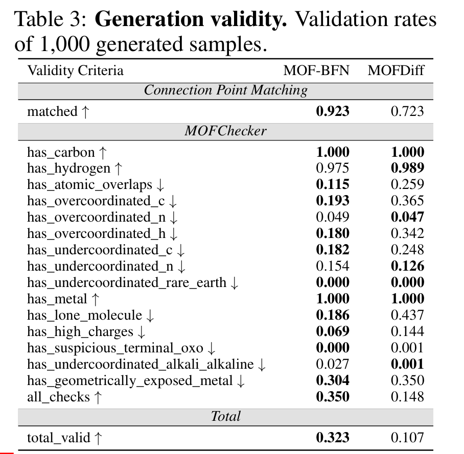
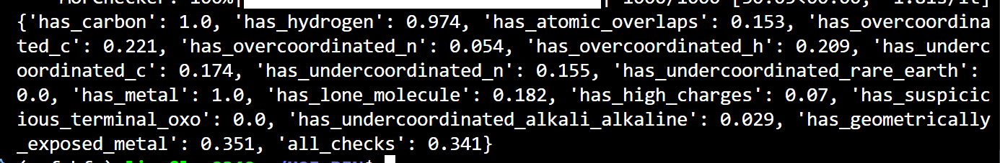
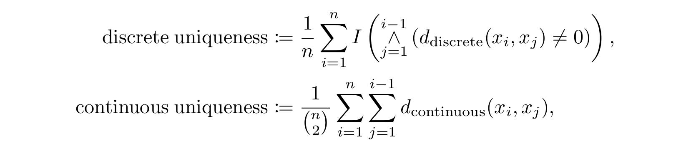
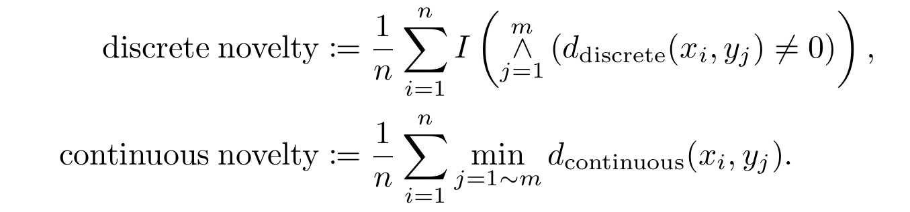

## De Novo测评

| Validity Criteria                      | 论文 MOF-BFN | 你的实验结果 | 差值（你 - 论文） |
| -------------------------------------- | ------------ | ------------ | ----------------- |
| **Connection Point Matching**          |              |              |                   |
| matched ↑                              | **0.923**    | *未给出*     | –                 |
| **MOFChecker**                         |              |              |                   |
| has_carbon ↑                           | **1.000**    | **1.000**    | +0.000            |
| has_hydrogen ↑                         | 0.975        | **0.974**    | -0.001            |
| has_atomic_overlaps ↓                  | **0.115**    | 0.153        | +0.038            |
| has_overcoordinated_c ↓                | **0.193**    | 0.221        | +0.028            |
| has_overcoordinated_n ↓                | 0.049        | **0.054**    | +0.005            |
| has_overcoordinated_h ↓                | **0.180**    | 0.209        | +0.029            |
| has_undercoordinated_c ↓               | 0.182        | **0.174**    | -0.008            |
| has_undercoordinated_n ↓               | **0.154**    | 0.155        | +0.001            |
| has_undercoordinated_rare_earth ↓      | **0.000**    | **0.000**    | +0.000            |
| has_metal ↑                            | **1.000**    | **1.000**    | +0.000            |
| has_lone_molecule ↓                    | 0.186        | **0.182**    | -0.004            |
| has_high_charges ↓                     | **0.069**    | 0.070        | +0.001            |
| has_suspicious_terminal_oxo ↓          | **0.000**    | **0.000**    | +0.000            |
| has_undercoordinated_alkali_alkaline ↓ | 0.027        | **0.029**    | +0.002            |
| has_geometrically_exposed_metal ↓      | 0.304        | **0.351**    | +0.047            |
| **all_checks ↑**                       | **0.350**    | 0.341        | -0.009            |

实验结果符合论文的结果。

## 通用评价指标

* MOFDIFF: COARSE-GRAINED DIFFUSION FOR METAL ORGANIC FRAMEWORK DESIGN
  * **VNU（Valid, Novel, Unique）** 评价体系
  * **Valid：**
    1. **连接匹配（Matched Connection）：** 金属连接点和非金属连接点的数量必须相等、。
    2. **力场弛豫（Relaxation）：** 原子结构必须能在力场下“收敛”，证明它在物理上是稳定的，不会发生原子重叠或结构崩溃。
    3. **`MOFChecker`：** 使用第三方工具检查元素组成、孔隙率、电荷分布以及是否有断开的原子。
  * **Novel：** 生成的 MOF 不能是训练集里的已知MOF，通过比较 `MOFid`来确认。
  * **Unique：** 10,000 个样本要各具特色。

> [!NOTE]
>
> 为了验证它能不能设计出捕捉二氧化碳的“特种材料”，作者动用了**分子模拟**。
>
> - **潜空间优化（Latent Optimization）：** 模型不是盲目乱抽样，而是利用 **Adam 优化器** 在模型的潜空间里定向搜索，寻找那些预测 CO~2~ 工作容量最高的结构。
> - **GCMC 模拟：**作者实现了大正则系综蒙特卡洛（GCMC,grand canonical Monte Carlo）模拟，计算了：
>   - **工作容量（Working Capacity）：** 循环中真正能抓多少二氧化碳。
>   - **选择性（Selectivity）：** 能不能在氮气堆里精准抓出二氧化碳。
>   - **吸附热（Heat of Adsorption）：** 抓得牢不牢。

* MOFCHECKER
  * Sanity checks:
    - Presence of at least one metal, carbon and hydrogen atom
    - Overlapping atoms (distance between atoms above covalent *radius* of the smaller atom)
    - Overvalent carbons (coordination number above 4), nitrogens (heuristics), or hydrogens (CN > 1)
    - Missing hydrogen on common coordination geometries of C and N (heuristics)
    - Atoms with excessive [EQeq partial charge](https://pubs.acs.org/doi/10.1021/jz3008485)
  * Basic analysis:
    - Presence of floating atoms or molecules
    - Hash of the atomic structure graph (useful to identify duplicates)
  * 元素组成检查，原子重叠检查，超价检查，缺失氢原子检查，异常部分电荷（原子的电荷极高或极低），孤立原子或分子，原子结构图哈希 （去重）

## 实验可合成性

### 产品有效性与合成难易度

* System of Agentic AI for the Discovery of  Metal-Organic Frameworks

  * **孔隙率筛选 (Porosity Screening via Zeo++)**：
    - **PLD (Pore Limiting Diameter)**：限孔直径必须 $> 2.5$ Å（确保小分子如 $N_2$ 能通过）。
    - **LCD (Largest Cavity Diameter)**：最大空腔直径。
    - **Void Fraction (空隙率)**：要求 $> 30\%$。
    - **可及孔容 (Accessible Volume)**：要求可及孔体积必须大于不可及孔体积。
  * 使用 **MACE-MP-0**（机器学习力场）进行弛豫，结构必须能在力场下达到能量最低点，不发生原子重叠或晶格崩溃
  * **配体合成路线分析 (Reaction Pathway)**：
    - 利用 **Allchemy** 软件对生成的有机配体进行逆合成分析，判断其是否可以从廉价易得的原料合成。
  * **多维合成评分**：
    - **SA score (Synthetic Accessibility)**：合成难易程度。
    - **SCScore (Synthetic Complexity)**：合成复杂性。
    - **BR-SAScore**：专门针对桥接配体的改良评分。
  * **人类专家盲测 (Human-in-the-loop Blind Test)**：
    - **指标**：由经验丰富的实验化学家对 AI 生成的配体进行 1-5 分的打分（1 为极难合成，5 为极易合成）。
    - **验证结果**：将 AI 的预测与人类直觉对比，确保 AI 推荐的结构在化学上是合理的。

  ### 物理与力学稳定性 

  - **热稳定性评估 ($T_d$)**：
    - 通过机器学习模型预测材料的**热分解温度**。
  - **溶剂脱除稳定性 (Stability after Activation)**：
    - 预测材料在去除孔道内溶剂分子后，其骨架是否能保持完整。
  - **力学强度 (Mechanical Integrity)**：
    - **体积模量 (Bulk Moduli)**：利用机器学习力场计算材料的抗压能力，模量越高代表结构越坚固。
  - **能量评估 (Formation Energy)**：
    - 使用高精度的 **DFT (r2SCAN-D4)** 计算形成能，确认其在热力学上的相对稳定性。
  
* A generative artificial intelligence framework based on a molecular diffusion model for the design of metal-organic frameworks for carbon capture

  * 合成可行性 (Synthesizability)

    - **SA Score (Synthetic Accessibility Score)**：利用 ==RDKit== 等工具计算配体的合成可及性分数。分数越低，代表该有机配体在实验室中被合成的可能性越高。
  
   - 动力学稳定性评估 (Stability via Molecular Dynamics)
  
      - **MD 模拟**：对初步筛选出的 MOF 进行 **1 纳秒 (ns)** 的分子动力学模拟（在 300 K 和 1 bar 条件下）。
      - **判断标准**：如果在模拟过程中晶格保持完整、没有发生剧烈的结构坍塌或化学键断裂，则认为该材料在室温下具有物理稳定性。
      
  -  $CO_2$ 吸附性能评估 (Performance Metrics)
  
      - **GNN 快速筛选**：使用 **晶体图神经网络 (Crystal Graph Neural Networks)** 对数万个结构进行初步扫描，预测其 $CO_2$ 吸附容量。
      - **GCMC 精确模拟**：对 GNN 选出的佼佼者进行 **大正则系综蒙特卡洛 (GCMC)** 模拟。
        - **工作条件**：模拟在 298 K 和 0.15 bar（典型的烟道气分压）下的吸附容量。
        - **容量指标**：最终挑选出吸附容量大于 **2 mmol/g** 的高性能 MOF。

* **Continuous Uniqueness and Novelty Metrics for Generative Modeling of Inorganic Crystals**

  * 将“定性”的判断转变为“定量”的连续计算。

    #### 1. 唯一性 (Uniqueness)

    唯一性衡量的是生成的 $N$ 个样本中，有多少是互不相同的。

    - **传统做法**：只要两个结构超过了预设的阈值，就判定为重复。

    - **新标准 ($U_{d}$)**：基于距离的唯一性。

      - 公式逻辑：计算所有样本对之间的实际物理距离（实数值）的平均值。 在这两种情况下，数值越大代表样本集的多样性越高。

        $$U_{d} = \frac{1}{N} \sum_{i=1}^{N} \exp\left(-\sum_{j \neq i} K(d(x_i, x_j))\right)$$

        

      - **分析**：它不再是简单的计数，而是考察样本在空间中的分布。如果大量样本堆在一起（距离很近），得分会迅速下降。这能有效识别出那些“换汤不换药”的生成结果。

    #### 2. 新颖性 (Novelty) 

    新颖性衡量生成的样本与训练数据集（已知材料）的差异。

    - **新标准 ($N_{d}$)**：

      - 计算每个生成样本到训练集中“最近邻居”的物理距离。 得分越高，表示生成结果与已知数据（训练集）的差异越大。

        $$d_{min} = \min_{x_t \in X_{train}} d(x_g, x_t)$$

        

      - **分析**：通过设置一个连续的核函数，该指标能量化“创新的程度”。如果 AI 生成了一个和已知材料结构相似但元素不同的晶体，新指标能捕捉到这种“微创新”，而不是直接给 0 分或 1 分。

    #### 3. 距离函数的选择

    - **Sine-based Distance**：专门衡量晶格对称性和原子位置。
      - 它通过正弦函数处理原子坐标。由于晶体具有**周期性**（像无限重复的方格），原子的位置会在晶格中不断循环。正弦函数完美模拟了这种周期性——当一个原子从晶格的一头移动到另一头时，正弦值是平滑过渡的。
      - 解决了“坐标平移”的问题。在旧指标下，如果你把整个结构向左平移了 $0.1$ Å，系统可能判定为新结构；但在 Sine-based 距离下，它能识别出这其实是同一个东西。
    - **Descriptor-based Distance (Magpie)**：**Magpie** 是一套预定义的特征向量（Descriptors），它将每个元素转化为一系列物理化学属性，如：
      - 原子序数、电负性、原子半径、价电子数等。
      - **计算方式**：它会计算生成样本中所有元素的这些属性的**统计量**（平均值、方差、范围等），形成一个高维向量。两个晶体之间的距离就是这两个向量之间的欧氏距离
      - 这样可以区分化学相似性
    - **优势**：这种多维度距离保证了评估标准具备 **Lipschitz 连续性**——即结构的小波动只会导致得分的小波动，评价结果极其稳定。

    #### 4. 评估标准的四大特征

    论文提出，一个合格的评估标准必须满足：

    1. **连续性 (Continuity)**：能区分相似度的等级。
    2. **区分度 (Discriminative power)**：能分清是“化学组成变了”还是“晶体结构变了”。
    3. **置换不变性 (Permutation Invariance)**：算出的得分不随样本录入顺序改变。
    4. **计算效率**：能快速处理万级规模的生成数据。
