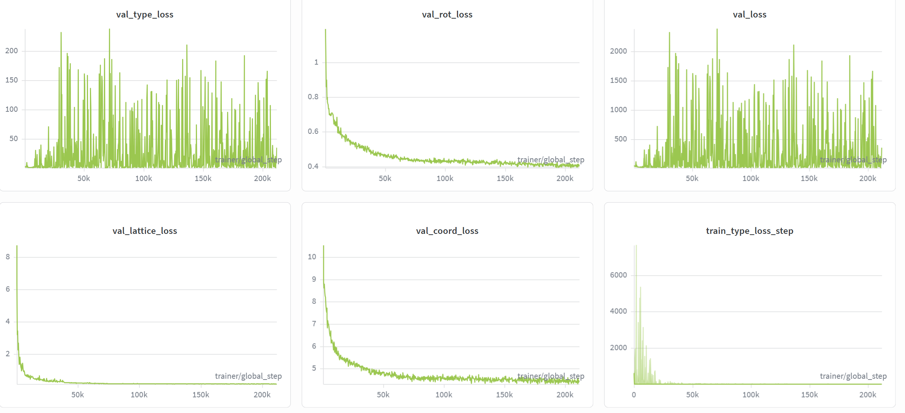
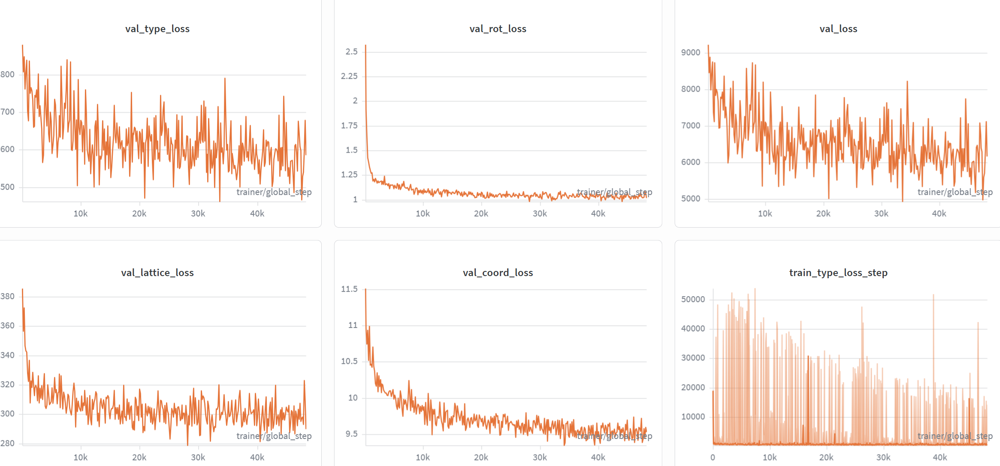
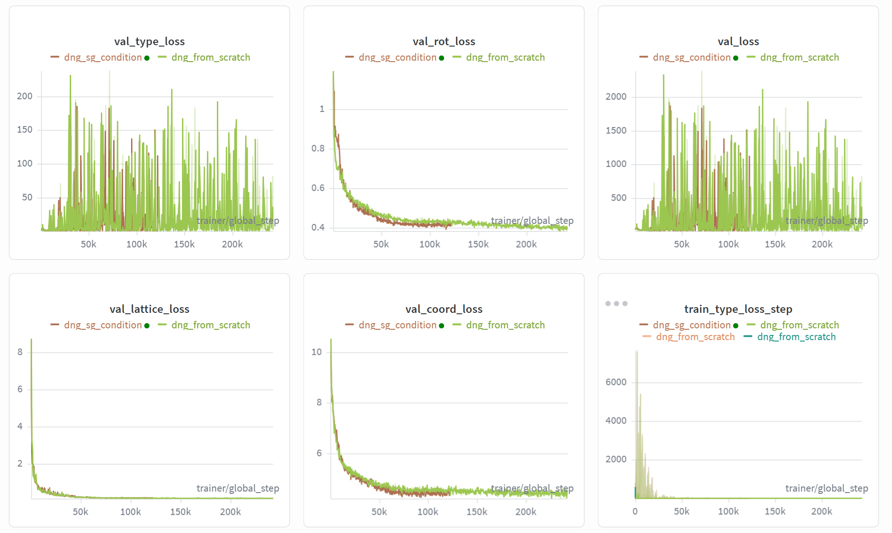
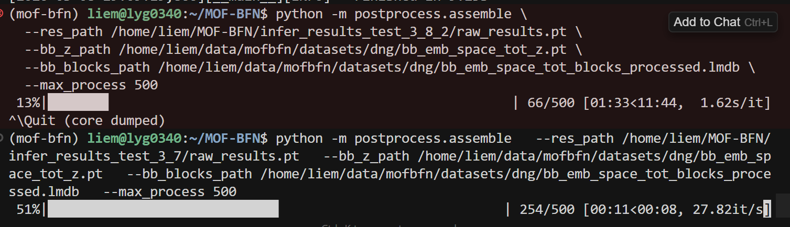
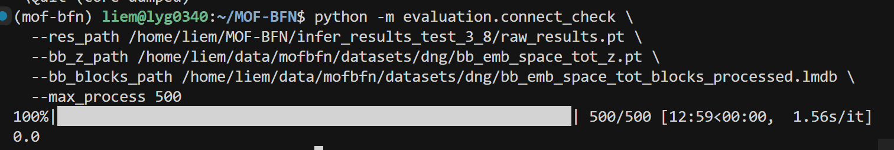

# MOF-BFN 研究周报（3月2日 — 3月8日）

---

## 一、本周重点

本周围绕 **MOF-BFN 晶体结构生成** 做了三块工作：

1. **晶格/体积损失**：确认体积正则主导 lattice_loss，改为 log 空间 + 下界约束后 loss 收敛更好，但生成晶胞分布塌缩、validity 不如论文。
2. **原代码复现**：用论文原配置从零训练，各项 loss 和连通性明显优于修改版，说明当前对体积的改动牵动了 type/coord 等 head，需要更谨慎。
3. **对称性**：后处理对称化/舍入对指标提升有限；加入空间群条件后训练 loss 更好，但推理出现**耗时暴增、连通性为 0**，需优先排查推理与条件传递。

---

## 二、主要结论

| 方向 | 结论 |
|------|------|
| 体积损失 | vol_loss 是 lattice_loss 主导项；改为 log-scale + softplus 下界后小样本收敛，但正式训练后 validity 变差、晶胞偏小。 |
| 二次实验（log-normal + type 头单独 LR） | val_type_loss 后期指数上升，train_type_loss 出现极高尖峰，推理通过率 0。 |
| 原代码 vs 修改版 | 原代码在 val_type / val_lattice / val_coord / train_type 等均明显更稳、更低；原代码推理连通性 0.878。 |
| 空间群条件化 | 训练整体 loss 优于原代码，但推理耗时约十几倍、连通性为 0，推理管线或条件使用有 bug。 |

---

## 三、关键图示

### 1. 原代码 vs 修改版 loss 对比

绿色为论文原代码、橙色为修改版：修改后 val_type / val_lattice / val_coord 等均明显变差，train_type_loss 出现极高尖峰。

### 2. 训练集体积分布

用于说明体积长尾分布，以及为何用 log 空间做体积约束更合理。

### 3. 第一次实验 validity 结果

修改后模型在 atomic_overlaps、overcoordinated 等项上差于论文，all_checks 通过率约 0.17–0.20，低于论文 0.35。

### 4. 空间群条件化训练曲线

棕色为加入空间群条件后的整体 loss，绿色为原代码；训练阶段棕色更低。

### 5. 空间群条件化推理异常

同一套推理指令下，修改后耗时约为原来的十几倍；连通性降为 0，与训练 loss 改善不符。

---

## 四、下周计划

1. **优先**：排查空间群条件化在推理阶段的条件传递与 infer/assemble 逻辑，修复连通性为 0 和耗时暴增。
2. 在不动坏 type/coord 的前提下，微调体积损失（权重、log-normal scale），单独观察 lattice/体积相关指标。
3. 视情况做训练集 outlier 过滤或 type 头/学习率调整，减轻 loss 尖峰。
